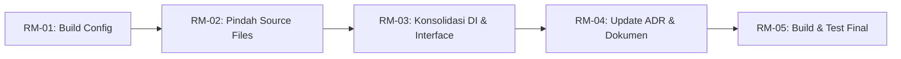

# 📋 Implementation Claim Order — Phase 2: Single Module Migration

> **Status Project:** ✅ **MVP SELESAI** — EPIC-0 s.d. EPIC-10 completed
> **Status Phase 2:** ✅ **SELESAI** — Migrasi multi-module → single module
>
> **ADR Compliance:** ADR-0001 (multi-module) ➡️ **SUPERSEDED** oleh ADR-0011 (single module) — lihat [ADR-0011](./adr/0011-single-module-architecture.md)

---

## 🎯 Mengapa Single Module?

Keputusan ini diambil setelah evaluasi menyeluruh (lihat sesi grilling di Freebuff):

| Alasan | Detail |
|--------|--------|
| **Boilerplate** | ~200 lines build config untuk ~40 source files — rasio 5:1. Tidak proporsional. |
| **Interface Indirection** | `TokenProvider` + `TokenRefreshHandler` di `:core:model` dibuat semata-mata untuk memecah circular dependency antar module. Di single module, tidak perlu. |
| **DI Tersebar** | 6 Hilt modules di 6 lokasi berbeda — bisa dikonsolidasi jadi 2-3. |
| **Project Size** | 1 domain bisnis, 1 developer. Tidak akan grow jadi super-app. YAGNI. |
| **Build Time** | Incremental build di project kecil tidak terasa bedanya. |

### Yang TETAP Dipertahankan

- ✅ Package structure per domain (`auth/`, `inspection/`, `sync/`, `core/`)
- ✅ Hilt DI (hanya dikonsolidasi)
- ✅ Version catalog `gradle/libs.versions.toml`
- ✅ Semua logika bisnis — **tidak ada perubahan kode**, hanya perpindahan file

---

## 🗺️ Dependency Graph



---

## 📋 Issue List

| ID | Judul | Prioritas | Dependensi | Status |
|----|-------|-----------|------------|--------|
| `EPIC-RM` | Refactor Multi-Module ke Single Module | 🔴 KRITIS | — | ✅ Closed |
| `RM-01` | Konsolidasi Build Config & Hapus Module | 🔴 KRITIS | EPIC-RM | ✅ Closed |
| `RM-02` | Pindahkan Semua Source Files ke `:app` | 🔴 KRITIS | RM-01 | ✅ Closed |
| `RM-03` | Hapus Interface Indirection & Konsolidasi DI | 🔴 KRITIS | RM-02 | ✅ Closed |
| `RM-04` | Update ADR & Dokumentasi | 🟠 NORMAL | RM-03 | ✅ Closed |
| `RM-05` | Build & Test — Verifikasi Final | 🔴 KRITIS | RM-04 | ✅ Closed |

---

## ✅ RM-01: Konsolidasi Build Config & Hapus Module

**Objective:** Ubah `settings.gradle.kts`, root `build.gradle.kts`, dan `app/build.gradle.kts`. Hapus semua module selain `:app`.

### Task List

- [x] Hapus `include(":core:model")`, `:core:network`, `:core:datastore`, `:feature:auth`, `:feature:inspection` dari `settings.gradle.kts`
- [x] Hapus `alias(libs.plugins.android.library) apply false` dari root `build.gradle.kts`
- [x] Gabung dependencies `:core:model` ke `app/build.gradle.kts`:
  - `implementation(libs.kotlinx.serialization.json)`
- [x] Gabung dependencies `:core:network` ke `app/build.gradle.kts`:
  - `implementation(libs.retrofit)`, `implementation(libs.retrofit.converter.kotlinx.serialization)`
  - `implementation(libs.okhttp)`, `implementation(libs.okhttp.logging.interceptor)`
- [x] Gabung dependencies `:core:datastore` ke `app/build.gradle.kts`:
  - `implementation(libs.room3.runtime)`, `ksp(libs.room3.compiler)`
  - `implementation(libs.datastore)`, `implementation(libs.datastore.preferences)`
  - `implementation(libs.datastore.tink)`, `implementation(libs.tink.android)`
- [x] Gabung dependencies `:feature:auth` ke `app/build.gradle.kts`
  - (sebagian besar sudah ada di app, hanya serialization + testing)
- [x] Gabung dependencies `:feature:inspection` ke `app/build.gradle.kts`
  - (sebagian besar sudah ada di app, hanya serialization + testing)
- [x] Hapus semua `implementation(project(":core:..."))` dan `implementation(project(":feature:..."))` dari `app/build.gradle.kts`
- [x] Hapus `core/model/build.gradle.kts`, `core/network/build.gradle.kts`, `core/datastore/build.gradle.kts`
- [x] Hapus `feature/auth/build.gradle.kts`, `feature/inspection/build.gradle.kts`
- [x] Pastikan namespace tetap `my.id.kentoes.rsudajibarangapp` di `app/build.gradle.kts`

### Verification

```bash
./gradlew :app:dependencies --no-build-cache 2>&1 | grep "FAILED\|Conflict\|ERROR"
```
Expected: tidak ada conflict.

---

## ✅ RM-02: Pindahkan Semua Source Files ke `:app`

**Objective:** Semua file Kotlin dan resources dari module-module lama dipindahkan ke `app/src/`. Hapus direktori `feature/` dan `core/` setelah selesai.

### Source Files — Yang Dipindahkan

> 📁 Semua file dipindahkan ke `app/src/main/java/my/id/kentoes/rsudajibarangapp/`
> Path di bawah mulai dari `app/src/main/java/my/id/kentoes/rsudajibarangapp/`

| Asal (relative dari project root) | Tujuan (relative dari app/src) |
|-----------------------------------|--------------------------------|
| `feature/auth/src/main/java/.../auth/` | `main/java/.../auth/` |
| `feature/inspection/src/main/java/.../inspection/` | `main/java/.../inspection/` |
| `feature/inspection/src/main/java/.../master/` | `main/java/.../master/` |
| `feature/inspection/src/main/java/.../dashboard/` | `main/java/.../dashboard/` |
| `feature/inspection/src/main/java/.../sync/` | `main/java/.../sync/` |
| `core/model/src/main/java/.../core/model/` | `main/java/.../core/model/` |
| `core/network/src/main/java/.../core/network/` | `main/java/.../core/network/` |
| `core/datastore/src/main/java/.../core/datastore/` | `main/java/.../core/datastore/` |
| `core/datastore/src/main/java/.../core/database/` | `main/java/.../core/database/` |

### Test Files — Yang Dipindahkan

| Asal | Tujuan |
|------|--------|
| `feature/auth/src/test/` | `app/src/test/` |
| `feature/inspection/src/test/` | `app/src/test/` |
| `core/datastore/src/test/` | `app/src/test/` |

### Task List

- [x] Pindahkan semua file dari `feature/auth/src/main/java/` → `app/src/main/java/`
- [x] Pindahkan semua file dari `feature/inspection/src/main/java/` → `app/src/main/java/`
- [x] Pindahkan semua file dari `core/model/src/main/java/` → `app/src/main/java/`
- [x] Pindahkan semua file dari `core/network/src/main/java/` → `app/src/main/java/`
- [x] Pindahkan semua file dari `core/datastore/src/main/java/` → `app/src/main/java/`
- [x] Pindahkan test files dari `feature/` dan `core/` ke `app/src/test/`
- [x] Update package imports jika ada yang berubah
- [x] Hapus seluruh direktori `feature/` dan `core/` beserta `build.gradle.kts` dan `src/` di dalamnya
- [x] Update `.gitignore` jika ada paths yang tidak relevan lagi
- [x] Verifikasi file `app/src/main/AndroidManifest.xml` — pastikan semua `<activity>`, `<provider>`, `<receiver>` masih ada

### Verification

```bash
./gradlew :app:assembleDebug 2>&1
```
Expected: build sukses (mungkin error import package — akan diperbaiki di RM-03).

---

## ✅ RM-03: Hapus Interface Indirection & Konsolidasi DI

**Objective:** Hapus `TokenProvider` dan `TokenRefreshHandler` — inline langsung ke implementasi. Gabung 6 Hilt modules menjadi 2-3.

### 3a. Hapus Interface Indirection

> 📌 Catatan: Setelah RM-02, semua file sudah di `app/src/main/java/.../`. Path di bawah relative dari `app/src/main/java/my/id/kentoes/rsudajibarangapp/`

**File yang dihapus:**
- `core/model/TokenProvider.kt` — interface tidak diperlukan lagi
- `core/model/TokenRefreshHandler.kt` — interface tidak diperlukan lagi

**File yang diubah:**
- `core/network/AuthInterceptor.kt` — inject `TokenManager` langsung, bukan `TokenProvider`
- `core/network/TokenAuthenticator.kt` — inject `AuthRepository` langsung, bukan `TokenRefreshHandler`
- `core/datastore/di/DataStoreModule.kt` — hapus `provideTokenProvider()`
- `auth/AuthModule.kt` — hapus `provideTokenRefreshHandler()`

### 3b. Konsolidasi Hilt Modules

**Kondisi awal — 6 modules tersebar:**
1. `AppModule.kt` (di `core/di/` setelah RM-02) — OkHttpClient, Retrofit
2. `NetworkModule.kt` (di `core/network/di/`) — Json
3. `DataStoreModule.kt` (di `core/datastore/di/`) — DataStore, TokenManager
4. `DatabaseModule.kt` (di `core/datastore/di/`) — AppDatabase, DAOs
5. `AuthModule.kt` (di `auth/`) — AuthApi, TokenRefreshHandler
6. `InspectionModule.kt` (di `inspection/`) — MasterDataApi, SyncApi

**Kondisi akhir — 2 modules (keduanya di `core/di/`):**
1. **`AppModule.kt`** — OkHttpClient, Retrofit, Json, AuthApi, MasterDataApi, SyncApi, TokenManager
2. **`DatabaseModule.kt`** — AppDatabase, DAOs, DataStore

**Perubahan:**
- [x] `core/network/AuthInterceptor.kt`: ubah `TokenProvider` → `TokenManager` di constructor
- [x] `core/network/TokenAuthenticator.kt`: ubah `TokenRefreshHandler` → `AuthRepository` di constructor
- [x] `core/datastore/di/DataStoreModule.kt`: hapus binding `provideTokenProvider()`
- [x] `auth/AuthModule.kt`: hapus `provideTokenRefreshHandler()`. Pindahkan `provideAuthApi()` ke `core/di/AppModule.kt`
- [x] `inspection/InspectionModule.kt`: pindahkan `provideMasterDataApi()` dan `provideSyncApi()` ke `core/di/AppModule.kt`
- [x] `core/network/di/NetworkModule.kt`: pindahkan `provideJson()` ke `core/di/AppModule.kt`
- [x] Hapus `auth/AuthModule.kt`, `inspection/InspectionModule.kt`, `core/network/di/NetworkModule.kt` setelah semua isinya dipindah

### Verification

```bash
./gradlew :app:assembleDebug 2>&1
```
Expected: build sukses.

---

## ✅ RM-04: Update ADR & Dokumentasi

**Objective:** Update ADR-0001 (superseded), buat ADR-0011, update semua dokumentasi.

### Task List

#### ADRs
- [x] Update `docs/adr/0001-multi-module-architecture.md`: tambah `Status: Superseded by ADR-0011`
- [x] Buat `docs/adr/0011-single-module-architecture.md` dengan konten:
  - **Status:** Accepted (supersedes ADR-0001)
  - **Context:** Aplikasi kecil RSUD Ajibarang (~40 source files, 1 domain bisnis, 1 developer). Multi-module terbukti sia-sia: ~200 lines build config untuk ~40 source files, interface indirection (TokenProvider/TokenRefreshHandler) hanya untuk circular dependency, 6 Hilt modules tersebar.
  - **Decision:** Kembali ke single module (`:app`). Pertahankan package structure per domain (`auth/`, `inspection/`, `sync/`, `core/`). Hapus interface indirection, konsolidasi DI modules.
  - **Consequences:** Build config lebih sederhana, setup lebih cepat, tidak ada circular dependency antar module. Hilangnya isolasi build per fitur — tidak relevan untuk tim 1 dev.
  - **Compared Options:** Single module (dulu dipertimbangkan di ADR-0001), Multi-module (dipilih di ADR-0001, sekarang di-reverse).

#### Dokumentasi Lain
- [x] Update `docs/IMPLEMENTATION-CLAIM-ORDER.md`: tambah referensi ke Phase 2
- [x] Update `CONTEXT-MAP.md`: hapus referensi multi-module
- [x] Update `CLAUDE.md`: hapus referensi ke `:core:`, `:feature:`
- [x] Update `docs/03-directory-structure.md`: sesuaikan tree dengan single module
- [x] Update `CODING-RULES.md` jika ada referensi ke multi-module di package structure section

---

## ✅ RM-05: Build & Test — Verifikasi Final

**Objective:** Build sukses, semua test passing, tidak ada lint error.

### Task List

- [x] `./gradlew :app:clean` — hapus cache build
- [x] `./gradlew :app:assembleDebug` — build debug APK sukses
- [x] `./gradlew :app:testDebugUnitTest` — semua unit test passing (target: ~91 tests)
- [x] `./gradlew :app:lintDebug` — tidak ada error lint
- [x] Code review final via `code-reviewer-deepseek-flash`
- [x] Verifikasi ProGuard rules (jika ada keep rules untuk class dari module lain)
- [x] Update `.gitignore` — hapus ignore untuk paths module lama jika ada

### CI/CD, ProGuard & Graphify

```bash
# Periksa keep rules untuk model class yang di-serialize
# Pastikan tidak ada class dari module lama yang masih di-proguard rules
```

**Rebuild Graphify index agar knowledge graph sesuai dengan struktur baru:**
```bash
graphify extract ./app/src/main/ --code-only --no-viz
cp app/graphify-out/graph.json graphify-out/graph.json 2>/dev/null || true
```

---

## 📊 Ringkasan Berkas yang Berubah

| Berkas | Tindakan |
|--------|----------|
| `settings.gradle.kts` | ✏️ Hapus include module |
| `build.gradle.kts` (root) | ✏️ Hapus android-library plugin |
| `app/build.gradle.kts` | ✏️ Gabung semua dependencies |
| `core/*/build.gradle.kts` (3 files) | 🗑️ Hapus |
| `feature/*/build.gradle.kts` (2 files) | 🗑️ Hapus |
| `**/TokenProvider.kt` | 🗑️ Hapus file |
| `**/TokenRefreshHandler.kt` | 🗑️ Hapus file |
| `**/AuthModule.kt` | 🗑️ Hapus setelah isinya dipindah |
| `**/InspectionModule.kt` | 🗑️ Hapus setelah isinya dipindah |
| `**/NetworkModule.kt` | 🗑️ Hapus setelah isinya dipindah |
| `core/di/AppModule.kt` | ✏️ Konsolidasi |
| `core/di/DatabaseModule.kt` | ✏️ Konsolidasi |
| `**/AuthInterceptor.kt` | ✏️ Inject langsung |
| `**/TokenAuthenticator.kt` | ✏️ Inject langsung |
| `docs/adr/0001-*` | ✏️ Superseded |
| `docs/adr/0011-*` | 🆕 Baru |
| Berkas source lainnya | 🔀 Pindah ke `app/src/` |

---

## 🧪 Checklist Sebelum Close EPIC-RM

- [x] Semua test passing (`./gradlew test`)
- [x] Build debug sukses (`./gradlew assembleDebug`)
- [x] Tidak ada lint error (`./gradlew lint`)
- [x] Tidak ada import yang broken
- [x] ADR-0011 sudah dibuat, ADR-0001 di-superseded
- [x] Dokumentasi sudah diupdate
- [x] Proguard rules masih valid
- [x] Code review final selesai

**✅ EPIC-RM CLOSED** — Semua task selesai.
