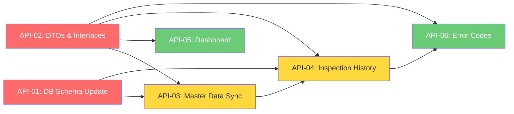

# 📋 Implementation Claim Order — Phase 3: API Alignment & New Sync Endpoints

> **Status Project:** ✅ **MVP SELESAI** — EPIC-0 s.d. EPIC-10 ✅ | RM Phase 2 ✅  
> **Status Phase 3:** 🆕 **DIMULAI** — Lihat [EPIC-11: API Alignment & New Sync Endpoints](../.beads/README.md)
>
> **BE Docs:** [`docs/android-to-be-api-contract.md`](./android-to-be-api-contract.md) · [`docs/android-implementation-guide.md`](./android-implementation-guide.md)  
> **Git Diff Contract:** Lihat perubahan API contract di commit history

---

## 🎯 Latar Belakang

Dokumen API contract baru (`docs/android-to-be-api-contract.md`) dan implementation guide (`docs/android-implementation-guide.md`) memperkenalkan perubahan besar pada cara Android berkomunikasi dengan Backend:

1. **Endpoint restructuring** — dari `/api/master/*` → `/api/*` (path tanpa `master/`)
2. **SyncResponse wrapper** — semua endpoint master data return `{ data, synced_at }`
3. **New sync endpoints** — Room-Items, User-Rooms, My-Rooms
4. **Pagination** — endpoint LIST menggunakan server-driven pagination
5. **Hybrid history** — cache lokal + fetch dari server untuk riwayat inspeksi
6. **Dashboard endpoint** — 1 panggilan untuk semua stat
7. **Standard error codes** — semua error punya `code` field

### Ringkasan Gap Analysis

| Gap | Kode Lama | Dokumen Baru |
|-----|-----------|--------------|
| Path endpoint | `@GET("master/rooms")` | `@GET("rooms")` |
| Response type | `List<RoomOut>` | `SyncResponse<RoomOut>` |
| Room-Items | ❌ | `GET /api/room-items` |
| My-Rooms | ❌ | `GET /api/auth/me/rooms` |
| User-Rooms | ❌ | `GET /api/auth/user-rooms` |
| History list | ❌ | `GET /api/inspections` (paginated) |
| History detail | ❌ | `GET /api/inspections/{id}` |
| Dashboard | ❌ (lokal) | `GET /api/analytics/dashboard` |
| Submit response | `Unit` | `InspectionOut` |
| Error codes | ❌ | `{ detail, code }` |
| `updated_at` field | ❌ | `RuangEntity`, `MasterDataItem` |
| `business_date` | Derived | Field eksplisit |

---

## 🗺️ Dependency Graph



> 🔴 **P0** — API-01, API-02  
> 🟡 **P1** — API-03, API-04  
> 🟢 **P2** — API-05, API-06  

---

## 📋 Issue List

| ID | Judul | Prioritas | Beads ID | Dependensi | Status |
|----|-------|-----------|----------|------------|--------|
| **EPIC-11** | API Alignment & New Sync Endpoints | 🔴 P0 | `rsud-android-client-1mn` | — | ⬜ |
| **API-01** | DB Schema — `updated_at`, `business_date`, new entities | 🔴 P0 | `rsud-android-client-sza` | EPIC-11 | ⬜ |
| **API-02** | API DTOs & Interfaces — SyncResponse, PaginatedResponse, new endpoints | 🔴 P0 | `rsud-android-client-wla` | EPIC-11 | ⬜ |
| **API-03** | Master Data Sync — RoomItems, MyRooms, UserRooms | 🟡 P1 | `rsud-android-client-5up` | API-01, API-02 | ⬜ |
| **API-04** | Inspection History — List & Detail, Hybrid Storage | 🟡 P1 | `rsud-android-client-2do` | API-01, API-02, API-03 | ⬜ |
| **API-05** | Dashboard & Analytics — `/api/analytics/dashboard` | 🟢 P2 | `rsud-android-client-jp8` | API-02 | ⬜ |
| **API-06** | Submit Response & Standard Error Codes | 🟢 P2 | `rsud-android-client-b5s` | API-02, API-04 | ⬜ |

---

## ✅ API-01: DB Schema — updated_at, business_date, new entities

**Beads ID:** `rsud-android-client-sza`  
**Objective:** Update database schema — tambah field baru dan tabel pivot untuk mendukung API contract baru.

### Task List

- [ ] Tambah field `updatedAt: String?` ke `RuangEntity`
- [ ] Tambah field `updatedAt: String?` ke `MasterDataItem`
- [ ] Tambah field `businessDate: String` ke `DrafInspeksi`
- [ ] Update `DrafInspeksi` constructor — include `businessDate`
- [ ] Buat entity: `RoomItemEntity` (pivot room↔item)
  - Fields: `id`, `roomId`, `itemId`, `createdAt`
- [ ] Buat entity: `UserRoomEntity` (pivot user↔room)
  - Fields: `id`, `userId`, `roomId`, `createdAt`
- [ ] Buat entity: `InspectionEntity` (history hybrid)
  - Fields: `id`, `roomId`, `inspectorId`, `status`, `businessDate`, `localTimestamp`, `rejectionReason`, `createdAt`, `rawJson`
- [ ] Buat entity: `InspectionDetailEntity`
  - Fields: `id`, `inspectionId`, `itemId`, `itemNameSnapshot`, `score`
- [ ] Buat entity: `InspectionPhotoEntity`
  - Fields: `id`, `detailId`, `photoFileName`, `thumbnailFileName`, `sortOrder`
- [ ] Tambah DAO methods di `MasterDataDao`:
  - `insertRoomItems()`, `getRoomItems()`
  - `insertUserRooms()`, `getUserRooms()`
  - `insertInspection()`, `getInspections()`, `getInspectionById()`
- [ ] Update `AppDatabase` — register 5 entity baru, increment version
- [ ] Update `InspectionRepository` — support field `businessDate`
- [ ] Update `InspectionPayload`, `PayloadItem` — gunakan `businessDate` dari field
- [ ] **Verifikasi:** `./gradlew :app:assembleDebug`

### File yang Diubah/Dibuat

| File | Tindakan |
|------|----------|
| `core/database/entity/RuangEntity.kt` | ✏️ Tambah `updatedAt` |
| `core/database/entity/MasterDataItem.kt` | ✏️ Tambah `updatedAt` |
| `core/database/entity/DrafInspeksi.kt` | ✏️ Tambah `businessDate` |
| `core/database/entity/RoomItemEntity.kt` | 🆕 Baru |
| `core/database/entity/UserRoomEntity.kt` | 🆕 Baru |
| `core/database/entity/InspectionEntity.kt` | 🆕 Baru |
| `core/database/entity/InspectionDetailEntity.kt` | 🆕 Baru |
| `core/database/entity/InspectionPhotoEntity.kt` | 🆕 Baru |
| `core/database/dao/MasterDataDao.kt` | ✏️ Tambah methods |
| `core/database/AppDatabase.kt` | ✏️ Register entities |
| `inspection/InspectionRepository.kt` | ✏️ Support businessDate |
| `inspection/InspectionRepository.kt` (Payload) | ✏️ businessDate dari field |

---

## ✅ API-02: API DTOs & Interfaces — SyncResponse, PaginatedResponse, new endpoints

**Beads ID:** `rsud-android-client-wla`  
**Objective:** Update semua Retrofit API interfaces dan DTOs sesuai API contract baru.

### Task List

- [ ] Buat `SyncResponse<T>` — generic wrapper: `{ data: List<T>, synced_at: String }`
- [ ] Buat `PaginatedResponse<T>` — generic wrapper: `{ items: List<T>, total, page, per_page, total_pages }`
- [ ] Update `MasterDataApi`:
  - [ ] `@GET("master/rooms")` → `@GET("rooms")`
  - [ ] `@GET("master/inspection-items")` → `@GET("inspection-items")`
  - [ ] Return type `List<RoomOut>` → `SyncResponse<RoomOut>`
  - [ ] Return type `List<ItemOut>` → `SyncResponse<ItemOut>`
  - [ ] Tambah parameter `@Query("since") since: String? = null`
- [ ] Buat `RoomItemDto` — `id`, `roomId`, `itemId`, `createdAt`
- [ ] Buat `UserRoomDto` — `id`, `userId`, `roomId`, `createdAt`
- [ ] Tambah endpoint di `MasterDataApi`: `@GET("room-items")` return `SyncResponse<RoomItemDto>`
- [ ] Tambah endpoint di `AuthApi`: `@GET("auth/me/rooms")` return `SyncResponse<RoomOut>`
- [ ] Tambah endpoint di `AuthApi`: `@GET("auth/user-rooms")` return `SyncResponse<UserRoomDto>`
- [ ] Buat `InspectionListItemDto` — `id`, `roomId`, `inspectorId`, `status`, `businessDate`, `createdAt`, `detailCount`
- [ ] Buat `InspectionOutDto` — full detail dengan nested `details[]` + `photos[]`
- [ ] Buat `DashboardDto` — `pendingCount`, `totalRooms`, `monthlyInspectionCount`, `avgScorePct`
- [ ] Buat `PhotoOutDto` — `id`, `photoFileName`, `thumbnailFileName`, `sortOrder`
- [ ] Buat `ApiErrorDto` — `{ detail: String, code: String }`
- [ ] Update `SyncApi`:
  - [ ] Tambah `@GET("inspections")` — list inspection (paginated, filterable)
  - [ ] Tambah `@GET("inspections/{id}")` — detail inspection
  - [ ] Update `submitInspection()`: return `InspectionOutDto` (bukan `Unit`)
- [ ] Update `AnalyticsApi`: tambah `@GET("analytics/dashboard")` return `DashboardDto`
- [ ] Update `UploadPhotoResponse`: tambah field `fileSize: Long?`
- [ ] Update `InspectionSubmit` / `PhotoSubmit` — sesuaikan dengan contract baru (field `file_name`, `sort_order`)
- [ ] **Verifikasi:** `./gradlew :app:assembleDebug`

### File yang Diubah/Dibuat

| File | Tindakan |
|------|----------|
| `core/model/ApiResponse.kt` | ✏️ Tambah `SyncResponse`, `PaginatedResponse` |
| `master/api/MasterDataApi.kt` | ✏️ Path fix, return type, query param |
| `auth/api/AuthApi.kt` | ✏️ Tambah `me/rooms`, `user-rooms` |
| `sync/api/SyncApi.kt` | ✏️ Tambah list/detail inspection, return type |
| `dashboard/api/AnalyticsApi.kt` | ✏️ Tambah dashboard endpoint |
| `sync/api/SyncApi.kt` (DTOs) | ✏️ Update `InspectionSubmit`, `PhotoSubmit` |
| File-file DTO baru | 🆕 RoomItemDto, UserRoomDto, InspectionOutDto, dll |

---

## ✅ API-03: Master Data Sync — RoomItems, MyRooms, UserRooms

**Beads ID:** `rsud-android-client-5up`  
**Objective:** Implementasi sync logic untuk master data baru dan validasi room↔item.

### Task List

- [ ] Update `MasterDataRepository.syncFromApi()`:
  - [ ] Bagi jadi method terpisah: `syncRooms()`, `syncItems()`, `syncRoomItems()`, `syncMyRooms()`, `syncUserRooms()`
  - [ ] Masing-masing method return `SyncResponse<T>` untuk dapat `synced_at`
- [ ] Bangun mapping lokal setelah sync:
  ```kotlin
  val roomItemMap: Map<Long, List<Long>>  // roomId → list of itemIds
  val userRoomMap: Map<Int, List<Long>>   // userId → list of roomIds
  ```
- [ ] Implementasi `clearAndInsert` untuk pivot tables (replace semua data lama)
- [ ] Update `SyncManager`:
  - [ ] Tambah `syncMasterData()` yang dipanggil sebelum `syncAllPending()`
  - [ ] Urutan sync: rooms → items → room-items → user-rooms → my-rooms
- [ ] Buat `SyncState` model:
  ```kotlin
  data class SyncState(
      val roomsSyncedAt: String? = null,
      val itemsSyncedAt: String? = null,
      val roomItemsSyncedAt: String? = null,
      val userRoomsSyncedAt: String? = null,
      val myRoomsSyncedAt: String? = null
  )
  ```
- [ ] Persist `SyncState` ke DataStore/SharedPreferences
- [ ] Update `SyncWorker` — sync master data sebelum sync inspeksi
- [ ] Update `InspectionFormViewModel` — filter items berdasarkan room yang dipilih
- [ ] Update `MasterDataListScreen` — filter rooms berdasarkan MyRooms untuk inspector
- [ ] Handle first-time sync: `since=1970-01-01T00:00:00Z`
- [ ] **Verifikasi:** `./gradlew :app:assembleDebug + testDebugUnitTest`

### File yang Diubah/Dibuat

| File | Tindakan |
|------|----------|
| `master/MasterDataRepository.kt` | ✏️ Refactor sync methods |
| `master/SyncState.kt` | 🆕 Baru |
| `sync/SyncManager.kt` | ✏️ Tambah sync master data |
| `sync/SyncWorker.kt` | ✏️ Sync master data dulu |
| `inspection/InspectionFormViewModel.kt` | ✏️ Filter items by room |

---

## ✅ API-04: Inspection History — List & Detail, Hybrid Storage

**Beads ID:** `rsud-android-client-2do`  
**Objective:** Fitur riwayat inspeksi dengan hybrid storage untuk daftar dan detail inspeksi.

### Task List

- [ ] **Update `SyncApi.submitInspection`**: return type `InspectionOutDto`
- [ ] Update `SyncManager.syncSingleDraft`: tangkap response `InspectionOutDto` dan simpan ke `InspectionEntity`
- [ ] Buat `InspectionHistoryRepository`:
  - [ ] `getInspections(page, perPage, status)` — fetch dari API + cache lokal
  - [ ] `getInspectionDetail(id)` — fetch dari API + cache lokal
  - [ ] `cacheInspections(data)` — simpan ke Room
  - [ ] `getLocalInspections()` — baca dari cache
- [ ] Implementasi hybrid fetch strategy:
  - [ ] Tampilkan cache dulu (instant)
  - [ ] Refresh dari server (update cache)
- [ ] Buat `InspectionListScreen` (Compose):
  - [ ] LazyColumn dengan infinite scroll (pagination)
  - [ ] Filter chips: All / PENDING / APPROVED / REJECTED
  - [ ] Card per inspection: room_name, status badge, date, detail_count
  - [ ] Loading / empty / error state
- [ ] Buat `InspectionDetailScreen` (Compose):
  - [ ] Header: room_name, inspector_name, status, date
  - [ ] Detail items list: item_name, score, photos thumbnail
  - [ ] Rejection reason (jika ada)
- [ ] Buat `InspectionHistoryViewModel`:
  - [ ] `StateFlow<InspectionHistoryUiState>` — list + detail
  - [ ] Pagination tracking (current page, loading more)
  - [ ] Filter status
  - [ ] `showAll` untuk supervisor
- [ ] Lookup `room_name` dari `RoomEntity` lokal
- [ ] Lookup `inspector_name` dari `UserEntity` lokal
- [ ] Integrasi ke `NavGraph`: routes `INSPECTION_HISTORY` + `INSPECTION_DETAIL/{id}`
- [ ] **Verifikasi:** `./gradlew :app:assembleDebug`

### File yang Diubah/Dibuat

| File | Tindakan |
|------|----------|
| `sync/SyncManager.kt` | ✏️ Tangkap response submit |
| `inspection/InspectionHistoryRepository.kt` | 🆕 Baru |
| `inspection/InspectionHistoryViewModel.kt` | 🆕 Baru |
| `inspection/ui/InspectionListScreen.kt` | 🆕 Baru |
| `inspection/ui/InspectionDetailScreen.kt` | 🆕 Baru |
| `core/navigation/NavGraph.kt` | ✏️ Tambah routes |

---

## ✅ API-05: Dashboard & Analytics — `/api/analytics/dashboard`

**Beads ID:** `rsud-android-client-jp8`  
**Objective:** Dashboard endpoint dari server, bukan dari lokal.

### Task List

- [ ] Update `AnalyticsApi`: tambah `@GET("analytics/dashboard")` dengan `@Query("year_month")`
- [ ] Buat `DashboardDto` (jika belum ada di API-02):
  - `pendingCount: Int`, `totalRooms: Int`
  - `monthlyInspectionCount: Int`, `avgScorePct: Double`
- [ ] Update `DashboardViewModel`:
  - [ ] Ganti `combine` lokal → fetch dari API dashboard
  - [ ] Panggil dengan `year_month=current` (format `YYYY-MM`)
  - [ ] Simpan hasil ke state
- [ ] Handle error: dashboard hanya untuk supervisor/admin (403 → guest state)
- [ ] Tampilkan guest screen / info card untuk inspector role
- [ ] Update `DashboardScreen`:
  - [ ] 4 card: Pending Approvals, Total Rooms, Monthly Inspections, Avg Score %
  - [ ] Loading shimmer
  - [ ] Error state dengan retry
- [ ] **Verifikasi:** `./gradlew :app:assembleDebug`

### File yang Diubah/Dibuat

| File | Tindakan |
|------|----------|
| `dashboard/api/AnalyticsApi.kt` | ✏️ Tambah dashboard endpoint |
| `dashboard/DashboardViewModel.kt` | ✏️ Ganti ke API call |
| `dashboard/DashboardScreen.kt` | ✏️ 4 card stats |

---

## ✅ API-06: Submit Response & Standard Error Codes

**Beads ID:** `rsud-android-client-b5s`  
**Objective:** Standarisasi error codes di interceptor dan perbaiki response handling.

### Task List

- [ ] Verify `SyncApi.submitInspection` return `InspectionOutDto` (dari API-04)
- [ ] Update `SyncManager.syncSingleDraft`:
  - [ ] Handle response `InspectionOutDto`
  - [ ] Simpan `inspection.id` untuk tracking
- [ ] Update `AuthInterceptor`:
  - [ ] Deteksi error code `TOKEN_EXPIRED`, `TOKEN_INVALID` dari response body
  - [ ] Trigger refresh hanya untuk `TOKEN_EXPIRED`
  - [ ] `TOKEN_INVALID` → force logout langsung
- [ ] Update `TokenAuthenticator: authenticate()`:
  - [ ] Parse error code dari response
  - [ ] Bedakan antara expired vs invalid token
- [ ] Handle error codes di `SyncManager`:
  - [ ] `409 DUPLICATE_INSPECTION` → skip draf (anggap sukses, sudah terkirim sebelumnya)
  - [ ] `413 FILE_TOO_LARGE` → skip foto besar, laporkan di hasil sync
  - [ ] `422` validasi error → log detail field errors
- [ ] Buat `ApiErrorUtil`:
  ```kotlin
  fun extractErrorCode(response: Response): String?
  fun extractErrorDetail(response: Response): String?
  ```
- [ ] Update `SyncWorker.doWork()`:
  - [ ] Tampilkan error code di notifikasi gagal
  - [ ] Bedakan antara retryable vs non-retryable errors
- [ ] **Verifikasi:** `./gradlew :app:assembleDebug`

### File yang Diubah/Dibuat

| File | Tindakan |
|------|----------|
| `core/network/AuthInterceptor.kt` | ✏️ Parse error code |
| `core/network/TokenAuthenticator.kt` | ✏️ Code-based check |
| `core/network/ApiErrorUtil.kt` | 🆕 Baru |
| `sync/SyncManager.kt` | ✏️ Handle error codes |
| `sync/SyncWorker.kt` | ✏️ Error code notifikasi |

---

## 📊 Ringkasan Berkas yang Berubah (Seluruh EPIC-11)

| Berkas | Tindakan | API |
|--------|----------|-----|
| `core/database/entity/RuangEntity.kt` | ✏️ Tambah `updatedAt` | API-01 |
| `core/database/entity/MasterDataItem.kt` | ✏️ Tambah `updatedAt` | API-01 |
| `core/database/entity/DrafInspeksi.kt` | ✏️ Tambah `businessDate` | API-01 |
| `core/database/entity/RoomItemEntity.kt` | 🆕 Baru | API-01 |
| `core/database/entity/UserRoomEntity.kt` | 🆕 Baru | API-01 |
| `core/database/entity/InspectionEntity.kt` | 🆕 Baru | API-01 |
| `core/database/entity/InspectionDetailEntity.kt` | 🆕 Baru | API-01 |
| `core/database/entity/InspectionPhotoEntity.kt` | 🆕 Baru | API-01 |
| `core/database/dao/MasterDataDao.kt` | ✏️ Tambah methods | API-01 |
| `core/database/AppDatabase.kt` | ✏️ Register entities | API-01 |
| `inspection/InspectionRepository.kt` | ✏️ Support businessDate | API-01 |
| `core/model/ApiResponse.kt` | ✏️ SyncResponse, PaginatedResponse | API-02 |
| `master/api/MasterDataApi.kt` | ✏️ Path fix, return type | API-02 |
| `auth/api/AuthApi.kt` | ✏️ Tambah endpoints | API-02 |
| `sync/api/SyncApi.kt` | ✏️ Tambah list/detail | API-02 |
| `dashboard/api/AnalyticsApi.kt` | ✏️ Dashboard endpoint | API-02 |
| File-file DTO baru (~8 files) | 🆕 Baru | API-02 |
| `master/MasterDataRepository.kt` | ✏️ Refactor sync | API-03 |
| `master/SyncState.kt` | 🆕 Baru | API-03 |
| `sync/SyncManager.kt` | ✏️ Sync master data | API-03 |
| `sync/SyncWorker.kt` | ✏️ Sync order | API-03 |
| `inspection/InspectionFormViewModel.kt` | ✏️ Filter items by room | API-03 |
| `inspection/InspectionHistoryRepository.kt` | 🆕 Baru | API-04 |
| `inspection/InspectionHistoryViewModel.kt` | 🆕 Baru | API-04 |
| `inspection/ui/InspectionListScreen.kt` | 🆕 Baru | API-04 |
| `inspection/ui/InspectionDetailScreen.kt` | 🆕 Baru | API-04 |
| `core/navigation/NavGraph.kt` | ✏️ Tambah routes | API-04 |
| `dashboard/DashboardViewModel.kt` | ✏️ Ganti ke API call | API-05 |
| `dashboard/DashboardScreen.kt` | ✏️ 4 card stats | API-05 |
| `core/network/AuthInterceptor.kt` | ✏️ Parse error codes | API-06 |
| `core/network/TokenAuthenticator.kt` | ✏️ Code-based check | API-06 |
| `core/network/ApiErrorUtil.kt` | 🆕 Baru | API-06 |

---

## 🚦 Cara Claim Issue

Setiap agent yang ingin mengerjakan task WAJIB mengikuti protokol ini:

```bash
# 1. BACA CODING-RULES.md dulu (langkah #0 WAJIB)
cat CODING-RULES.md

# 2. Pahami konteks via graphify
graphify query "Bagaimana arsitektur <area>?"

# 3. Claim issue
bd update <beads-id> --status in_progress
bd update <beads-id> --claim

# 4. Implementasi (ikuti task list di dokumen ini + task list di beads issue)
#    - Baca file yang relevan
#    - Lakukan perubahan
#    - Jalankan verifikasi: ./gradlew :app:assembleDebug

# 5. Setelah selesai
bd update <beads-id> --status closed
```

---

## 🚦 Legend

| Simbol | Arti |
|--------|------|
| 🔴 P0 | **Kritis** — blocking untuk task lain |
| 🟡 P1 | **Tinggi** — core feature, harus selesai untuk fase ini |
| 🟢 P2 | **Normal** — bisa ditunda, enhancement/enrichment |
| ⬜ | Belum dikerjakan |
| 🔄 | Sedang dikerjakan (in progress) |
| ✅ | Selesai |

---

## 🧪 Prasyarat Sebelum Close EPIC-11

- [ ] **Semua** task di API-01 s.d. API-06 selesai ✅
- [ ] API-01: DB entities + DAO methods selesai
- [ ] API-02: DTOs + Retrofit interfaces selesai
- [ ] API-03: Master data sync logic selesai
- [ ] API-04: Inspection history (list + detail) berfungsi
- [ ] API-05: Dashboard real-time dari API
- [ ] API-06: Error codes + submit response proper
- [ ] `./gradlew :app:assembleDebug` — build sukses
- [ ] `./gradlew :app:testDebugUnitTest` — test passing
- [ ] Update `docs/IMPLEMENTATION-CLAIM-ORDER.md` — tambah referensi Phase 3
- [ ] Code review final via `code-reviewer-deepseek-flash`
