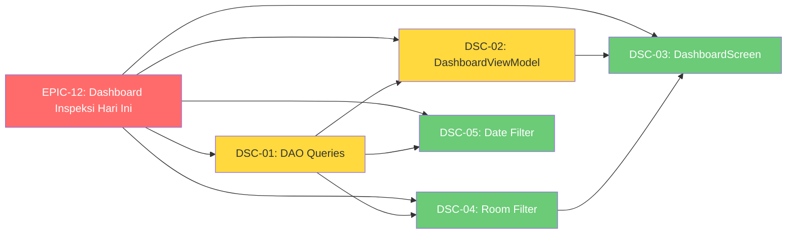

# 📋 Implementation Claim Order — Phase 4: Dashboard Inspection Status Cards

> **Status Project:** ✅ **MVP SELESAI** — EPIC-0 s.d. EPIC-10 ✅ | RM Phase 2 ✅ | Phase 3 ✅  
> **Status Phase 4:** ✅ **SELESAI** — Epic-12: Dashboard Inspeksi Hari Ini  
> **Refinements sesi:** date picker UI + snackbar error + pagination server-driven + kepemilikan draf (ADR-0015) + cleanup foto (ADR-0014)
> **Spec:** [`docs/dashboard-inspection-status-cards-spec.md`](./dashboard-inspection-status-cards-spec.md)  
> **ADR Baru:** `ADR-0014` — MediaStore Photo Storage & 30-Day Retention  
> **Glossary:** [`app/.../core/CONTEXT.md`](../app/src/main/java/my/id/kentoes/rsudajibarangapp/core/CONTEXT.md) · [`auth/CONTEXT.md`](../app/src/main/java/my/id/kentoes/rsudajibarangapp/auth/CONTEXT.md) · [`sync/CONTEXT.md`](../app/src/main/java/my/id/kentoes/rsudajibarangapp/sync/CONTEXT.md)

---

## 🎯 Latar Belakang

Dashboard inspector saat ini hanya menampilkan statistik draft dan tombol aksi cepat. Belum ada informasi visual tentang progress inspeksi hari ini — berapa ruangan yang sudah vs belum diinspeksi.

### Ringkasan 7 Keputusan Grill Session

| # | Pertanyaan | Keputusan |
|---|-----------|-----------|
| 1 | Definisi "sudah/belum diinspeksi" | **Opsi B**: Hitung draf + inspection, berdasarkan `businessDate` hari ini |
| 2 | Nasib tombol Aksi Cepat | Hapus **Inspeksi Baru** & **Lihat Draf**. **Riwayat Inspeksi** tetap. Card **Draf** jadi clickable |
| 3 | Card Draf clickable | **Opsi A**: Tambah `onClick` opsional ke `StatCard` |
| 4 | Filter tanggal riwayat | **Opsi A**: Filter lokal via Room DB (`businessDate = today`) |
| 5 | Data retention | **Hybrid**: Metadata inspeksi permanen, foto di gallery 30 hari, user bisa hapus manual |
| 6 | Storage permission | **Opsi A**: MediaStore, path `Pictures/rsud_ajibarang/`, muncul di galeri |
| 7 | Layout dashboard | **Opsi A**: Section terpisah "Status Inspeksi Hari Ini" |

---

## 🗺️ Dependency Graph



---

## 📋 Issue List

| ID | Judul | Beads ID | Dependensi | Status | Estimasi |
|----|-------|----------|------------|--------|----------|
| **EPIC-12** | Dashboard Inspeksi Hari Ini — Inspection Status Cards | `rsud-android-client-36o` | EPIC-11 | ✅ | 4 jam |
| **DSC-01** | DAO Queries + Repository | `rsud-android-client-bu6` | EPIC-12 | ✅ | 30 menit |
| **DSC-02** | DashboardViewModel — counts state | `rsud-android-client-54f` | DSC-01, EPIC-12 | ✅ | 45 menit |
| **DSC-03** | DashboardScreen — layout cards | `rsud-android-client-f64` | DSC-02, DSC-04, EPIC-12 | ✅ | 90 menit |
| **DSC-04** | Room Selection — uninspected filter | `rsud-android-client-7va` | DSC-01, EPIC-12 | ✅ | 60 menit |
| **DSC-05** | Inspection History — date filter | `rsud-android-client-6kn` | DSC-01, EPIC-12 | ✅ | 60 menit |

---

## 📋 Task Detail

### 🆕 DSC-01: DAO Queries + Repository

**Beads ID:** `rsud-android-client-bu6`  
**Objective:** Tambah query ke MasterDataDao dan method ke MasterDataRepository untuk mendapat room IDs yang sudah diinspeksi/draft hari ini.

#### Task List

- [x] Tambah query di `MasterDataDao`:
  ```kotlin
  @Query("SELECT DISTINCT roomId FROM draf_inspeksi WHERE businessDate = :date")
  suspend fun getDraftRoomIdsForDate(date: String): List<Long>
  ```
  ```kotlin
  @Query("SELECT DISTINCT roomId FROM inspection WHERE businessDate = :date")
  suspend fun getInspectedRoomIdsForDate(date: String): List<Long>
  ```
- [x] Tambah method di `MasterDataRepository`:
  ```kotlin
  suspend fun getInspectedRoomIdsForDate(date: String): Set<Long> {
      val draftIds = masterDataDao.getDraftRoomIdsForDate(date)
      val inspectionIds = masterDataDao.getInspectedRoomIdsForDate(date)
      return (draftIds + inspectionIds).toSet()
  }
  ```
- [x] **Verifikasi:** `./gradlew :app:assembleDebug`

#### Files Changed

| File | Tindakan |
|------|----------|
| `core/database/dao/MasterDataDao.kt` | ✏️ +2 query |
| `master/MasterDataRepository.kt` | ✏️ +1 method |

---

### 🆕 DSC-02: DashboardViewModel — counts state

**Beads ID:** `rsud-android-client-54f`  
**Objective:** Tambah state dan computation logic untuk inspected/uninspected room counts di DashboardViewModel.

#### Task List

- [x] Tambah field ke `DashboardUiState`:
  ```kotlin
  val inspectedRoomCount: Int = 0,
  val uninspectedRoomCount: Int = 0,
  ```
- [x] Tambah method `computeInspectionStatus(date: String)` di ViewModel:
  ```kotlin
  private suspend fun computeInspectionStatus(date: String) {
      val allRooms = masterDataDao.getAllRooms().first()
      val allInspectedIds = repository.getInspectedRoomIdsForDate(date)
      _uiState.value = _uiState.value.copy(
          inspectedRoomCount = allInspectedIds.size,
          uninspectedRoomCount = allRooms.size - allInspectedIds.size
      )
  }
  ```
- [x] Panggil `computeInspectionStatus()` di `init` block
- [x] **Verifikasi:** `./gradlew :app:assembleDebug`

#### Files Changed

| File | Tindakan |
|------|----------|
| `dashboard/DashboardViewModel.kt` | ✏️ +state +computation |
| `dashboard/DashboardScreen.kt` | ✏️ (akan berubah di DSC-03) |

---

### 🆕 DSC-03: DashboardScreen — layout cards, navigation, click handling

**Beads ID:** `rsud-android-client-f64`  
**Objective:** Ubah layout dashboard: hapus tombol, tambah 2 card clickable, buat card Draf clickable, update navigasi.

#### Task List

- [x] **StatCard.kt**: Tambah parameter opsional `onClick: (() -> Unit)? = null`
  - Jika `onClick != null`, gunakan `Card(onClick = onClick)` bukan `Card()` biasa
  - Tambah efek visual: elevation naik saat hover/click
- [x] **DashboardScreen.kt**: Tambah section baru "Status Inspeksi Hari Ini"
  - 2 card baru: "Belum Diinspeksi" dan "Sudah Diinspeksi"
  - Warna: merah/primary untuk "Belum", hijau untuk "Sudah"
  - Nilai: dari `uiState.uninspectedRoomCount` dan `uiState.inspectedRoomCount`
- [x] **DashboardScreen.kt**: Card Draf di Ringkasan → clickable → `onNavigateToDrafts`
- [x] **DashboardScreen.kt**: Hapus tombol "Inspeksi Baru" dan "Lihat Draf" dari Aksi Cepat
- [x] **DashboardScreen.kt**: Pertahankan tombol "Riwayat Inspeksi"
- [x] **DashboardScreen.kt**: Tambah callback:
  - `onNavigateToUninspectedRooms: () -> Unit` (card Belum Diinspeksi)
  - `onNavigateToHistoryWithDate: () -> Unit` (card Sudah Diinspeksi)
- [x] **NavGraph.kt**: 
  - Tambah `filterDate` optional param ke `INSPECTION_HISTORY` route
  - Tambah `uninspectedOnly` + `date` optional param ke `INSPECTION_LIST` route
  - Update navigasi dari dashboard untuk pass params
- [x] **Verifikasi:** `./gradlew :app:assembleDebug`

#### Files Changed

| File | Tindakan |
|------|----------|
| `dashboard/components/StatCard.kt` | ✏️ +`onClick` param |
| `dashboard/DashboardScreen.kt` | ✏️ Layout baru |
| `core/navigation/NavGraph.kt` | ✏️ Route params baru |

---

### 🆕 DSC-04: Room Selection — uninspected-only filter mode

**Beads ID:** `rsud-android-client-7va`  
**Objective:** Saat navigasi dari card "Belum Diinspeksi", room selection hanya tampilkan ruangan yang belum diinspeksi hari ini.

#### Task List

- [x] **MasterDataViewModel**: Tambah state field
  ```kotlin
  val excludeRoomIds: Set<Long> = emptySet()
  ```
- [x] **MasterDataViewModel**: Tambah method
  ```kotlin
  fun setUninspectedFilter(date: String) {
      viewModelScope.launch {
          val ids = repository.getInspectedRoomIdsForDate(date)
          _uiState.value = _uiState.value.copy(excludeRoomIds = ids)
      }
  }
  ```
- [x] **MasterDataViewModel**: Update combine block — filter rooms jika `excludeRoomIds` tidak kosong
  ```kotlin
  // Di dalam combine(repository.items, repository.rooms)
  val currentState = _uiState.value
  val filteredRooms = if (currentState.excludeRoomIds.isEmpty()) rooms
      else rooms.filter { it.id !in currentState.excludeRoomIds }
  ```
- [x] **MasterDataListScreen**: Baca param `uninspectedOnly` dan `date` dari route
  - Jika `uninspectedOnly == true`, panggil `viewModel.setUninspectedFilter(date)`
- [x] **MasterDataListScreen**: Ubah judul sesuai mode
  - Normal: "Pilih Ruangan"
  - Uninspected-only: "Pilih Ruangan (Belum Diinspeksi)"
- [x] **Verifikasi:** `./gradlew :app:assembleDebug`

#### Files Changed

| File | Tindakan |
|------|----------|
| `master/MasterDataViewModel.kt` | ✏️ +filter state +method |
| `master/ui/MasterDataListScreen.kt` | ✏️ +uninspected mode |

---

### 🆕 DSC-05: Inspection History — date filter preset

**Beads ID:** `rsud-android-client-6kn`  
**Objective:** Saat navigasi dari card "Sudah Diinspeksi", inspection history terfilter otomatis untuk hari ini.

#### Task List

- [x] **InspectionHistoryUiState**: Tambah field
  ```kotlin
  val filterDate: String? = null
  ```
- [x] **InspectionHistoryViewModel**: Tambah method
  ```kotlin
  fun setFilterDate(date: String) {
      _uiState.value = _uiState.value.copy(filterDate = date)
      // Re-collect cache with date filter
      collectCache(status = _uiState.value.filterStatus, date = date)
  }
  ```
- [x] **InspectionHistoryViewModel**: Update `collectCache()` signature:
  ```kotlin
  private fun collectCache(status: String? = null, date: String? = null) {
      cacheJob?.cancel()
      cacheJob = viewModelScope.launch {
          repository.observeLocalInspections(status, date).collect { cached ->
              _uiState.value = _uiState.value.copy(inspections = cached, isInitialLoading = false)
          }
      }
  }
  ```
- [x] **InspectionHistoryRepository**: Tambah overload `observeLocalInspections(status, date)`:
  - Jika `date != null`, filter hasil dari Room dengan `businessDate = date`
  - Atau tambah query baru di `MasterDataDao`:
    ```kotlin
    @Query("SELECT * FROM inspection WHERE businessDate = :date ORDER BY createdAt DESC")
    fun getInspectionsByDate(date: String): Flow<List<InspectionEntity>>
    ```
- [x] **InspectionHistoryViewModel**: Update `init` — baca dari NavArgs
  ```kotlin
  init {
      collectCache()
      refreshFromServer()
      // Jika ada filterDate dari NavArgs, set setelah init
  }
  ```
- [x] **InspectionListScreen**: Tampilkan indikator filter date (chip atau subtitle)
  - Jika `filterDate != null`, tampilkan "Hari ini, {date}" di subtitle
- [x] **NavGraph**: Pass `filterDate` dari route param ke ViewModel
- [x] **Verifikasi:** `./gradlew :app:assembleDebug`

#### Files Changed

| File | Tindakan |
|------|----------|
| `inspection/InspectionHistoryViewModel.kt` | ✏️ +filter date state +method |
| `inspection/InspectionHistoryRepository.kt` | ✏️ +observe with date |
| `inspection/ui/InspectionListScreen.kt` | ✏️ +date indicator |
| `core/database/dao/MasterDataDao.kt` | ✏️ +getInspectionsByDate (opsional) |

> **🔧 Refinement sesi:** filter tanggal diimplementasi penuh dengan `Material3 DatePickerDialog` (`InspectionDatePickerDialog`), bar filter (`InspectionDateFilterBar`), dan snackbar error terpusat (`ErrorSnackbarEffect`) — diekstrak dari `InspectionListScreen` sehingga screen < 300 baris. Helper tanggal (`parseDateToMillis`/`formatMillisToDate`) di `inspection/ui/dateUtils.kt` (+ unit test `DateUtilsTest`, `DateUtilsTimezoneTest`). Pagination riwayat kini server-driven (`totalPages` → `hasMorePages`) dengan race protection `loadEpoch`.

---

## 📊 Ringkasan Semua Perubahan

| File | DSC | Tindakan |
|------|-----|----------|
| `core/database/dao/MasterDataDao.kt` | DSC-01, (DSC-05) | ✏️ +2-3 query |
| `master/MasterDataRepository.kt` | DSC-01 | ✏️ +1 method |
| `dashboard/DashboardViewModel.kt` | DSC-02 | ✏️ +state +computation |
| `dashboard/components/StatCard.kt` | DSC-03 | ✏️ +onClick param |
| `dashboard/DashboardScreen.kt` | DSC-03 | ✏️ Layout baru |
| `core/navigation/NavGraph.kt` | DSC-03 | ✏️ Route params |
| `master/MasterDataViewModel.kt` | DSC-04 | ✏️ +filter |
| `master/ui/MasterDataListScreen.kt` | DSC-04 | ✏️ +uninspected mode |
| `inspection/InspectionHistoryViewModel.kt` | DSC-05 | ✏️ +date filter |
| `inspection/InspectionHistoryRepository.kt` | DSC-05 | ✏️ +date query |
| `inspection/ui/InspectionListScreen.kt` | DSC-05 | ✏️ +date indicator |

---

## 🚦 Cara Claim Issue

```bash
# 1. Lihat konteks via graphify
graphify query "Bagaimana arsitektur dashboard dan inspection?"

# 2. Baca spec
cat docs/dashboard-inspection-status-cards-spec.md

# 3. Claim issue
bd update <beads-id> --status in_progress
bd update <beads-id> --claim

# 4. Implementasi — ikuti task list

# 5. Verifikasi
./gradlew :app:assembleDebug

# 6. Close
bd update <beads-id> --status closed
```

---

## 🚦 Legend

| Simbol | Arti |
|--------|------|
| 🆕 | Belum dikerjakan |
| 🔄 | Sedang dikerjakan |
| ✅ | Selesai |
| 🔴 P0 | Kritis — core feature |
| 🟡 P1 | Tinggi — enhancement penting |
| 🟢 P2 | Normal — bisa ditunda |
