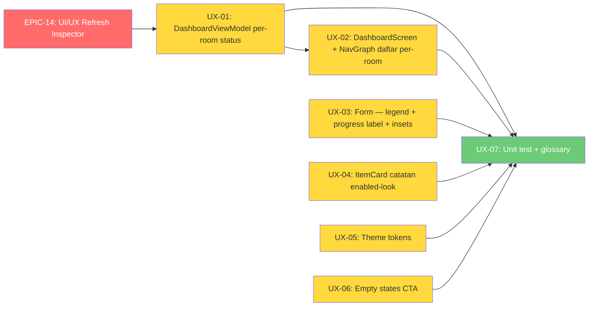

# 📋 Implementation Claim Order — Phase 6: UI/UX Refresh Inspector (EPIC-14)

> **Status Project:** ✅ MVP SELESAI · RM Phase 2 ✅ · Phase 3 ✅ · Phase 4 ✅ · Phase 5 ✅
> **Status Phase 6:** ✅ **SELESAI** — EPIC-14: UI/UX Refresh Inspector (grill-with-docs 2026-08)
> **Beads Epic:** `rsud-android-client-8b7` · **7 sub-issues** (UX-01 s.d. UX-07)
> **Kontrak API:** `docs/android-to-be-api-contract.md` — **TANPA endpoint baru** (semua data existing, keputusan Q5)
> **Glossary:** [`inspection/CONTEXT.md`](../app/src/main/java/my/id/kentoes/rsudajibarangapp/inspection/CONTEXT.md) — term "Status Inspeksi Hari Ini" akan diperbarui (UX-07)

---

## 🎯 Latar Belakang

Sesi **grill-with-docs** (2026-08) + riset internet tren UI/UX Android 2025–2026 (Material 3 Expressive, edge-to-edge insets, empty states + CTA, design tokens). Tujuan: dashboard & form inspeksi **lebih menarik dan informatif** untuk role **inspector** (ADR-0017), dengan prinsip:

- **Semua info baru berdasar data nyata dari backend** — diverifikasi di kontrak API, tanpa endpoint baru (endpoint analytics ADR-0011 supervisor-only → tidak dipakai)
- **Tanpa AI slop** — tiap elemen fungsional (navigasi/status/aksi), bukan dekorasi

### Ringkasan Keputusan Grill Session

| # | Pertanyaan | Keputusan |
|---|-----------|-----------|
| 1 | Scope | **(c)** Dashboard + Form Inspeksi prioritas, polish ringan sisanya; role inspector-only; tanpa AI slop |
| 2 | Dashboard "informatif" | **(c)** Kartu "Belum/Sudah Diinspeksi" → **daftar status per-room** (Belum/Draf/Menunggu Kirim/Menunggu Review/Disetujui/Ditolak) + jumlah item per room, klik → navigasi sesuai status |
| 3 | Form "informatif" | **(c)** Progress + counter (**sudah ada** di bottom bar) + **legend skor** (kurang). Grouping kategori TIDAK dikembalikan (ADR-0019) |
| 4 | Polish "menarik" | **(b)** Design tokens (shapes + warna keras → token M3) + **empty states dengan CTA**; login **tidak** dipoles |
| 5 | Bug UX | Catatan di ItemCard tampak **disabled** (abu-abu) → fix agar jelas interaktif |
| 6 | Bug UX | Tombol bottom bar form **mepet frame handphone** (edge-to-edge tanpa insets) → `navigationBarsPadding()` + `imePadding()` |
| 7 | Backend | **TANPA endpoint baru** — semua data sudah tersedia untuk inspector |

---

## 🗺️ Dependency Graph



> **Aturan:** UX-02 butuh UX-01 (data list dulu, baru UI). UX-07 (test + glossary) hanya bisa di-claim setelah UX-01–UX-06 selesai.

---

## 📋 Issue List

| ID | Judul | Beads ID | Dependensi | Status | Estimasi |
|----|-------|----------|------------|--------|----------|
| **EPIC-14** | UI/UX Refresh Inspector (grill-with-docs 2026-08) | `rsud-android-client-8b7` | — | ✅ | 6.5 jam |
| **UX-01** | DashboardViewModel — per-room status list (RoomStatus) | `rsud-android-client-8b7.1` | EPIC-14 | ✅ | 60 menit |
| **UX-02** | DashboardScreen + NavGraph — daftar status per-room | `rsud-android-client-8b7.2` | UX-01 | ✅ | 90 menit |
| **UX-03** | Form Inspeksi — legend skor + label progress + bottom bar insets | `rsud-android-client-8b7.3` | EPIC-14 | ✅ | 45 menit |
| **UX-04** | ItemCard — fix catatan tampak disabled | `rsud-android-client-8b7.4` | EPIC-14 | ✅ | 30 menit |
| **UX-05** | Theme tokens — RsuShapes + hapus warna keras | `rsud-android-client-8b7.5` | EPIC-14 | ✅ | 30 menit |
| **UX-06** | Empty states CTA (draf, riwayat, pilih ruangan) | `rsud-android-client-8b7.6` | EPIC-14 | ✅ | 45 menit |
| **UX-07** | Unit test + update glossary CONTEXT.md | `rsud-android-client-8b7.7` | UX-01 s.d. UX-06 | ✅ | 90 menit |

---

## 📋 Task Detail

### ✅ UX-01: DashboardViewModel — per-room status list (RoomStatus)

**Beads ID:** `rsud-android-client-8b7.1`
**Objective:** Sediakan data status per-room untuk daftar "Status Inspeksi Hari Ini" (keputusan Q2-c).

#### Task List

- [x] Enum `RoomStatus`: `BELUM, DRAF, MENUNGGU_KIRIM, MENUNGGU_REVIEW, DISETUJUI, DITOLAK`
- [x] Data class `RoomStatusItem`: `roomId, roomName, itemCount, status, draftId?, inspectionId?`
- [x] `DashboardUiState` + `roomStatuses: List<RoomStatusItem>`
- [x] `computeInspectionStatus()`: derive dari `getAllRoomsOnce()` (scope `isMyRoom`) + `drafDao.getAllDrafts().first()` (businessDate=today) + `masterDataDao.getInspectionsByDate(today).first()` + `getAllRoomItems()` (item count)
- [x] Precedence: **inspection (server truth) > draft > BELUM**; `PENDING_SYNC` → `MENUNGGU_KIRIM`
- [x] Sorting: `BELUM` paling atas, lalu nama room
- [x] **Pertahankan** `inspectedRoomCount`/`uninspectedRoomCount` via `repository.getInspectedRoomIdsForDate` — tes existing tetap hijau

#### Files Changed

| File | Tindakan |
|------|----------|
| `dashboard/DashboardViewModel.kt` | ✏️ +RoomStatus, +RoomStatusItem, +roomStatuses, rewrite computeInspectionStatus |

---

### ✅ UX-02: DashboardScreen + NavGraph — daftar status per-room

**Beads ID:** `rsud-android-client-8b7.2` (dependensi: UX-01)
**Objective:** Ganti 2 kartu "Belum/Sudah Diinspeksi" dengan daftar per-room yang bisa diklik.

#### Task List

- [x] Hapus callback `onNavigateToUninspectedRooms` / `onNavigateToHistoryWithDate`
- [x] Tambah callback: `onOpenRoomForm(roomId, roomName)`, `onResumeDraft(draftId)`, `onInspectionClick(inspectionId)`
- [x] `RoomStatusRow`: ikon room, nama, jumlah item, chip status berwarna (token M3: `primary`/`tertiary`/`secondary`/`error`/`onSurfaceVariant`)
- [x] Header subtitle "X dari Y ruangan selesai"
- [x] Click behavior: `BELUM` → form baru; `DRAF`/`MENUNGGU_KIRIM` → resume draf; lainnya → detail inspeksi
- [x] Fallback jika `roomStatuses` kosong (room belum di-assign)
- [x] NavGraph: wire callback ke `Routes.inspectionForm` / resume draft / `inspectionDetail`
- [x] Token colors di StatCard: hapus `Color(0xFFF9A825)` → `tertiary`, `Color(0xFF388E3C)` → `secondary`

#### Files Changed

| File | Tindakan |
|------|----------|
| `dashboard/DashboardScreen.kt` | ✏️ +RoomStatusRow, ganti kartu, hapus callback lama |
| `core/navigation/NavGraph.kt` | ✏️ wire callback baru |

---

### ✅ UX-03: Form Inspeksi — legend skor + label progress + bottom bar insets

**Beads ID:** `rsud-android-client-8b7.3`
**Objective:** Perbaikan UX form (keputusan Q3-c + Q7): informatif + nyaman.

#### Task List

- [x] Legend skor di atas daftar item: `0 = Berisiko (wajib foto) · 1 = Minor · 2 = Sesuai` (`labelMedium`, `onSurfaceVariant`)
- [x] Label counter progress lebih jelas: `X/Y item valid`
- [x] Bottom bar: `.navigationBarsPadding()` + `.imePadding()` — tombol tidak mepet frame handphone & tidak tertutup keyboard (edge-to-edge)

#### Files Changed

| File | Tindakan |
|------|----------|
| `inspection/InspectionFormScreen.kt` | ✏️ +legend, +label progress, +insets bottom bar |

---

### ✅ UX-04: ItemCard — fix catatan tampak disabled

**Beads ID:** `rsud-android-client-8b7.4`
**Objective:** Field catatan terlihat abu-abu/disabled walau enabled (umpan balik user). Root cause: `OutlinedTextField` unfocused default (border `outline` + label `onSurfaceVariant` + container transparan) terbaca sebagai disabled.

#### Task List

- [x] `OutlinedTextFieldDefaults.colors()`: `focusedContainerColor` & `unfocusedContainerColor` = `surfaceContainerHighest` (fill terlihat = jelas input area)
- [x] `focusedBorderColor` = `primary`, `unfocusedBorderColor` = `outline`
- [x] Tambah placeholder "Tulis detail temuan..." agar terlihat interaktif

#### Files Changed

| File | Tindakan |
|------|----------|
| `inspection/components/ItemCard.kt` | ✏️ +colors, +placeholder |

---

### ✅ UX-05: Theme tokens — RsuShapes + hapus warna keras

**Beads ID:** `rsud-android-client-8b7.5`
**Objective:** Fondasi tokens (keputusan Q4-b): konsistensi visual + benar di dark mode (warna keras rusak saat dynamic color).

#### Task List

- [x] `RsuShapes` di `Theme.kt` (small 8 / medium 12 / large 16 / extraLarge 24) + `shapes = RsuShapes` di `MaterialTheme`
- [x] `DashboardScreen`: `Color(0xFFF9A825)` → `tertiary`, `Color(0xFF388E3C)` → `secondary`
- [x] `InspectionListScreen` statusColor: `Color(0xFFF9A825)` → `tertiary`, `Color(0xFF388E3C)` → `secondary`

#### Files Changed

| File | Tindakan |
|------|----------|
| `core/ui/theme/Theme.kt` | ✏️ +RsuShapes |
| `dashboard/DashboardScreen.kt` | ✏️ warna keras → token |
| `inspection/ui/InspectionListScreen.kt` | ✏️ warna keras → token |

> ✅ `RsuShapes` + `shapes = RsuShapes` di `Theme.kt` (ditulis di sesi grill, diverifikasi di UX-05).

---

### ✅ UX-06: Empty states CTA (draf, riwayat, pilih ruangan)

**Beads ID:** `rsud-android-client-8b7.6`
**Objective:** Empty state informatif dengan CTA (keputusan Q4-b). Empty state sudah ada tapi tanpa aksi.

#### Task List

- [x] `DaftarDrafScreen`: tombol "Mulai Inspeksi" → callback `onStartInspection` → `Routes.inspectionList()`
- [x] NavGraph: wire `onStartInspection` di `DaftarDrafScreen`
- [x] `InspectionListScreen`: tombol "Muat Ulang" di empty state → `viewModel.refreshFromServer()`
- [x] `MasterDataListScreen`: tombol "Coba Sync Ulang" di empty state → `viewModel.refresh()`

#### Files Changed

| File | Tindakan |
|------|----------|
| `inspection/ui/DaftarDrafScreen.kt` | ✏️ +CTA Mulai Inspeksi |
| `core/navigation/NavGraph.kt` | ✏️ wire onStartInspection |
| `inspection/ui/InspectionListScreen.kt` | ✏️ +CTA Muat Ulang |
| `master/ui/MasterDataListScreen.kt` | ✏️ +CTA Coba Sync Ulang |

---

### ✅ UX-07: Unit test + update glossary CONTEXT.md

**Beads ID:** `rsud-android-client-8b7.7` (dependensi: UX-01 s.d. UX-06)
**Objective:** Validasi & dokumentasi keputusan (grill-with-docs → domain-modeling).

#### Task List

- [x] `DashboardViewModelTest` setup(): tambah default mock `getAllRoomItems()` + `getInspectionsByDate()`
- [x] Test baru: `roomStatuses` derive status dengan precedence (BELUM/DRAF/DISETUJUI), itemCount, `draftId`/`inspectionId`
- [x] Test: `MENUNGGU_KIRIM` (PENDING_SYNC) & `DITOLAK`
- [x] Update `inspection/CONTEXT.md`: term **Status Inspeksi Hari Ini** → definisi daftar per-room (bukan 2 angka)
- [x] **Verifikasi:** `./gradlew :app:testDebugUnitTest` ✅ (termasuk 3 test baru roomStatuses) + `./gradlew :app:assembleDebug` ✅ — **BUILD SUCCESSFUL**

#### Files Changed

| File | Tindakan |
|------|----------|
| `app/src/test/.../dashboard/DashboardViewModelTest.kt` | ✏️ +default mock, +3 test roomStatuses |
| `app/src/main/java/.../inspection/CONTEXT.md` | ✏️ update term Status Inspeksi Hari Ini |

---

## 📊 Ringkasan Semua Perubahan

| File | UX | Tindakan |
|------|----|----------|
| `dashboard/DashboardViewModel.kt` | UX-01 | ✏️ +RoomStatus, +roomStatuses |
| `dashboard/DashboardScreen.kt` | UX-02, UX-05 | ✏️ daftar per-room + token colors |
| `core/navigation/NavGraph.kt` | UX-02, UX-06 | ✏️ wire callback baru |
| `inspection/InspectionFormScreen.kt` | UX-03 | ✏️ legend + insets |
| `inspection/components/ItemCard.kt` | UX-04 | ✏️ catatan enabled-look |
| `core/ui/theme/Theme.kt` | UX-05 | ✏️ +RsuShapes (sebagian sudah) |
| `inspection/ui/InspectionListScreen.kt` | UX-05, UX-06 | ✏️ token colors + CTA |
| `inspection/ui/DaftarDrafScreen.kt` | UX-06 | ✏️ +CTA Mulai Inspeksi |
| `master/ui/MasterDataListScreen.kt` | UX-06 | ✏️ +CTA Coba Sync Ulang |
| `app/src/test/.../DashboardViewModelTest.kt` | UX-07 | ✏️ +test roomStatuses |
| `inspection/CONTEXT.md` | UX-07 | ✏️ update glossary |

### 📝 Catatan Implementasi

1. **UX-01:** count `inspectedRoomCount`/`uninspectedRoomCount` tetap dari `repository.getInspectedRoomIdsForDate` (definisi sama: draft OR inspection) agar tes existing tidak berubah; `roomStatuses` dihitung dari query detail (status + id untuk navigasi).
2. **UX-03:** progress bar + counter sudah ada di bottom bar (temuan saat grill) — hanya perlu label + legend + insets.
3. **UX-05:** typography default M3 tidak di-override (menambah nilai identik = slop) — hanya shapes + konsistensi warna token.
4. **Tanpa perubahan backend** — semua data sudah tersedia untuk inspector (kontrak API §2–§4).

---

## 🚦 Cara Claim Issue

```bash
# 1. Baca konteks
graphify query "bagaimana alur status inspeksi hari ini dan data dashboard?"
cat app/src/main/java/my/id/kentoes/rsudajibarangapp/inspection/CONTEXT.md
cat docs/adr/0017-android-inspector-only.md

# 2. Claim issue (claim EPIC-14 dulu, lalu UX-01, dst. sesuai dependency graph)
bd update rsud-android-client-8b7 --claim
bd update rsud-android-client-8b7.1 --claim

# 3. Implementasi — ikuti task list

# 4. Verifikasi
./gradlew :app:assembleDebug
./gradlew :app:testDebugUnitTest

# 5. Close
bd update rsud-android-client-8b7.1 --status closed
```

### Prasyarat Claim

- ✅ Sudah baca `CODING-RULES.md` (wajib! file tidak auto-read)
- ✅ Semua dependencies selesai (UX-02 butuh UX-01; UX-07 butuh UX-01–UX-06)
- ✅ Paham vocabulary `inspection/CONTEXT.md` (term **Status Inspeksi Hari Ini** akan diperbarui di UX-07)

---

## 🚦 Legend

| Simbol | Arti |
|--------|------|
| ✅ | Belum dikerjakan |
| 🔄 | Sedang dikerjakan |
| ✅ | Selesai |
| 🔴 P0 | Kritis — core feature |
| 🟡 P1 | Tinggi — enhancement penting |
| 🟢 P2 | Normal — bisa ditunda |
| ⛔ | Blocked (dependensi backend) |
