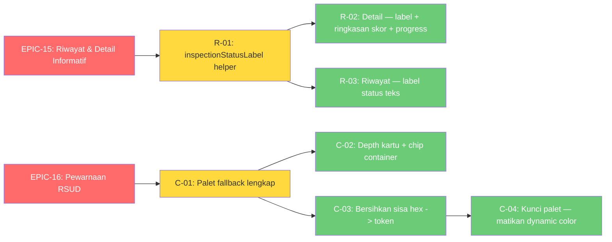

# 📋 Implementation Claim Order — Phase 7-8: Riwayat/Detail Informatif + Pewarnaan RSUD

> **Status Project:** ✅ MVP · Phase 2–6 ✅ | **Phase 7:** ✅ SELESAI (EPIC-15) | **Phase 8:** ✅ SELESAI (EPIC-16)
> **Beads Epic:** `rsud-android-client-ivo` (EPIC-15) · `rsud-android-client-m11` (EPIC-16) — 7 sub-issues
> **Kontrak API:** `docs/android-to-be-api-contract.md` — **TANPA endpoint baru** (semua data existing)
> **Glossary:** [`inspection/CONTEXT.md`](../app/src/main/java/my/id/kentoes/rsudajibarangapp/inspection/CONTEXT.md)

---

## 🎯 Latar Belakang

Dua fase lanjutan dari EPIC-14, hasil sesi grill-with-docs 2026-08:

**Phase 7 (EPIC-15)** — Riwayat & Detail inspeksi kurang informatif: kartu riwayat hanya ikon status (tanpa label teks), detail menampilkan teks mentah `Status: PENDING` + hex keras.
**Phase 8 (EPIC-16)** — Pewarnaan monoton (umpan balik user): kartu putih di atas putih, StatCard/header pakai tint alpha 8% yang wash-out, fallback scheme cuma 6 role → default ungu M3 yang clash, sisa hex keras berserakan.

### Ringkasan Keputusan Grill

| # | Phase | Keputusan |
|---|-------|-----------|
| 1 | 7 | **(c)** Ringkasan skor di detail + label status di riwayat + konsistensi tokens |
| 2 | 7 | Breakdown skor di kartu riwayat DITOLAK — list response hanya punya `detail_count` (N+1 anti-pola) |
| 3 | 7 | Ringkasan skor (Berisiko/Minor/Sesuai + progress proporsi Sesuai) dari `details[].score` — data existing |
| 4 | 7 | `catatan` per item tidak dipakai — kolom BE `inspection_details.catatan` masih pending (ADR-0018 Q2) |
| 5 | 8 | **(a)** Dynamic color tetap + fallback scheme lengkap + depth surfaceContainer + chip container (bukan alpha 8%) |
| 6 | 8 | Palet RSUD: biru (primary) / teal (secondary) / amber hangat (tertiary) + semua container role |
| 7 | 8 | **Kunci palet RSUD** — matikan dynamic color di semua device (konsistensi brand; warna status prediktabel; dark mode tetap sistem) |

---

## 🗺️ Dependency Graph



---

## 📋 Issue List

| ID | Judul | Beads ID | Dependensi | Status | Estimasi |
|----|-------|----------|------------|--------|----------|
| **EPIC-15** | Riwayat & Detail Inspeksi Lebih Informatif (Phase 7) | `rsud-android-client-ivo` | — | ✅ | 80 menit |
| **R-01** | `inspectionStatusLabel()` helper + unit test | `rsud-android-client-ivo.1` | EPIC-15 | ✅ | 15 menit |
| **R-02** | Detail — label status + token colors + ringkasan skor + progress bar | `rsud-android-client-ivo.2` | R-01 | ✅ | 45 menit |
| **R-03** | Riwayat — label status teks di kartu | `rsud-android-client-ivo.3` | R-01 | ✅ | 20 menit |
| **EPIC-16** | Pewarnaan Lebih Kaya + Palet RSUD Terkunci (Phase 8) | `rsud-android-client-m11` | — | ✅ | 115 menit |
| **C-01** | Theme — palet fallback lengkap (tertiary amber + containers) | `rsud-android-client-m11.1` | EPIC-16 | ✅ | 30 menit |
| **C-02** | Depth kartu — surfaceContainerHigh + chip container | `rsud-android-client-m11.2` | C-01 | ✅ | 40 menit |
| **C-03** | Bersihkan sisa hex → token M3 | `rsud-android-client-m11.3` | C-01 | ✅ | 30 menit |
| **C-04** | Kunci palet RSUD — matikan dynamic color | `rsud-android-client-m11.4` | C-03 | ✅ | 15 menit |

---

## 📋 Task Detail

### ✅ R-01: `inspectionStatusLabel()` helper + unit test

**Beads ID:** `rsud-android-client-ivo.1` · **Commit:** `deecb98`

- [x] Helper `String.inspectionStatusLabel()` di `StatusDisplay.kt` (PENDING/APPROVED/REJECTED → label Indonesia)
- [x] `StatusDisplayTest`: mapping + fallback unknown status
- [x] Verifikasi: `testDebugUnitTest` ✅

### ✅ R-02: Detail — label status + token colors + ringkasan skor + progress bar

**Beads ID:** `rsud-android-client-ivo.2` · **Commit:** `deecb98`

- [x] Header: `Status: PENDING` → `inspectionStatusLabel()`; warna keras → token M3 (secondary/error/tertiary)
- [x] Ringkasan skor: `X Berisiko / Y Minor / Z Sesuai` (dari `details[].score`) + `LinearProgressIndicator` proporsi Sesuai + teks "X dari Y item sesuai standar"
- [x] Header card: `surfaceContainerHigh` + chip status berwarna (tint 12%)
- [x] Item detail: score hex → token; card `surfaceContainerHigh`
- [x] Verifikasi: `assembleDebug` + `testDebugUnitTest` ✅

### ✅ R-03: Riwayat — label status teks di kartu

**Beads ID:** `rsud-android-client-ivo.3` · **Commit:** `deecb98`

- [x] `InspectionHistoryCard`: label status teks di samping ikon (`inspectionStatusLabel` + token warna)
- [x] Verifikasi: `assembleDebug` ✅

### ✅ C-01: Theme — palet fallback lengkap

**Beads ID:** `rsud-android-client-m11.1` · **Commit:** `8a09b3b`

- [x] `LightColors`/`DarkColors`: +`tertiary` amber, +secondary/tertiary/error `*Container` + `onXContainer`, +`outline`/`outlineVariant`, +`surfaceContainerLowest…Highest`
- [x] Komentar palet RSUD (seed biru/teal/amber)
- [x] Verifikasi: `assembleDebug` ✅

### ✅ C-02: Depth kartu — surfaceContainerHigh + chip container

**Beads ID:** `rsud-android-client-m11.2` · **Commit:** `8a09b3b`

- [x] Semua card utama → `surfaceContainerHigh` (RoomStatusRow, RoomCard, DraftCard, HistoryCard, ItemCard, detail item)
- [x] `StatCard`: tint alpha 8% → `surfaceContainerHigh` + ikon chip berwarna (tint 12%, radius 12dp)
- [x] Detail header: alpha 8% → `surfaceContainerHigh` + chip status
- [x] Verifikasi: `assembleDebug` ✅

### ✅ C-03: Bersihkan sisa hex → token M3

**Beads ID:** `rsud-android-client-m11.3` · **Commit:** `8a09b3b`

- [x] `ScoreIndicator`: hex `D32F2F/F9A825/388E3C` → token error/tertiary/secondary (`skorColor()` composable)
- [x] Detail item score: hex → token
- [x] `StatusDisplay`: hapus `color` hex → `draftStatusColor()` composable token (fix `DraftCard` + `RecentDraftCard`)
- [x] `OfflineBanner`: `B71C1C` → `error` + `onError`
- [x] Verifikasi: `testDebugUnitTest` + `assembleDebug` ✅

### ✅ C-04: Kunci palet RSUD — matikan dynamic color

**Beads ID:** `rsud-android-client-m11.4` · **Commit:** `1c99073`

- [x] Hapus branch `dynamicLight/DarkColorScheme` + `Build.VERSION_CODES.S` + `LocalContext`
- [x] `RsuAppTheme`: `colorScheme = if (darkTheme) DarkColors else LightColors`
- [x] Dark mode tetap mengikuti sistem
- [x] Verifikasi: `assembleDebug` ✅

---

## 📊 Ringkasan Semua Perubahan

| File | Phase | Commit | Tindakan |
|------|-------|--------|----------|
| `core/model/StatusDisplay.kt` | 7, 8 | deecb98, 8a09b3b | +inspectionStatusLabel, hapus color hex → draftStatusColor |
| `inspection/ui/InspectionDetailScreen.kt` | 7, 8 | deecb98, 8a09b3b | label status + ringkasan skor + progress + chip + tokens |
| `inspection/ui/InspectionListScreen.kt` | 7, 8 | deecb98, 8a09b3b | label status teks + surfaceContainerHigh |
| `app/src/test/.../core/model/StatusDisplayTest.kt` | 7 | deecb98 | ➕ test helper |
| `core/ui/theme/Theme.kt` | 8 | 8a09b3b, 1c99073 | palet lengkap + kunci palet (matikan dynamic color) |
| `dashboard/components/StatCard.kt` | 8 | 8a09b3b | surfaceContainerHigh + ikon chip |
| `dashboard/components/RecentDraftCard.kt` | 8 | 8a09b3b | display.color → draftStatusColor |
| `dashboard/DashboardScreen.kt` | 8 | 8a09b3b | RoomStatusRow surfaceContainerHigh |
| `inspection/components/ItemCard.kt` | 8 | 8a09b3b | surfaceContainerHigh |
| `inspection/components/ScoreIndicator.kt` | 8 | 8a09b3b | hex → token skorColor |
| `inspection/ui/DaftarDrafScreen.kt` | 8 | 8a09b3b | surfaceContainerHigh + draftStatusColor |
| `inspection/ui/components/OfflineBanner.kt` | 8 | 8a09b3b | B71C1C → error/onError |
| `master/ui/MasterDataListScreen.kt` | 8 | 8a09b3b | RoomCard surfaceContainerHigh |

### 📝 Catatan Implementasi

1. **Phase 7:** breakdown skor TIDAK ditambahkan ke kartu riwayat — list response BE hanya punya `detail_count` (tanpa N+1); breakdown hanya di detail (`details[].score`).
2. **Phase 7:** `catatan` per item tidak ditampilkan — kolom BE `inspection_details.catatan` masih pending (ADR-0018 Q2).
3. **Phase 8:** `toStatusDisplay()` (draft) refactor — warna dipindah ke `draftStatusColor()` composable (token M3) karena helper non-composable tidak bisa akses theme.
4. **Phase 8:** kunci palet = hapus branch dynamic color total (bukan cuma flip flag) — kalau ingin Material You kembali, tambah ~5 baris.
5. **Verifikasi:** semua commit `assembleDebug` ✅ · Phase 7 `testDebugUnitTest` ✅ · Phase 8 `testDebugUnitTest` ✅.

---

## 🚦 Cara Claim Issue

```bash
# 1. Baca konteks
graphify query "bagaimana warna & status ditampilkan di riwayat/detail?"
cat app/src/main/java/my/id/kentoes/rsudajibarangapp/core/ui/theme/Theme.kt

# 2. Claim (claim epic dulu, lalu child sesuai dependency)
bd update rsud-android-client-ivo --claim
bd update rsud-android-client-ivo.1 --claim

# 3. Implementasi — ikuti task list

# 4. Verifikasi
./gradlew :app:assembleDebug
./gradlew :app:testDebugUnitTest

# 5. Close
bd update rsud-android-client-ivo.1 --status closed
```

### Prasyarat Claim

- ✅ Sudah baca `CODING-RULES.md` (wajib! file tidak auto-read)
- ✅ Semua dependencies selesai (R-02/R-03 butuh R-01; C-02/C-03 butuh C-01)
- ✅ Paham keputusan palet RSUD (biru/teal/amber, dynamic color OFF)

---

## 🚦 Legend

| Simbol | Arti |
|--------|------|
| 🆕 | Belum dikerjakan |
| 🔄 | Sedang dikerjakan |
| ✅ | Selesai |
| 🔴 P0 | Kritis — core feature |
| 🟡 P1 | Tinggi — enhancement penting |
| 🟢 P2 | Normal — bisa ditunda |
| ⛔ | Blocked (dependensi backend) |
