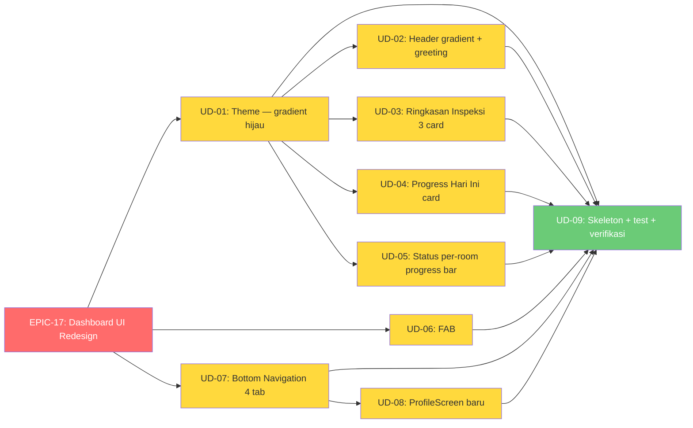

# 📋 Implementation Claim Order — Phase 9: Dashboard UI Redesign (Modern Medical Dashboard)

> **Status Project:** ✅ MVP · Phase 2–8 ✅ | **Phase 9:** 🆕 **BELUM DIMULAI**
> **Beads Epic:** `rsud-android-client-d9k` (EPIC-17) — 9 sub-issues (UD-01 s.d. UD-09)
> **Kontrak API:** `docs/android-to-be-api-contract.md` — **TANPA endpoint baru** (semua data existing)
> **Glossary:** [`inspection/CONTEXT.md`](../app/src/main/java/my/id/kentoes/rsudajibarangapp/inspection/CONTEXT.md)
> **Mockup:** `docs/UI-prd.md` + ChatGPT Image 2026-08-07

---

## 🎯 Latar Belakang

Redesign UI dashboard Android sesuai `docs/UI-prd.md` dan mockup visual. Prinsip:

- **Modern Medical Dashboard** — gradient hijau medis, greeting, progress card, status per-room dengan progress bar
- **Bottom Navigation 4 tab** — Dashboard, Inspeksi, Riwayat, Profil
- **FAB "+ Mulai Inspeksi"** — akses cepat ke form inspeksi
- **TANPA endpoint baru** — semua data existing dari backend (offline-first)

### Fitur Baru (Delta dari Phase 6–8)

| # | Fitur | Status Phase 6–8 |
|---|-------|-------------------|
| 1 | Gradient header dengan greeting "Selamat Datang 👋" + sinkron WIB | ❌ TopAppBar polos |
| 2 | Ringkasan Inspeksi: 3 stat card dalam 1 baris | ⚠️ Layout 2+1 |
| 3 | Progress Hari Ini: linear + circular progress | ❌ Belum ada |
| 4 | Status per-room: progress bar + badge + action button | ⚠️ Tanpa progress bar |
| 5 | FAB "+ Mulai Inspeksi" | ❌ Belum ada |
| 6 | Bottom Navigation 4 tab | ❌ Navigasi flat |
| 7 | ProfileScreen baru | ❌ Belum ada |
| 8 | Skeleton loading | ⚠️ CircularProgressIndicator |

### Keputusan Grill (Phase 9)

| # | Pertanyaan | Keputusan |
|---|-----------|-----------|
| 1 | Ruang lingkup | **(a)** Delta-nya saja — bagian yang belum ada |
| 2 | FAB vs keputusan lama | FAB ditambah untuk akses cepat (override keputusan review 2026-08) |
| 3 | Bottom nav tabs | Dashboard, Inspeksi (room selection), Riwayat (history), Profil (user profile) |
| 4 | Format sinkron | WIB (Asia/Jakarta) — "13:09 WIB" |
| 5 | BE | Tidak butuh kerja baru — semua data existing |

---

## 🗺️ Dependency Graph



> **Aturan:** UD-02 s.d. UD-05 butuh UD-01 (theme dulu). UD-08 butuh UD-07 (bottom nav dulu). UD-09 (verifikasi) hanya bisa di-claim setelah UD-01 s.d. UD-08 selesai.

---

## 📋 Issue List

| ID | Judul | Beads ID | Dependensi | Status | Estimasi |
|----|-------|----------|------------|--------|----------|
| **EPIC-17** | Dashboard UI Redesign — Modern Medical Dashboard (Phase 9) | `rsud-android-client-d9k` | — | 🆕 | 10 jam |
| **UD-01** | Theme — gradient hijau + background #F5FAF7 | `rsud-android-client-d9k.1` | EPIC-17 | 🆕 | 30 menit |
| **UD-02** | Header gradient + greeting + sinkron WIB | `rsud-android-client-d9k.2` | UD-01 | 🆕 | 60 menit |
| **UD-03** | Ringkasan Inspeksi — 3 stat card dalam 1 baris | `rsud-android-client-d9k.3` | UD-01 | 🆕 | 30 menit |
| **UD-04** | Progress Hari Ini — card linear + circular progress | `rsud-android-client-d9k.4` | UD-01 | 🆕 | 60 menit |
| **UD-05** | Status per-room — progress bar + badge + action button | `rsud-android-client-d9k.5` | UD-01 | 🆕 | 90 menit |
| **UD-06** | FAB "+ Mulai Inspeksi" | `rsud-android-client-d9k.6` | EPIC-17 | 🆕 | 30 menit |
| **UD-07** | Bottom Navigation 4 tab | `rsud-android-client-d9k.7` | EPIC-17 | 🆕 | 90 menit |
| **UD-08** | ProfileScreen baru | `rsud-android-client-d9k.8` | UD-07 | 🆕 | 60 menit |
| **UD-09** | Skeleton loading + verifikasi | `rsud-android-client-d9k.9` | UD-01 s.d. UD-08 | 🆕 | 60 menit |

---

## 📋 Task Detail

### 🆕 UD-01: Theme — gradient hijau + background #F5FAF7

**Beads ID:** `rsud-android-client-d9k.1`
**Objective:** Update palet tema untuk mendukung gradient hijau medis sesuai PRD.

#### Task List

- [ ] Update `Theme.kt`: primary = `#16A34A` (medical green), secondary = `#22C55E`
- [ ] Update `Theme.kt`: background = `#F5FAF7` (light green-white)
- [ ] Update `Theme.kt`: success = `#10B981`, warning = `#F59E0B`, danger = `#EF4444`
- [ ] Verifikasi: `./gradlew :app:assembleDebug`

#### Files Changed

| File | Tindakan |
|------|----------|
| `core/ui/theme/Theme.kt` | ✏️ update color palette |

---

### 🆕 UD-02: Header gradient + greeting + sinkron WIB

**Beads ID:** `rsud-android-client-d9k.2` (dependensi: UD-01)
**Objective:** Ganti TopAppBar dengan header gradient hijau.

#### Task List

- [ ] Buat komponen `DashboardHeader` dengan gradient hijau (`#16A34A` → `#22C55E`)
- [ ] Tambah greeting: "Selamat Datang 👋" + nama inspector
- [ ] Tambah status sinkron format WIB: "Sinkron terakhir: 13:09 WIB"
- [ ] Tambah tombol "Keluar" (outlined white)
- [ ] Update `DashboardScreen` untuk pakai header baru
- [ ] Verifikasi: `./gradlew :app:assembleDebug`

#### Files Changed

| File | Tindakan |
|------|----------|
| `dashboard/DashboardScreen.kt` | ✏️ +DashboardHeader, ganti TopAppBar |

---

### 🆕 UD-03: Ringkasan Inspeksi — 3 stat card dalam 1 baris

**Beads ID:** `rsud-android-client-d9k.3` (dependensi: UD-01)
**Objective:** Ganti layout stat card dari 2+1 menjadi 3 dalam 1 baris horizontal.

#### Task List

- [ ] Update `DashboardScreen`: ganti layout stat cards menjadi `Row` dengan 3 `StatCard`
- [ ] StatCard: icon, value, label — warna hijau, kuning, hijau tua
- [ ] Verifikasi: `./gradlew :app:assembleDebug`

#### Files Changed

| File | Tindakan |
|------|----------|
| `dashboard/DashboardScreen.kt` | ✏️ update layout stat cards |

---

### 🆕 UD-04: Progress Hari Ini — card linear + circular progress

**Beads ID:** `rsud-android-client-d9k.4` (dependensi: UD-01)
**Objective:** Widget baru: Progress Hari Ini dengan linear progress bar + circular progress indicator.

#### Task List

- [ ] Buat komponen `ProgressTodayCard`
- [ ] Tampilkan "1 dari X Ruangan" + linear progress bar
- [ ] Tampilkan circular progress di sisi kanan
- [ ] Tampilkan persentase (25%)
- [ ] Data dari `DashboardUiState`: `inspectedRoomCount`, `roomStatuses.size`
- [ ] Verifikasi: `./gradlew :app:assembleDebug`

#### Files Changed

| File | Tindakan |
|------|----------|
| `dashboard/components/ProgressTodayCard.kt` | 🆕 komponen baru |
| `dashboard/DashboardScreen.kt` | ✏️ +ProgressTodayCard |

---

### 🆕 UD-05: Status per-room — progress bar + badge + action button

**Beads ID:** `rsud-android-client-d9k.5` (dependensi: UD-01)
**Objective:** Update kartu status per-room dengan progress bar, status badge berwarna, tombol aksi.

#### Task List

- [ ] Update `RoomStatusRow`: tambah progress bar (LinearProgressIndicator)
- [ ] Tampilkan "X / Y item" di samping progress bar
- [ ] Status badge: Belum Diperiksa (abu), Sedang Diperiksa (kuning), Selesai (hijau)
- [ ] Action button: Mulai (BELUM), Lanjutkan (DRAF/MENUNGGU_KIRIM), Lihat Hasil (lainnya)
- [ ] Ikon ruangan dalam circle hijau
- [ ] Verifikasi: `./gradlew :app:assembleDebug`

#### Files Changed

| File | Tindakan |
|------|----------|
| `dashboard/DashboardScreen.kt` | ✏️ update RoomStatusRow |

---

### 🆕 UD-06: FAB "+ Mulai Inspeksi"

**Beads ID:** `rsud-android-client-d9k.6`
**Objective:** FloatingActionButton untuk akses cepat ke form inspeksi.

#### Task List

- [ ] Tambah `FloatingActionButton` di `DashboardScreen`
- [ ] Label: "+ Mulai Inspeksi"
- [ ] Aksi: navigasi ke room selection (inspection_list)
- [ ] Posisi: bottom right
- [ ] Verifikasi: `./gradlew :app:assembleDebug`

#### Files Changed

| File | Tindakan |
|------|----------|
| `dashboard/DashboardScreen.kt` | ✏️ +FloatingActionButton |

---

### 🆕 UD-07: Bottom Navigation 4 tab

**Beads ID:** `rsud-android-client-d9k.7`
**Objective:** Bottom navigation dengan 4 tab: Dashboard, Inspeksi, Riwayat, Profil.

#### Task List

- [ ] Buat `BottomNavBar` komponen
- [ ] 4 tab: Dashboard (home), Inspeksi (shield), Riwayat (history), Profil (person)
- [ ] Icon: Material Symbols Rounded
- [ ] Integrasi ke `MainActivity` atau `MainScreen` scaffold
- [ ] Update `NavGraph` untuk mendukung bottom navigation
- [ ] Verifikasi: `./gradlew :app:assembleDebug`

#### Files Changed

| File | Tindakan |
|------|----------|
| `core/navigation/BottomNavBar.kt` | 🆕 komponen baru |
| `core/ui/MainActivity.kt` | ✏️ integrasi bottom nav |
| `core/navigation/NavGraph.kt` | ✏️ update untuk bottom nav |

---

### 🆕 UD-08: ProfileScreen baru

**Beads ID:** `rsud-android-client-d9k.8` (dependensi: UD-07)
**Objective:** Buat layar Profil baru untuk tab "Profil" di bottom navigation.

#### Task List

- [ ] Buat `ProfileScreen.kt`
- [ ] Tampilkan nama, username, role dari `AuthRepository`
- [ ] Tambah tombol "Keluar" (logout)
- [ ] Tambah info aplikasi (versi)
- [ ] Wire ke `NavGraph` sebagai tab baru
- [ ] Verifikasi: `./gradlew :app:assembleDebug`

#### Files Changed

| File | Tindakan |
|------|----------|
| `auth/ui/ProfileScreen.kt` | 🆕 layar baru |
| `core/navigation/NavGraph.kt` | ✏️ wire ProfileScreen |

---

### 🆕 UD-09: Skeleton loading + verifikasi

**Beads ID:** `rsud-android-client-d9k.9` (dependensi: UD-01 s.d. UD-08)
**Objective:** Skeleton loading + unit test + verifikasi akhir.

#### Task List

- [ ] Skeleton loading untuk dashboard (bukan CircularProgressIndicator)
- [ ] Update `DashboardViewModelTest` untuk komponen baru
- [ ] Update glossary `inspection/CONTEXT.md` jika ada term baru
- [ ] Verifikasi: `./gradlew :app:assembleDebug` + `./gradlew :app:testDebugUnitTest`

#### Files Changed

| File | Tindakan |
|------|----------|
| `dashboard/DashboardScreen.kt` | ✏️ +skeleton loading |
| `app/src/test/.../DashboardViewModelTest.kt` | ✏️ update test |
| `inspection/CONTEXT.md` | ✏️ update glossary |

---

## 📊 Ringkasan Semua Perubahan

| File | UD | Tindakan |
|------|----|----------|
| `core/ui/theme/Theme.kt` | UD-01 | ✏️ update color palette |
| `dashboard/DashboardScreen.kt` | UD-02,03,05,06,09 | ✏️ header, layout, progress bar, FAB, skeleton |
| `dashboard/components/ProgressTodayCard.kt` | UD-04 | 🆕 komponen baru |
| `core/navigation/BottomNavBar.kt` | UD-07 | 🆕 komponen baru |
| `core/ui/MainActivity.kt` | UD-07 | ✏️ integrasi bottom nav |
| `core/navigation/NavGraph.kt` | UD-07,08 | ✏️ update untuk bottom nav + profile |
| `auth/ui/ProfileScreen.kt` | UD-08 | 🆕 layar baru |
| `app/src/test/.../DashboardViewModelTest.kt` | UD-09 | ✏️ update test |
| `inspection/CONTEXT.md` | UD-09 | ✏️ update glossary |

### 📝 Catatan Implementasi

1. **Phase 9 = delta-nya saja** — bagian yang sudah ada (stat cards, room status, sync bar) tidak disentuh kecuali perlu penyesuaian layout.
2. **FAB override keputusan lama** — keputusan review 2026-08 "tidak ada tombol Inspeksi Baru di dashboard" di-override untuk akses cepat.
3. **Bottom nav** — restrukturisasi navigasi dari flat NavHost menjadi scaffold dengan bottom bar. Tab "Inspeksi" = room selection, "Riwayat" = inspection history.
4. **Format sinkron WIB** — "Terakhir sync: 2026-08-02 07:30" → "Sinkron terakhir: 13:09 WIB" (Asia/Jakarta).
5. **BE tidak berubah** — semua data (draft count, room status, profile) sudah tersedia dari endpoint existing.
6. **Skeleton loading** — ganti CircularProgressIndicator dengan skeleton placeholder untuk UX lebih baik.

---

## 🚦 Cara Claim Issue

```bash
# 1. Baca konteks
graphify query "bagaimana dashboard saat ini dan data yang tersedia?"
cat app/src/main/java/my/id/kentoes/rsudajibarangapp/inspection/CONTEXT.md
cat docs/UI-prd.md

# 2. Claim (claim EPIC-17 dulu, lalu UD-01, dst. sesuai dependency graph)
bd update rsud-android-client-d9k --claim
bd update rsud-android-client-d9k.1 --claim

# 3. Implementasi — ikuti task list

# 4. Verifikasi
./gradlew :app:assembleDebug
./gradlew :app:testDebugUnitTest

# 5. Close
bd update rsud-android-client-d9k.1 --status closed
```

### Prasyarat Claim

- ✅ Sudah baca `CODING-RULES.md` (wajib!)
- ✅ Semua dependencies selesai (UD-02 s.d. UD-05 butuh UD-01; UD-08 butuh UD-07)
- ✅ Paham mockup visual (docs/UI-prd.md + ChatGPT Image)

---

## 🚦 Legend

| Simbol | Arti |
|--------|------|
| 🆕 | Belum dikerjakan |
| 🔄 | Sedang dikerjakan |
| ✅ | Selesai |
| 🔴 P0 | Kritis — core feature |
| 🟡 P1 | Tinggi — enhancement penting |
| 🟢 P2 | Normal — bisa ditunda |
| ⛔ | Blocked (dependensi backend) |
