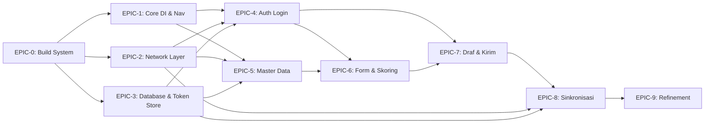

# 📋 Implementation Claim Order — RSUD Ajibarang Android Client

> **Status Project:** Greenfield (0 file Kotlin, hanya dokumentasi)
> **Stack:** Jetpack Compose · Hilt · Room 3.0+ · Retrofit · Proto DataStore + Tink · WorkManager · Coil

---

## 🗺️ Dependency Graph



> **Aturan:** Setiap EPIC hanya bisa di-*claim* setelah semua dependensinya selesai.

---

## 📊 Phase Overview

| Phase | Epic | ID | Priority | Depend On | Estimasi |
|-------|------|----|----------|-----------|----------|
| **0: Foundation** | Modern Android Stack | `EPIC-0` | 🔴 KRITIS | — | 1-2 session |
| **1: Core** | Core DI & Nav | `EPIC-1` | 🔴 KRITIS | EPIC-0 | 1 session |
| **1: Core** | Network Layer | `EPIC-2` | 🔴 KRITIS | EPIC-0 | 1 session |
| **1: Core** | Database & Token | `EPIC-3` | 🔴 KRITIS | EPIC-0 | 1-2 session |
| **2: Auth** | Login & Token Mgmt | `EPIC-4` | 🔴 KRITIS | EPIC-1,2,3 | 1-2 session |
| **3: Inspeksi** | Master Data | `EPIC-5` | 🟠 TINGGI | EPIC-1,2,3 | 1 session |
| **3: Inspeksi** | Form & Skoring | `EPIC-6` | 🟠 TINGGI | EPIC-5 | 2 session |
| **3: Inspeksi** | Draf & Kirim | `EPIC-7` | 🟠 TINGGI | EPIC-6 | 1-2 session |
| **4: Sinkronisasi** | Upload Worker | `EPIC-8` | 🟠 TINGGI | EPIC-7,2,3 | 1-2 session |
| **5: Poles** | Refinement | `EPIC-9` | 🟢 NORMAL | EPIC-8 | 1-2 session |

---

## ✅ Phase 0: Foundation — Build System & Dependencies

### 🔗 Issue: `EPIC-0` ( `rsud-android-client-dpw` )

**Objective:** Setup build system dengan modern Android stack (Jetpack Compose, Hilt, Room 3.0+, KSP).

- [ ] **⬜ Belum di-claim** — Upgrade `gradle/libs.versions.toml` dengan dependencies:
  - Jetpack Compose BOM, Compose UI, Material3, Compose Navigation
  - Hilt (androidx.hilt:hilt-work, hilt-navigation-compose)
  - Room 3.0+ (KSP)
  - Proto DataStore + Tink (`datastore-tink`)
  - Retrofit + OkHttp + kotlinx.serialization converter
  - Coil (Compose integration)
  - Kotlin Serialization plugin
  - Kotlin Compose compiler plugin
  - KSP plugin
- [ ] **⬜ Belum di-claim** — Update `build.gradle.kts` root: plugins + classpath
- [ ] **⬜ Belum di-claim** — Update `app/build.gradle.kts`: apply semua plugin, `buildFeatures { compose = true }`
- [ ] **⬜ Belum di-claim** — Setup minSdk 24, targetSdk 36, compileSdk 36
- [ ] **⬜ Belum di-claim** — Konfigurasi Kotlin Compiler Extension version
- [ ] **⬜ Belum di-claim** — Setup `gradle.properties` (Jetpack Compose opt-in, kotlin code style)
- [ ] **⬜ Belum di-claim** — Verifikasi project build sukses

> **Setelah selesai:** 🟢 Claim `EPIC-1`, `EPIC-2`, `EPIC-3` (parallel — tidak ada blocking)

---

## ✅ Phase 1: Core Infrastructure

### 🔗 Issue: `EPIC-1` — Core: DI & Navigation ( `rsud-android-client-9m3` )

**Objective:** App class, Hilt modules, UiState models, NavHost, theme.

- [ ] **⬜ Belum di-claim** — Buat `App.kt`: `@HiltAndroidApp`
- [ ] **⬜ Belum di-claim** — Buat `model/UiState.kt`: `sealed class UiState<T> { Loading, Success, Error }`
- [ ] **⬜ Belum di-claim** — Buat `navigation/NavGraph.kt`: NavHost routing (placeholder screens)
- [ ] **⬜ Belum di-claim** — Buat `ui/theme/Theme.kt`: Compose theme (Material3 + typography + colors)
- [ ] **⬜ Belum di-claim** — Buat `ui/components/` base composables (Button, TextField, Card, LoadingIndicator)

> **Catatan:** DI Modules (`NetworkModule`, `DatabaseModule`, `DataStoreModule`) akan dibuat di EPIC-2 dan EPIC-3 bersama instance yang mereka provide.

**Depends on:** `EPIC-0`

### 🔗 Issue: `EPIC-2` — Core: Network Layer ( `rsud-android-client-5xd` )

**Objective:** Retrofit + OkHttp interceptor chain dengan auto-refresh token.

- [ ] **⬜ Belum di-claim** — Setup `OkHttpClient` dengan logging interceptor (debug only)
- [ ] **⬜ Belum di-claim** — Setup `Retrofit` instance dengan kotlinx.serialization converter
- [ ] **⬜ Belum di-claim** — Buat `di/NetworkModule.kt`: provide OkHttpClient + Retrofit + ApiServices
- [ ] **⬜ Belum di-claim** — Buat `network/AuthInterceptor.kt`: tambah `Authorization: Bearer` header
- [ ] **⬜ Belum di-claim** — Buat `network/TokenAuthenticator.kt`: auto-refresh 401 → retry
- [ ] **⬜ Belum di-claim** — Buat `network/ApiResponse.kt`: base response wrapper (jika backend punya envelope)
- [ ] **⬜ Belum di-claim** — Setup timeouts + retry policy
- [ ] **⬜ Belum di-claim** — Setup `BuildConfig` untuk BASE_URL (debug vs release)

**Depends on:** `EPIC-0`

### 🔗 Issue: `EPIC-3` — Core: Database, Token Storage ( `rsud-android-client-b7p` )

**Objective:** Room database (master data + draf) + Proto DataStore Tink (token).

- [ ] **⬜ Belum di-claim** — Setup `AppDatabase.kt`: Room database class (KSP)
- [ ] **⬜ Belum di-claim** — Buat `di/DatabaseModule.kt`: provide AppDatabase + DAOs
- [ ] **⬜ Belum di-claim** — Buat `di/DataStoreModule.kt`: provide DataStore + TokenManager
- [ ] **⬜ Belum di-claim** — Buat entity: `MasterDataItem`, `RoomEntity`
- [ ] **⬜ Belum di-claim** — Buat entity: `DrafInspeksi` (header), `DrafItem` (line items), `DrafFoto` (path foto lokal)
- [ ] **⬜ Belum di-claim** — Buat DAOs: `MasterDataDao`, `DrafDao`
- [ ] **⬜ Belum di-claim** — Buat `TypeConverters.kt` untuk List<String>
- [ ] **⬜ Belum di-claim** — Setup Proto schema `token.proto` untuk Access/Refresh Token
- [ ] **⬜ Belum di-claim** — Buat `TokenManager.kt`: save, read, clear, isLoggedIn
- [ ] **⬜ Belum di-claim** — Setup kunci enkripsi Tink dengan Android Keystore

**Depends on:** `EPIC-0`

---

## ✅ Phase 2: Authentication

### 🔗 Issue: `EPIC-4` — Auth: Login & Token Management ( `rsud-android-client-o0v` )

**Objective:** Login screen, JWT token management, auto-refresh, force logout.

- [ ] **⬜ Belum di-claim** — Buat `api/AuthApi.kt`: `POST /login`, `POST /refresh`, `POST /logout`
- [ ] **⬜ Belum di-claim** — Buat `AuthRepository.kt`: login → save token → state
- [ ] **⬜ Belum di-claim** — Buat `AuthViewModel.kt`: login logic, loading, error
- [ ] **⬜ Belum di-claim** — Buat `LoginScreen.kt` (Compose): form username + password + tombol login
- [ ] **⬜ Belum di-claim** — Implementasi `AuthState` (StateFlow): Authenticated / Unauthenticated / Loading
- [ ] **⬜ Belum di-claim** — Integrasi AuthState ke NavGraph (redirect login ↔ home)
- [ ] **⬜ Belum di-claim** — Implementasi TokenAuthenticator (auto-refresh dulu dari EPIC-2)
- [ ] **⬜ Belum di-claim** — Implementasi Force Logout: clear semua token + data
- [ ] **⬜ Belum di-claim** — Handle error login: InvalidCredentials, NetworkError, ServerError

**Depends on:** `EPIC-1`, `EPIC-2`, `EPIC-3`

---

## ✅ Phase 3: Inspeksi

### 🔗 Issue: `EPIC-5` — Master Data Download ( `rsud-android-client-v2h` )

**Objective:** Download & cache daftar item kebersihan dan ruangan ke lokal.

- [ ] **⬜ Belum di-claim** — Buat `api/MasterDataApi.kt`: `GET /master/items`, `GET /master/rooms`
- [ ] **⬜ Belum di-claim** — Buat `MasterDataRepository.kt`: fetch → cache ke Room → fallback cache
- [ ] **⬜ Belum di-claim** — Buat `MasterDataViewModel.kt`: expose StateFlow items + rooms
- [ ] **⬜ Belum di-claim** — Buat `ItemKebersihan` model (data murni, immutable)
- [ ] **⬜ Belum di-claim** — Buat `Ruang` model (data ruangan)
- [ ] **⬜ Belum di-claim** — Implementasi cache freshness + periodic refresh
- [ ] **⬜ Belum di-claim** — Tampilkan loading screen saat pertama kali download

**Depends on:** `EPIC-1`, `EPIC-2`, `EPIC-3`

### 🔗 Issue: `EPIC-6` — Dynamic Form, Scoring & Photo ( `rsud-android-client-bcx` )

**Objective:** Form inspeksi dinamis dengan scoring 0/1/2 dan bukti foto.

- [ ] **⬜ Belum di-claim** — Buat `ItemState.kt`: skor, fotoPaths, catatan, computed `isValid`
- [ ] **⬜ Belum di-claim** — Buat `InspectionFormViewModel.kt`: single source of truth UDF
- [ ] **⬜ Belum di-claim** — Buat `InspectionFormScreen.kt` (Compose + LazyColumn)
- [ ] **⬜ Belum di-claim** — Buat `ItemCard.kt` composable: nama item + radio 0/1/2 + foto area
- [ ] **⬜ Belum di-claim** — Buat `ScoreIndicator.kt` composable: 3 radio button dengan label + warna
- [ ] **⬜ Belum di-claim** — Implementasi camera capture via `MediaStore.ACTION_IMAGE_CAPTURE`
- [ ] **⬜ Belum di-claim** — Implementasi permission request CAMERA runtime
- [ ] **⬜ Belum di-claim** — Buat `PhotoThumbnail.kt` composable (Coil AsyncImage + tombol hapus)
- [ ] **⬜ Belum di-claim** — Implementasi validasi: skor 0 → wajib minimal 1 foto
- [ ] **⬜ Belum di-claim** — Implementasi re-validasi saat skor berubah (foto tetap)
- [ ] **⬜ Belum di-claim** — Implementasi multi-foto per item (unlimited)
- [ ] **⬜ Belum di-claim** — Tombol Simpan Draf (incomplete allowed)
- [ ] **⬜ Belum di-claim** — Tombol Kirim (semua item harus valid)

**Depends on:** `EPIC-5`

### 🔗 Issue: `EPIC-7` — Draf & Pengiriman ( `rsud-android-client-rrj` )

**Objective:** Simpan draf ke Room, siapkan payload untuk dikirim Sync.

- [ ] **⬜ Belum di-claim** — Buat `InspectionRepository.kt`: simpan draf, load draf, prepare kirim
- [ ] **⬜ Belum di-claim** — Simpan draf: DrafInspeksi + DrafItem + DrafFoto ke Room
- [ ] **⬜ Belum di-claim** — Generate `local_timestamp` (UTC ISO 8601) saat draf dibuat
- [ ] **⬜ Belum di-claim** — Implementasi idempotency key `(room_id, local_timestamp, inspector_id)`
- [ ] **⬜ Belum di-claim** — Load + resume draf yang belum terkirim
- [ ] **⬜ Belum di-claim** — Implementasi preparePengiriman: mapping ItemState → JSON payload
- [ ] **⬜ Belum di-claim** — Hapus draf lokal setelah kirim sukses
- [ ] **⬜ Belum di-claim** — Buat `DaftarDrafScreen.kt`: daftar draf tersimpan
- [ ] **⬜ Belum di-claim** — Implementasi hapus draf manual

**Depends on:** `EPIC-6`

---

## ✅ Phase 4: Synchronization

### 🔗 Issue: `EPIC-8` — Kompresi Gambar & Pengiriman ( `rsud-android-client-etl` )

**Objective:** Kompresi gambar (max 300KB) + WorkManager two-step upload.

- [ ] **⬜ Belum di-claim** — Implementasi `ImageCompressor.kt`: resize + turunkan kualitas hingga ~300KB
- [ ] **⬜ Belum di-claim** — Buat `SyncWorker.kt` (`@HiltWorker`): entry point WorkManager
- [ ] **⬜ Belum di-claim** — Konfigurasi WorkManager: hapus default initializer dari AndroidManifest
- [ ] **⬜ Belum di-claim** — Setup `Configuration.Provider` di App.kt (`HiltWorkerFactory`)
- [ ] **⬜ Belum di-claim** — Set WorkManager constraint: `Network.CONNECTED`
- [ ] **⬜ Belum di-claim** — Step 1: upload foto terkompresi via Multipart → dapatkan nama file
- [ ] **⬜ Belum di-claim** — Step 2: kirim JSON inspeksi + nama file ke endpoint
- [ ] **⬜ Belum di-claim** — Implementasi `SyncManager.kt`: orchestrasi sync flow
- [ ] **⬜ Belum di-claim** — Implementasi retry policy + exponential backoff
- [ ] **⬜ Belum di-claim** — Hapus draf dari Room setelah 200 OK
- [ ] **⬜ Belum di-claim** — Notifikasi hasil sync (success / failure via NotificationManager)
- [ ] **⬜ Belum di-claim** — Handle partial failure (sebagian foto gagal upload)

**Depends on:** `EPIC-7` (data draf), `EPIC-2` (network), `EPIC-3` (token + database)

---

## ✅ Phase 5: Refinement

### 🔗 Issue: `EPIC-9` — Error Handling & Polish ( `rsud-android-client-b72` )

**Objective:** UX polish, error handling, testing, release readiness.

- [ ] **⬜ Belum di-claim** — Global error handler (Snackbar / Dialog)
- [ ] **⬜ Belum di-claim** — Loading state di semua screen (Shimmer / CircularProgressIndicator)
- [ ] **⬜ Belum di-claim** — Empty state di DaftarDrafScreen
- [ ] **⬜ Belum di-claim** — Pull-to-refresh di master data & daftar draf
- [ ] **⬜ Belum di-claim** — Network connectivity observer (ConnectivityManager)
- [ ] **⬜ Belum di-claim** — Offline banner saat tidak ada koneksi
- [ ] **⬜ Belum di-claim** — ConfirmationDialog untuk hapus draf
- [ ] **⬜ Belum di-claim** — Optimasi recomposition (derivedStateOf, keys)
- [ ] **⬜ Belum di-claim** — ProGuard / R8 rules (`rules.keep`)
- [ ] **⬜ Belum di-claim** — Unit test: AuthViewModel, InspectionFormViewModel
- [ ] **⬜ Belum di-claim** — Unit test: InspectionRepository, MasterDataRepository
- [ ] **⬜ Belum di-claim** — Instrumented test: Room DAOs
- [ ] **⬜ Belum di-claim** — WorkManager test: SyncWorker
- [ ] **⬜ Belum di-claim** — Validasi idempotency test
- [ ] **⬜ Belum di-claim** — Final code review: blast radius via GitNexus

**Depends on:** `EPIC-8`

---

## 📝 Cara Claim Issue

Setiap agent yang ingin mengerjakan task WAJIB mengikuti protokol ini:

```bash
# 1. BACA CODING-RULES.md dulu (langkah #0 WAJIB)
# 2. LALU:
bd update <issue-id> --claim          # Claim issue

# 3. Setelah claim, ikuti workflow:
#    a. graphify query untuk pahami arsitektur
#    b. skill("context7-mcp") untuk dokumentasi library
#    c. impact() untuk analisis dampak
#    d. Implementasi kode
#    e. bd update <issue-id> --status done  # Tandai selesai
```

### Prasyarat Claim

- ✅ Sudah baca `CODING-RULES.md` (wajib! file tidak auto-read)
- ✅ Semua EPIC dependencies sudah selesai (✅ di checklist)
- ✅ Paham vocabulary CONTEXT.md terkait

### Contoh Claim Flow

```bash
# Claim EPIC-0:
bd update rsud-android-client-dpw --claim

# Setelah selesai implementasi:
bd update rsud-android-client-dpw --status done

# Lanjut claim EPIC-1, EPIC-2, EPIC-3 (parallel):
bd update rsud-android-client-9m3 --claim
bd update rsud-android-client-5xd --claim
bd update rsud-android-client-b7p --claim
```

---

## 🚦 Legend

| Simbol | Arti |
|--------|------|
| 🔴 KRITIS | Blocker untuk semua epic lain |
| 🟠 TINGGI | Core feature, harus selesai untuk MVP |
| 🟢 NORMAL | Bisa ditunda, untuk polish |
| ⬜ | Belum dikerjakan |
| 🔄 | Sedang dikerjakan (claimed) |
| ✅ | Selesai |
