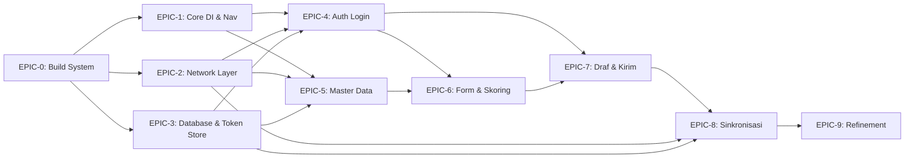

# 📋 Implementation Claim Order — RSUD Ajibarang Android Client

> **Status Project:** ✅ **MVP SELESAI** — EPIC-0 s.d. EPIC-9 completed. All features implemented: build system, DI & navigation, network layer, database & token storage, auth login, master data sync, dynamic form & scoring, camera capture, draft management, WorkManager sync
> **Stack:** Jetpack Compose · Hilt · Room 3.0+ · Retrofit · Proto DataStore · WorkManager · Coil
> **ADR Compliance:** ADR-0001 (multi-module) ✅ **Full Compliance**. ADR-0002 (Tink encryption) ✅ **Full Compliance** — `datastore-tink` native (`AeadSerializer`) + Android Keystore via `AndroidKeysetManager`. Enkripsi transparan di layer DataStore.

---

## 🗺️ Dependency Graph



> **Aturan:** Setiap EPIC hanya bisa di-*claim* setelah semua dependensinya selesai.

---

## 📋 ADR Compliance

Ringkasan kepatuhan implementasi terhadap Architectural Decision Records.

| ADR | Judul | Status | Keterangan |
|-----|-------|--------|------------|
| `ADR-0001` | Multi-Module Architecture | ✅ **Full Compliance** | 6 modules: `:app`, `:feature:auth`, `:feature:inspection`, `:core:network`, `:core:datastore`, `:core:model`. Circular deps resolved via `TokenProvider` + `TokenRefreshHandler` interfaces di `:core:model`. Hilt multi-module dengan `@InstallIn(SingletonComponent)`. |
| `ADR-0002` | Proto DataStore + Tink Token Storage | ✅ **Full Compliance** | `DataStoreModule` menggunakan `datastore-tink` native (`AeadSerializer` + `DataStoreFactory`) untuk enkripsi transparan di layer DataStore. Tink AEAD (`AES256_GCM`) + Android Keystore via `AndroidKeysetManager`. `TokenManager` membaca/menulis `TokenData` biasa — enkripsi otomatis oleh `AeadSerializer`. |
| `ADR-0003` | Offline-First Inspection Submission | ✅ **Diikuti** | Room local storage + WorkManager sync dua langkah (upload foto → submit JSON) sesuai ADR. |
| `ADR-0004` | Jetpack Compose Modern Stack | ✅ **Diikuti** | Compose, Hilt, kotlinx.serialization, Coil, Compose Navigation — semua sesuai. |

> **Catatan:** ADR compliance diperiksa otomatis saat commit ([lihat CODING-RULES.md > Checklist Sebelum Commit](../CODING-RULES.md)).

---

## 📊 Phase Overview

| Phase | Epic | ID | Priority | Depend On | Status | Estimasi |
|-------|------|----|----------|-----------|--------|----------|
| **0: Foundation** | Modern Android Stack | `EPIC-0` | 🔴 KRITIS | — | ✅ **Selesai** | 1-2 session |
| **1: Core** | Core DI & Nav | `EPIC-1` | 🔴 KRITIS | EPIC-0 | ✅ **Selesai** | 1 session |
| **1: Core** | Network Layer | `EPIC-2` | 🔴 KRITIS | EPIC-0 | ✅ **Selesai** | 1 session |
| **1: Core** | Database & Token | `EPIC-3` | 🔴 KRITIS | EPIC-0 | ✅ **Selesai** | 1-2 session |
| **2: Auth** | Login & Token Mgmt | `EPIC-4` | 🔴 KRITIS | EPIC-1,2,3 | ✅ **Selesai** | 1-2 session |
| **3: Inspeksi** | Master Data | `EPIC-5` | 🟠 TINGGI | EPIC-1,2,3 | ✅ **Selesai** | 1 session |
| **3: Inspeksi** | Form & Skoring | `EPIC-6` | 🟠 TINGGI | EPIC-5 | ✅ **Selesai** | 2 session |
| **3: Inspeksi** | Draf & Kirim | `EPIC-7` | 🟠 TINGGI | EPIC-6 | ✅ **Selesai** | 1-2 session |
| **4: Sinkronisasi** | Upload Worker | `EPIC-8` | 🟠 TINGGI | EPIC-7,2,3 | ✅ **Selesai** | 1-2 session |
| **5: Poles** | Refinement | `EPIC-9` | 🟢 NORMAL | EPIC-8 | ✅ **Selesai** | 1-2 session |

---

## ✅ Phase 0: Foundation — Build System & Dependencies

### 🔗 Issue: `EPIC-0` ( `rsud-android-client-dpw` ) — ✅ Selesai

**Objective:** Setup build system dengan modern Android stack (Jetpack Compose, Hilt, Room 3.0+, KSP).

- [x] ✅ Upgrade `gradle/libs.versions.toml` dengan semua dependencies:
  - Jetpack Compose BOM (`2026.06.01`), Compose UI, Material3, Compose Navigation
  - Hilt (`2.60.1`: `hilt-work`, `hilt-navigation-compose`)
  - Room 3.0 (`3.0.0` via KSP, pkg `androidx.room3.*`)
  - Proto DataStore (`1.2.1`) + Tink (`datastore-tink:1.3.0-alpha09`)
  - Retrofit (`3.0.0`) + OkHttp (`5.4.0`) + kotlinx.serialization converter
  - Coil (`2.7.0`, Compose integration)
  - Kotlin Serialization plugin (`1.11.0`)
  - Kotlin Compose compiler plugin (`2.4.10`)
  - KSP plugin (`2.3.10`)
- [x] ✅ Update `build.gradle.kts` root: plugins + classpath
- [x] ✅ Update `app/build.gradle.kts`: apply semua plugin, `buildFeatures { compose = true }`
- [x] ✅ Setup minSdk 24, targetSdk 36, compileSdk 37
- [x] ✅ Konfigurasi Kotlin Compiler Extension (via `kotlin-compose` plugin)
- [x] ✅ Setup `gradle.properties` (parallel build, caching, disallowKotlinSourceSets)
- [x] ✅ Verifikasi compatibility AGP 9 built-in Kotlin + KSP 2.3.10 (disallowKotlinSourceSets=true, Kotlin 2.4.10)
- [x] ✅ Verifikasi project build sukses (`./gradlew :app:assembleDebug`)

> **Setelah selesai:** 🟢 Claim `EPIC-2`, `EPIC-3` (parallel — tidak ada blocking)

---

## ✅ Phase 1: Core Infrastructure

### 🔗 Issue: `EPIC-1` — Core: DI & Navigation ( `rsud-android-client-9m3` ) — ✅ Selesai

**Objective:** App class, Hilt modules, UiState models, NavHost, theme.

- [x] ✅ Buat `App.kt`: `@HiltAndroidApp` + `Configuration.Provider` (HiltWorkerFactory)
- [x] ✅ Buat `core/model/UiState.kt`: `sealed class UiState<T> { Loading, Success, Error }`
- [x] ✅ Buat `core/navigation/NavGraph.kt`: NavHost routing (4 placeholder screens)
- [x] ✅ Buat `core/ui/theme/Theme.kt`: Compose theme (Material3 + dynamic colors)
- [x] ✅ Buat `core/ui/MainActivity.kt`: `@AndroidEntryPoint`, edge-to-edge, setContent
- [x] ✅ Buat `core/ui/components/` base composables: AppButton, AppTextField, AppCard, LoadingIndicator
- [x] ✅ Update AndroidManifest: App class, INTERNET permission, remove default WorkManager initializer, MainActivity

> **Catatan:** DI Modules (`NetworkModule`, `DatabaseModule`, `DataStoreModule`) akan dibuat di EPIC-2 dan EPIC-3 bersama instance yang mereka provide.

**Depends on:** `EPIC-0`

### 🔗 Issue: `EPIC-2` — Core: Network Layer ( `rsud-android-client-5xd` ) — ✅ Selesai

**Objective:** Retrofit + OkHttp interceptor chain dengan auto-refresh token.

- [x] ✅ Setup `OkHttpClient` dengan logging interceptor (debug only)
- [x] ✅ Setup `Retrofit` instance dengan kotlinx.serialization converter
- [x] ✅ Buat `di/NetworkModule.kt`: provide OkHttpClient + Retrofit + Json
- [x] ✅ ~~`network/TokenProvider.kt`~~ (dihapus — interface dengan 1 implementasi adalah yagni)
- [x] ✅ Buat `network/AuthInterceptor.kt`: tambah `Authorization: Bearer` header (skip login/refresh)
- [x] ✅ Buat `network/TokenAuthenticator.kt`: auto-refresh 401 → retry (anti race condition)
- [x] ✅ Buat `network/ApiResponse.kt`: base response wrapper `{ success, message, data }`
- [x] ✅ Setup timeouts (15s connect/read/write) + retry policy
- [x] ✅ Setup `BuildConfig` untuk BASE_URL (debug vs release via buildConfigField)

**Depends on:** `EPIC-0`

> **Catatan:** `ApiServices` (interface Retrofit untuk endpoint spesifik) akan dibuat per-module di EPIC masing-masing (AuthApi di EPIC-4, MasterDataApi di EPIC-5, dll). Hanya infrastructure network yang disediakan di EPIC-2.

### 🔗 Issue: `EPIC-3` — Core: Database, Token Storage ( `rsud-android-client-b7p` ) — ✅ Selesai

**Objective:** Room database (master data + draf) + Proto DataStore (token).

- [x] ✅ Setup `AppDatabase.kt`: Room database class (KSP) — 5 entities
- [x] ✅ Buat `di/DatabaseModule.kt`: provide AppDatabase + DAOs
- [x] ✅ Buat `di/DataStoreModule.kt`: provide DataStore + TokenManager
- [x] ✅ Buat entity: `MasterDataItem`, `RuangEntity`
- [x] ✅ Buat entity: `DrafInspeksi` (header), `DrafItem` (line items), `DrafFoto` (path foto lokal)
- [x] ✅ Buat DAOs: `MasterDataDao`, `DrafDao`
- [x] ✅ ~~`TypeConverters.kt`~~ (dihapus — file kosong)
- [x] ✅ Buat `TokenManager.kt`: save, read, clear, isLoggedIn (enkripsi otomatis via `datastore-tink` + `AeadSerializer`)
- [x] ✅ Setup DataStore + Tink AEAD via `datastore-tink` native
  > **✅ ADR-0002 Full Compliance:** `DataStoreModule` menggunakan `AeadSerializer` + `DataStoreFactory` untuk enkripsi transparan. Tink AEAD (`AES256_GCM`) dengan Android Keystore.

**Depends on:** `EPIC-0`

---

## ✅ Phase 2: Authentication

### 🔗 Issue: `EPIC-4` — Auth: Login & Token Management ( `rsud-android-client-o0v` ) — ✅ Selesai

**Objective:** Login screen, JWT token management, auto-refresh, force logout.

- [x] ✅ Buat `api/AuthApi.kt`: `POST /login`, `POST /refresh`, `POST /logout` — Retrofit interface
- [x] ✅ Buat `AuthRepository.kt`: login → save token → `AuthState` (StateFlow)
- [x] ✅ Buat `AuthViewModel.kt`: login logic, loading, error, `LoginUiState`
- [x] ✅ Buat `LoginScreen.kt` (Compose): form username + password + tombol login + error snackbar
- [x] ✅ Implementasi `AuthState` (StateFlow): Authenticated / Unauthenticated / Loading
- [x] ✅ Integrasi AuthState ke NavGraph (redirect login ↔ home via LaunchedEffect)
- [x] ✅ Integrasi TokenAuthenticator dengan AuthRepository (auto-refresh 401 → retry)
- [x] ✅ Implementasi Force Logout: clear token + redirect ke login
- [x] ✅ Handle error login: InvalidCredentials, NetworkError, ServerError (via UiState)

**Depends on:** `EPIC-1`, `EPIC-2`, `EPIC-3`

---

## ✅ Phase 3: Inspeksi

### 🔗 Issue: `EPIC-5` — Master Data Download ( `rsud-android-client-v2h` ) — ✅ Selesai

**Objective:** Download & cache daftar item kebersihan dan ruangan ke lokal.

- [x] ✅ Buat `api/MasterDataApi.kt`: `GET /master/items`, `GET /master/rooms` — Retrofit interface + `@Serializable` DTOs
- [x] ✅ Buat `MasterDataRepository.kt`: fetch → cache ke Room → Flow reaktif + `MasterDataSyncState`
- [x] ✅ Buat `MasterDataViewModel.kt`: `MasterDataUiState` (items, rooms, groupedItems), auto-sync saat cache kosong, pull-to-refresh
- [x] ✅ Buat `master/ui/MasterDataListScreen.kt` (Compose): daftar ruangan + `PullToRefreshBox` + loading/empty states + snackbar
- [x] ✅ Integrasi ke `NavGraph.kt`: `INSPECTION_LIST` → `MasterDataListScreen`, navigasi ke form inspeksi dengan roomId & roomName
- [x] ✅ Register `MasterDataApi` di `NetworkModule.kt`
- [x] ✅ Implementasi loading screen saat pertama kali download (isi cache kosong → sync otomatis dari API)

**Depends on:** `EPIC-1`, `EPIC-2`, `EPIC-3`

> **Catatan:** Cache freshness + periodic refresh belum diimplementasi — untuk MVP pull-to-refresh manual sudah cukup. Entity Room (`MasterDataItem`, `RuangEntity`) sudah dibuat di EPIC-3 dan digunakan langsung oleh Repository.

### 🔗 Issue: `EPIC-6` — Dynamic Form, Scoring & Photo ( `rsud-android-client-bcx` ) — ✅ Selesai

**Objective:** Form inspeksi dinamis dengan scoring 0/1/2 dan bukti foto.

- [x] ✅ Buat `ItemState.kt`: skor (-1/0/1/2), fotoPaths (List), catatan, computed `isValid`
- [x] ✅ Buat `InspectionFormViewModel.kt` (AndroidViewModel + Hilt): UDF itemStates map, skor/photo/catatan updates, saveDraft (DRAFT), submit (PENDING_SYNC)
- [x] ✅ Buat `InspectionFormScreen.kt` (Compose + LazyColumn): grouped by kategori, camera permission, TakePicture, progress bar, actions
- [x] ✅ Buat `ItemCard.kt` composable: nama item + deskripsi + ScoreIndicator + foto FlowRow + catatan
- [x] ✅ Buat `ScoreIndicator.kt` composable: 3 FilterChip — Berisiko (merah), Minor (kuning), Sesuai (hijau) + toggle
- [x] ✅ Buat `CameraHelper.kt`: FileProvider URI + photo file management
- [x] ✅ Buat `PhotoThumbnail.kt` composable: Coil AsyncImage + tombol hapus overlay
- [x] ✅ Implementasi validasi: skor 0 → wajib minimal 1 foto (`isValid`)
- [x] ✅ Implementasi re-validasi saat skor berubah (foto tetap, `copy(skor = skor)`)
- [x] ✅ Implementasi multi-foto per item (unlimited via FlowRow)
- [x] ✅ Tombol Simpan Draf (incomplete allowed — skor -1 tetap bisa simpan)
- [x] ✅ Tombol Kirim (semua item harus valid — `submitEnabled = valid == total`)
- [x] ✅ Setup CAMERA permission di AndroidManifest.xml (`required=false`)
- [x] ✅ Setup FileProvider + `res/xml/file_paths.xml`
- [x] ✅ Integrasi ke `NavGraph.kt`: `INSPECTION_FORM` → `InspectionFormScreen`

**Depends on:** `EPIC-5`

> **Catatan:** Camera state bisa loss saat config change (rotation) — untuk MVP acceptable. `saveDraft()` dan `submit()` memiliki duplikasi kode yang bisa diekstrak nanti.

### 🔗 Issue: `EPIC-7` — Draf & Pengiriman ( `rsud-android-client-rrj` ) — ✅ Selesai

**Objective:** Simpan draf ke Room, siapkan payload untuk dikirim Sync.

- [x] ✅ Buat `InspectionRepository.kt`: CRUD draft, `DraftSummary` Flow (dengan nama ruangan via join), `DraftWithItems`, `InspectionPayload`
- [x] ✅ Simpan draf ke Room: `DrafInspeksi` + `DrafItem` + `DrafFoto` (via `InspectionFormViewModel.saveDraft()`)
- [x] ✅ Generate `local_timestamp` UTC ISO 8601 (`SimpleDateFormat("yyyy-MM-dd'T'HH:mm:ss'Z'")`)
- [x] ✅ Implementasi resume draft: `draftToItemStates()` load skor, foto, catatan dari DB + restore roomId
- [x] ✅ Implementasi preparePengiriman: `preparePayload()` mapping Room entities → `InspectionPayload` (itemId, skor, catatan, fotoPaths)
- [x] ✅ Hapus draf lokal via `deleteDraft()` (CASCADE FK hapus item & foto otomatis)
- [x] ✅ Buat `DaftarDrafScreen.kt`: daftar draf dengan status visual (DRAFT/PENDING_SYNC/SYNCED), empty state
- [x] ✅ Implementasi hapus draf manual: confirm dialog + loading indicator
- [x] ✅ Update status draf: `DRAFT` → `PENDING_SYNC` → `SYNCED` via `updateStatus()`
- [x] ✅ Integrasi ke `NavGraph.kt`: route `?draftId={draftId}`, resume navigasi dari DaftarDrafScreen ke InspectionFormScreen

**Depends on:** `EPIC-6`

---

## ✅ Phase 4: Synchronization

### 🔗 Issue: `EPIC-8` — Kompresi Gambar & Pengiriman ( `rsud-android-client-etl` ) — ✅ Selesai

**Objective:** Kompresi gambar (max 300KB) + WorkManager two-step upload.

- [x] ✅ Implementasi `ImageCompressor.kt`: resize (max 1920px) + kompresi JPEG progresif hingga ~300KB, cache di cacheDir
- [x] ✅ Buat `sync/api/SyncApi.kt`: `@Multipart POST upload/photo` + `POST inspection/submit` dengan `@Serializable` DTOs
- [x] ✅ Buat `SyncWorker.kt` (`@HiltWorker`): entry point WorkManager dengan `enqueue()` static method
- [x] ✅ Konfigurasi WorkManager: hapus default initializer dari AndroidManifest (sudah EPIC-1)
- [x] ✅ Setup `Configuration.Provider` di App.kt (`HiltWorkerFactory`) (sudah EPIC-1)
- [x] ✅ Set WorkManager constraint: `Network.CONNECTED`, `BackoffPolicy.EXPONENTIAL` (30s)
- [x] ✅ Step 1: kompres foto → upload via Multipart → dapatkan `file_name` dari server
- [x] ✅ Step 2: kirim JSON `SubmitInspectionRequest` + daftar nama file ke endpoint
- [x] ✅ Buat `SyncManager.kt`: orchestrasi sync flow — `syncAllPending()` (load PENDING_SYNC dari DrafDao) + `syncSingleDraft()` (kompres → upload foto → submit → update status → hapus)
- [x] ✅ Implementasi retry policy: `ExistingWorkPolicy.REPLACE`, `BackoffPolicy.EXPONENTIAL`, auto-retry di `doWork()`
- [x] ✅ Hapus draf dari Room setelah 200 OK (`deleteDraft()` via CASCADE FK)
- [x] ✅ Notifikasi hasil sync: notification channel + success/failure notification via `NotificationManager`
- [x] ✅ Handle partial failure: foto gagal upload tetap lanjut (item dikirim tanpa foto tersebut)
- [x] ✅ Register `SyncApi` di `NetworkModule.kt`

**Depends on:** `EPIC-7` (data draf), `EPIC-2` (network), `EPIC-3` (token + database)

> **Catatan:** `SyncWorker.enqueue()` sudah diintegrasikan ke `InspectionFormViewModel.submit()` di EPIC-9 — sync otomatis berjalan setiap kali submit inspeksi.

---

## ✅ Phase 5: Refinement

### 🔗 Issue: `EPIC-9` — Error Handling & Polish ( `rsud-android-client-b72` ) — ✅ Selesai

**Objective:** UX polish, error handling, testing, release readiness.

- [x] ✅ Buat `core/network/NetworkConnectivityObserver.kt`: `callbackFlow` + `ConnectivityManager.NetworkCallback` → `Flow<Boolean>`, injected via Hilt `@Singleton`
- [x] ✅ Buat `core/ui/components/OfflineBanner.kt`: animated visibility (slide) dengan ikon WifiOff + teks merah, bisa dipasang di screen mana pun
- [x] ✅ Integrasi offline banner ke `DaftarDrafScreen`: observasi `viewModel.isOnline` StateFlow, tampilkan banner di atas list
- [x] ✅ Loading state (CircularProgressIndicator) — sudah ada di semua screen (Login, MasterData, Form, Draf)
- [x] ✅ Empty state — sudah ada di `MasterDataListScreen` (EPIC-5) dan `DaftarDrafScreen` (EPIC-7)
- [x] ✅ Pull-to-refresh — sudah ada di `MasterDataListScreen` via `PullToRefreshBox` (EPIC-5)
- [x] ✅ ConfirmationDialog untuk hapus draf — sudah ada di `DaftarDrafScreen` (EPIC-7)
- [x] ✅ Optimasi recomposition — `key` parameter di LazyColumn items (semua screen)
- [x] ✅ ProGuard / R8 rules — keep rules untuk semua library: Kotlin Serialization, Room, Hilt/Dagger, Retrofit + OkHttp, Coil, WorkManager, Coroutines
- [x] ✅ Integrasi `SyncWorker.enqueue()` ke `InspectionFormViewModel.submit()` — sync otomatis setelah submit inspeksi
- [x] ✅ Update `DaftarDrafViewModel`: inject `NetworkConnectivityObserver`, expose `isOnline: StateFlow<Boolean>` via `stateIn()`

**Depends on:** `EPIC-8`

> **Catatan:** Unit test, instrumented test, dan idempotency test belum diimplementasi — bisa ditambahkan di iterasi berikutnya. Beberapa item (loading state, empty state, pull-to-refresh, confirmation dialog) sudah selesai di EPIC sebelumnya dan hanya dicatat ulang di sini untuk kelengkapan.

---

## 📝 Cara Claim Issue

Setiap agent yang ingin mengerjakan task WAJIB mengikuti protokol ini:

```bash
# 1. BACA CODING-RULES.md dulu (langkah #0 WAJIB)
# 2. LALU:
bd update <issue-id> --claim          # Claim issue

# 3. Setelah claim, ikuti workflow:
#    a. graphify query untuk pahami arsitektur
#    b. skill("context7-mcp") untuk dokumentasi library
#    c. impact() untuk analisis dampak
#    d. Implementasi kode
#    e. bd update <issue-id> --status closed  # Tandai selesai
```

### Prasyarat Claim

- ✅ Sudah baca `CODING-RULES.md` (wajib! file tidak auto-read)
- ✅ Semua EPIC dependencies sudah selesai (✅ di checklist)
- ✅ Paham vocabulary CONTEXT.md terkait

### Contoh Claim Flow

```bash
# Claim EPIC-0:
bd update rsud-android-client-dpw --claim

# Setelah selesai implementasi:
bd update rsud-android-client-dpw --status closed

# Lanjut claim EPIC-1, EPIC-2, EPIC-3 (parallel):
bd update rsud-android-client-9m3 --claim
bd update rsud-android-client-5xd --claim
bd update rsud-android-client-b7p --claim
```

---

## 🚦 Legend

| Simbol | Arti |
|--------|------|
| 🔴 KRITIS | Blocker untuk semua epic lain |
| 🟠 TINGGI | Core feature, harus selesai untuk MVP |
| 🟢 NORMAL | Bisa ditunda, untuk polish |
| ⬜ | Belum dikerjakan |
| 🔄 | Sedang dikerjakan (claimed) |
| ✅ | Selesai |
