# Alur Sistem & Diagram — RSUD Ajibarang Android Client

Dokumentasi ini memetakan **semua alur (flow)** yang ada di aplikasi Android klien inspeksi
kebersihan RSUD Ajibarang. Setiap alur disertai diagram Mermaid untuk visualisasi.

> **Cara membaca**: diagram ditulis mengikuti implementasi aktual di kode (`app/src/main/java/`).
> Referensi konteks per domain: `CONTEXT-MAP.md`, `auth/CONTEXT.md`, `inspections/CONTEXT.md`,
> `sync/CONTEXT.md`, `core/CONTEXT.md`, serta ADR di `docs/adr/`.
> Catatan: konteks **Master** tidak memiliki `CONTEXT.md` sendiri — semantiknya terdokumentasi di
> `sync/CONTEXT.md` (Sinkronisasi Master Data).

---

## Daftar Isi

1. [Arsitektur Domain](#1-arsitektur-domain)
2. [Skema Database (ERD)](#2-skema-database-erd)
3. [Alur Startup Aplikasi & Restore Sesi](#3-alur-startup-aplikasi--restore-sesi)
4. [Alur Autentikasi](#4-alur-autentikasi)
   - 4.1 Login
   - 4.2 Auto-Refresh Token & Force Logout
   - 4.3 Logout Manual
5. [Alur Sinkronisasi Master Data](#5-alur-sinkronisasi-master-data)
6. [Alur Dashboard & Status Inspeksi](#6-alur-dashboard--status-inspeksi)
7. [Alur Form Inspeksi](#7-alur-form-inspeksi)
8. [Alur Pengambilan Foto](#8-alur-pengambilan-foto)
9. [Alur Sinkronisasi Draf (Upload Dua Langkah)](#9-alur-sinkronisasi-draf-upload-dua-langkah)
10. [Alur Riwayat Inspeksi (Hybrid)](#10-alur-riwayat-inspeksi-hybrid)
11. [Alur Cleanup Foto (DraftPhotoCleaner)](#11-alur-cleanup-foto-draftphotocleaner)
12. [Alur Navigasi](#12-alur-navigasi)
13. [Alur Re-Upload Foto (replacePhoto / ADR-0016)](#13-alur-re-upload-foto-replacephoto--adr-0016)
14. [Alur Inspeksi Ulang dari Detail Riwayat](#14-alur-inspeksi-ulang-dari-detail-riwayat)
15. [Alur Error Handling & Retry SyncWorker](#15-alur-error-handling--retry-syncworker)
16. [Alur State Machine WorkManager](#16-alur-state-machine-workmanager)
17. [Alur AuthInterceptor & TokenAuthenticator (Single-Flight Refresh)](#17-alur-authinterceptor--tokenauthenticator-single-flight-refresh)

---

## 1. Arsitektur Domain

Aplikasi terdiri dari 5 konteks domain. Semua request jaringan keluar melalui **Core**
(network + DI + database).

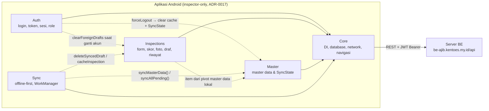
```mermaid
flowchart LR
    subgraph Client["Aplikasi Android (inspector-only, ADR-0017)"]
        direction TB
        AUTH["Auth<br/>login, token, sesi, role"]
        INSP["Inspections<br/>form, skor, foto, draf, riwayat"]
        MASTER["Master<br/>master data & SyncState"]
        SYNC["Sync<br/>offline-first, WorkManager"]
        CORE["Core<br/>DI, database, network, navigasi"]
    end

    SERVER["Server BE<br/>be-ajib.kentoes.my.id/api"]

    AUTH --> CORE
    INSP --> CORE
    MASTER --> CORE
    SYNC --> CORE
    CORE -->|"REST + JWT Bearer"| SERVER

    %% Hubungan antar konteks (ringkas, lihat CONTEXT-MAP.md)
    AUTH -.->|"clearForeignDrafts saat ganti akun"| INSP
    AUTH -.->|"forceLogout → clear cache + SyncState"| MASTER
    SYNC -.->|"syncMasterData() / syncAllPending()"| MASTER
    SYNC -.->|"deleteSyncedDraft / cacheInspection"| INSP
    INSP -.->|"item dari pivot master data lokal"| MASTER
```

### Komponen Kunci

| Komponen | File | Peran |
|---|---|---|
| `App` | `App.kt` | `@HiltAndroidApp`, set WorkerFactory kustom, jadwalkan cleanup foto |
| `NavGraph` | `core/navigation/NavGraph.kt` | Navigasi berbasis `AuthState` (start = Login/Dashboard) |
| `AuthRepository` | `auth/AuthRepository.kt` | Single source of truth status sesi + token |
| `SyncManager` | `sync/SyncManager.kt` | Orkestrator sync master data + upload draf |
| `SyncWorker` | `sync/SyncWorker.kt` | Worker WorkManager (constraint `Network.CONNECTED`) |
| `InspectionRepository` | `inspection/InspectionRepository.kt` | CRUD draf + siapkan payload submit |
| `InspectionHistoryRepository` | `inspection/InspectionHistoryRepository.kt` | Cache riwayat + fetch server + deteksi duplikat |
| `MasterDataRepository` | `master/MasterDataRepository.kt` | Sync incremental per endpoint master data |
| `DashboardViewModel` | `dashboard/DashboardViewModel.kt` | Metrik dashboard + auto-sync |
| `InspectionFormViewModel` | `inspection/InspectionFormViewModel.kt` | State form dinamis, simpan draf, submit |
| `DraftPhotoCleaner` | `inspection/DraftPhotoCleaner.kt` | Pembersih foto yatim/kadaluarsa periodik |

---

## 2. Skema Database (ERD)

Database Room `rsud_ajibarang.db` (versi 7, `fallbackToDestructiveMigration`) — 10 entity.

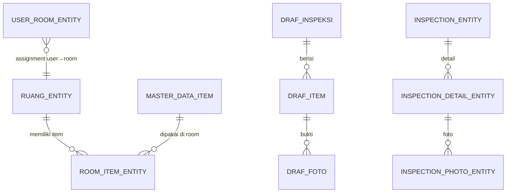
```mermaid
erDiagram
    RUANG_ENTITY ||--o{ ROOM_ITEM_ENTITY : "memiliki item"
    MASTER_DATA_ITEM ||--o{ ROOM_ITEM_ENTITY : "dipakai di room"
    USER_ROOM_ENTITY }o--|| RUANG_ENTITY : "assignment user→room"

    DRAF_INSPEKSI ||--o{ DRAF_ITEM : "berisi"
    DRAF_ITEM ||--o{ DRAF_FOTO : "bukti"

    INSPECTION_ENTITY ||--o{ INSPECTION_DETAIL_ENTITY : "detail"
    INSPECTION_DETAIL_ENTITY ||--o{ INSPECTION_PHOTO_ENTITY : "foto"
```

| Entity | Status | Catatan |
|---|---|---|
| `MasterDataItem` | master | Item kebersihan (nama, kategori, deskripsi) |
| `RuangEntity` | master | Room; `isMyRoom` = di-assign ke user login (di-set `syncMyRooms`) |
| `RoomItemEntity` | pivot | Mapping room↔item (replace-all snapshot, tombstone di-filter) |
| `UserRoomEntity` | pivot | Mapping user↔room (replace-all snapshot) |
| `DrafInspeksi` | draf | Header draf; `inspectorId` stempel pemilik akun (ADR-0015) |
| `DrafItem` | draf | Item + skor + catatan per draf |
| `DrafFoto` | draf | Path file foto lokal (file asli di `files/photos/`) |
| `InspectionEntity` | riwayat | Cache hasil submit/fetch server (sumber metrik "Terkirim") |
| `InspectionDetailEntity` | riwayat | Detail item + snapshot nama |
| `InspectionPhotoEntity` | riwayat | Foto terkirim; `localPath` = backup di `files/photos_sent/` (ADR-0016) |

> **Siklus hidup file foto (ADR-0016)**: draf aktif → file asli di `files/photos/`; saat sync
> sukses → file **terkompresi** dipindah ke `files/photos_sent/` (nama = nama file server),
> disimpan 30 hari, lalu dihapus `DraftPhotoCleaner`.

---

## 3. Alur Startup Aplikasi & Restore Sesi

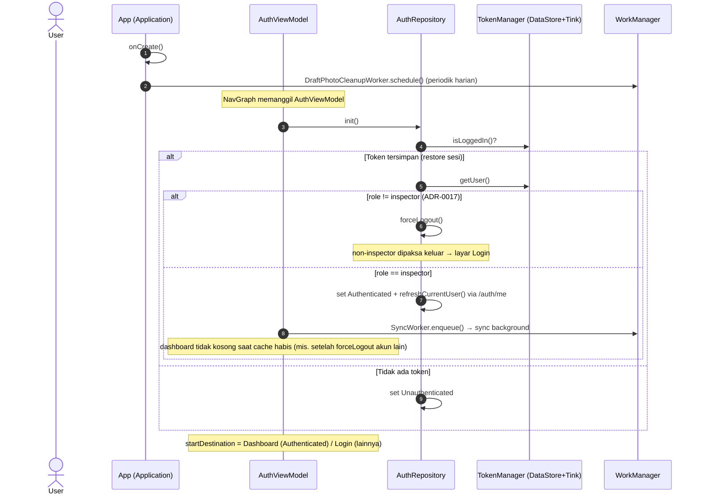
```mermaid
sequenceDiagram
    autonumber
    actor User
    participant App as App (Application)
    participant VM as AuthViewModel
    participant Repo as AuthRepository
    participant TM as TokenManager (DataStore+Tink)
    participant WM as WorkManager

    App->>App: onCreate()
    App->>WM: DraftPhotoCleanupWorker.schedule() (periodik harian)
    Note over VM: NavGraph memanggil AuthViewModel
    VM->>Repo: init()
    Repo->>TM: isLoggedIn()?
    alt Token tersimpan (restore sesi)
        Repo->>TM: getUser()
        alt role != inspector (ADR-0017)
            Repo->>Repo: forceLogout()
            Note over Repo: non-inspector dipaksa keluar → layar Login
        else role == inspector
            Repo->>Repo: set Authenticated + refreshCurrentUser() via /auth/me
            VM->>WM: SyncWorker.enqueue() → sync background
            Note over VM: dashboard tidak kosong saat cache habis (mis. setelah forceLogout akun lain)
        end
    else Tidak ada token
        Repo->>Repo: set Unauthenticated
    end
    Note over VM: startDestination = Dashboard (Authenticated) / Login (lainnya)
```

**Alur start**: `App.onCreate` menjadwalkan cleanup foto & mendaftarkan `SyncAwareWorkerFactory`
(worker dibuat manual karena `@HiltWorker` tidak diproses KSP). `NavGraph` membaca `AuthState`
untuk menentukan layar awal.

---

## 4. Alur Autentikasi

### 4.1 Login

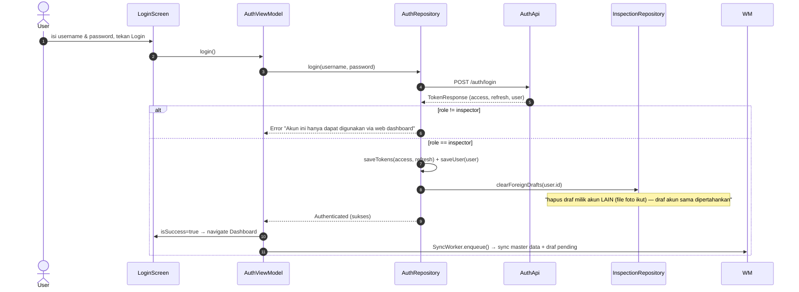
```mermaid
sequenceDiagram
    autonumber
    actor User
    participant Screen as LoginScreen
    participant VM as AuthViewModel
    participant Repo as AuthRepository
    participant API as AuthApi
    participant InspRepo as InspectionRepository

    User->>Screen: isi username & password, tekan Login
    Screen->>VM: login()
    VM->>Repo: login(username, password)
    Repo->>API: POST /auth/login
    API-->>Repo: TokenResponse (access, refresh, user)
    alt role != inspector
        Repo-->>VM: Error "Akun ini hanya dapat digunakan via web dashboard"
    else role == inspector
        Repo->>Repo: saveTokens(access, refresh) + saveUser(user)
        Repo->>InspRepo: clearForeignDrafts(user.id)
        Note over InspRepo: "hapus draf milik akun LAIN (file foto ikut) — draf akun sama dipertahankan"
        Repo-->>VM: Authenticated (sukses)
        VM->>Screen: isSuccess=true → navigate Dashboard
        VM->>WM: SyncWorker.enqueue() → sync master data + draf pending
    end
```

> **Catatan**: `AuthInterceptor` mengecualikan path `/auth/login` dan `/auth/refresh` dari header
> Bearer. Login non-inspector **ditolak sebelum token disimpan** (ADR-0017 — Android hanya
> melayani role `inspector`).

### 4.2 Auto-Refresh Token & Force Logout

Ketika Access Token expired, OkHttp `TokenAuthenticator` memicu refresh otomatis.

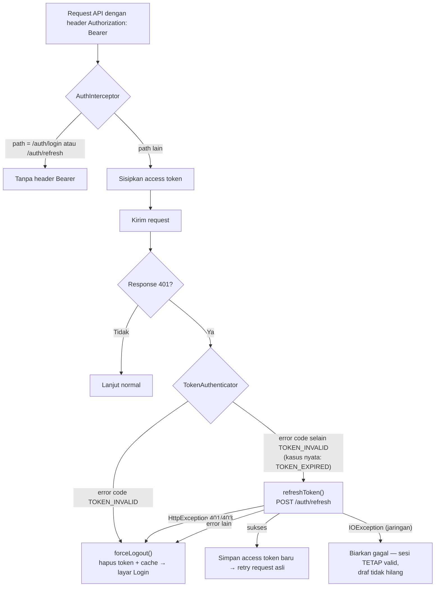
```mermaid
flowchart TD
    A["Request API dengan header Authorization: Bearer"] --> B{AuthInterceptor}
    B -->|"path = /auth/login atau /auth/refresh"| C["Tanpa header Bearer"]
    B -->|"path lain"| D["Sisipkan access token"]
    D --> E["Kirim request"]
    E --> F{Response 401?}
    F -->|Tidak| G["Lanjut normal"]
    F -->|Ya| H{"TokenAuthenticator"}
    H -->|"error code TOKEN_INVALID"| I["forceLogout()<br/>hapus token + cache → layar Login"]
    H -->|"error code selain TOKEN_INVALID<br/>(kasus nyata: TOKEN_EXPIRED)"| J["refreshToken()<br/>POST /auth/refresh"]
    J -->|"sukses"| K["Simpan access token baru → retry request asli"]
    J -->|"HttpException 401/403"| I
    J -->|"IOException (jaringan)"| L["Biarkan gagal — sesi TETAP valid,<br/>draf tidak hilang"]
    J -->|"error lain"| I
```

> **Aturan force logout** (ADR-0018 Q3): hanya dipicu saat server **benar-benar menolak token**
> (401/403). Gangguan jaringan sementara tidak pernah memaksa logout.

### 4.3 Logout Manual

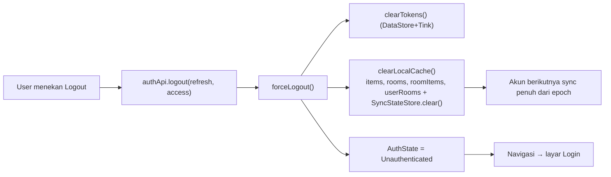
```mermaid
flowchart LR
    A["User menekan Logout"] --> B["authApi.logout(refresh, access)"]
    B --> C["forceLogout()"]
    C --> D["clearTokens() (DataStore+Tink)"]
    C --> E["clearLocalCache()<br/>items, rooms, roomItems, userRooms + SyncStateStore.clear()"]
    C --> F["AuthState = Unauthenticated"]
    F --> G["Navigasi → layar Login"]
    E --> H["Akun berikutnya sync penuh dari epoch"]
```

> **Draf TIDAK dihapus saat logout** (ADR-0015) — user yang sama login ulang tidak kehilangan
> progress. Hanya draf akun **berbeda** yang dibersihkan saat login (alur 4.1).

---

## 5. Alur Sinkronisasi Master Data

`SyncManager.syncMasterData()` menjalankan 5 langkah **berurutan**; tiap langkah sukses langsung
menulis ke Room → hasil bisa **parsial** (dilaporkan, tidak dilempar).

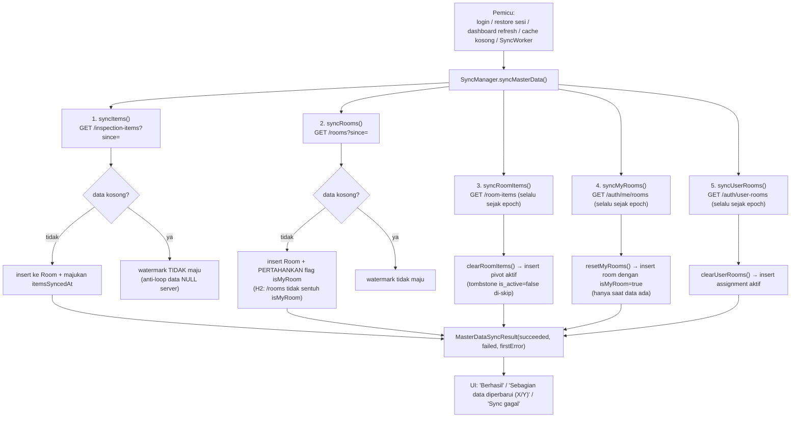
```mermaid
flowchart TD
    TRIG["Pemicu:<br/>login / restore sesi / dashboard refresh / cache kosong / SyncWorker"] --> SM["SyncManager.syncMasterData()"]

    SM --> S1["1. syncItems()<br/>GET /inspection-items?since="]
    SM --> S2["2. syncRooms()<br/>GET /rooms?since="]
    SM --> S3["3. syncRoomItems()<br/>GET /room-items (selalu sejak epoch)"]
    SM --> S4["4. syncMyRooms()<br/>GET /auth/me/rooms (selalu sejak epoch)"]
    SM --> S5["5. syncUserRooms()<br/>GET /auth/user-rooms (selalu sejak epoch)"]

    S1 --> R1{"data kosong?"}
    R1 -->|"tidak"| I1["insert ke Room + majukan itemsSyncedAt"]
    R1 -->|"ya"| W1["watermark TIDAK maju<br/>(anti-loop data NULL server)"]

    S2 --> R2{"data kosong?"}
    R2 -->|"tidak"| I2["insert Room + PERTAHANKAN flag isMyRoom<br/>(H2: /rooms tidak sentuh isMyRoom)"]
    R2 -->|"ya"| W2["watermark tidak maju"]

    S3 --> I3["clearRoomItems() → insert pivot aktif<br/>(tombstone is_active=false di-skip)"]
    S4 --> I4["resetMyRooms() → insert room dengan isMyRoom=true<br/>(hanya saat data ada)"]
    S5 --> I5["clearUserRooms() → insert assignment aktif"]

    I1 & I2 & I3 & I4 & I5 --> RESULT["MasterDataSyncResult(succeeded, failed, firstError)"]
    RESULT --> UI["UI: 'Berhasil' / 'Sebagian data diperbarui (X/Y)' / 'Sync gagal'"]
```

> **Detail penting**:
> - Endpoint **pivot** (`room-items`, `me/rooms`, `user-rooms`) **selalu** memakai `since=epoch`
>   (snapshot penuh, replace-all) — bukan delta.
> - `syncRooms` **tidak menyentuh** `isMyRoom` (fix H2 partial-sync) — kegagalan `syncMyRooms`
>   tidak menghapus scope room inspector.
> - Watermark (`SyncState`) hanya maju saat ada data.

---

## 6. Alur Dashboard & Status Inspeksi

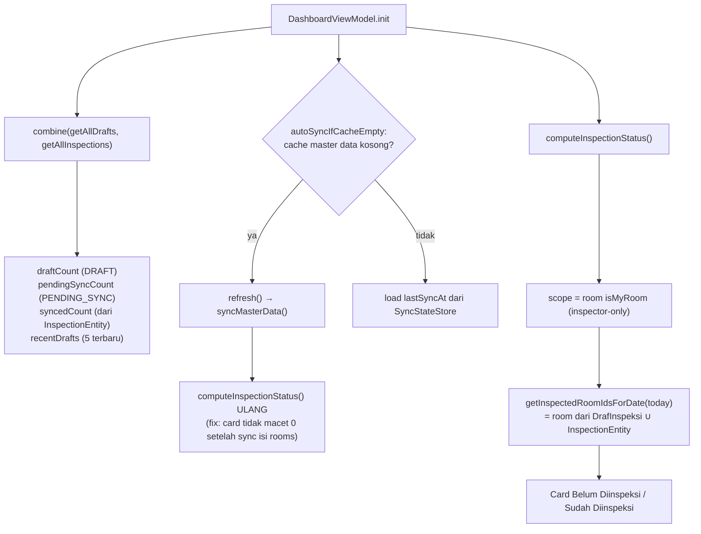
```mermaid
flowchart TD
    INIT["DashboardViewModel.init"] --> COMBINE["combine(getAllDrafts, getAllInspections)"]
    COMBINE --> STATS["draftCount (DRAFT)<br/>pendingSyncCount (PENDING_SYNC)<br/>syncedCount (dari InspectionEntity)<br/>recentDrafts (5 terbaru)"]

    INIT --> COMPUTE["computeInspectionStatus()"]
    INIT --> AUTO{"autoSyncIfCacheEmpty:<br/>cache master data kosong?"}
    AUTO -->|"ya"| REFRESH["refresh() → syncMasterData()"]
    AUTO -->|"tidak"| LOADLAST["load lastSyncAt dari SyncStateStore"]
    REFRESH --> COMPUTE2["computeInspectionStatus() ULANG<br/>(fix: card tidak macet 0 setelah sync isi rooms)"]

    COMPUTE --> SCOPE["scope = room isMyRoom (inspector-only)"]
    SCOPE --> DATE["getInspectedRoomIdsForDate(today)<br/>= room dari DrafInspeksi ∪ InspectionEntity"]
    DATE --> CARDS["Card Belum Diinspeksi / Sudah Diinspeksi"]
```

**Alur dari dashboard**:
- Card **Belum Diinspeksi** → daftar ruangan dengan `uninspectedOnly=true&date=today`.
- Card **Sudah Diinspeksi** → riwayat dengan filter `businessDate=today`.
- Inspeksi ulang: card "Sudah" → detail inspeksi → tombol **Inspeksi Ulang** → form kosong untuk
  room yang sama.
- Draf tersimpan → card **Draf** → resume.

---

## 7. Alur Form Inspeksi

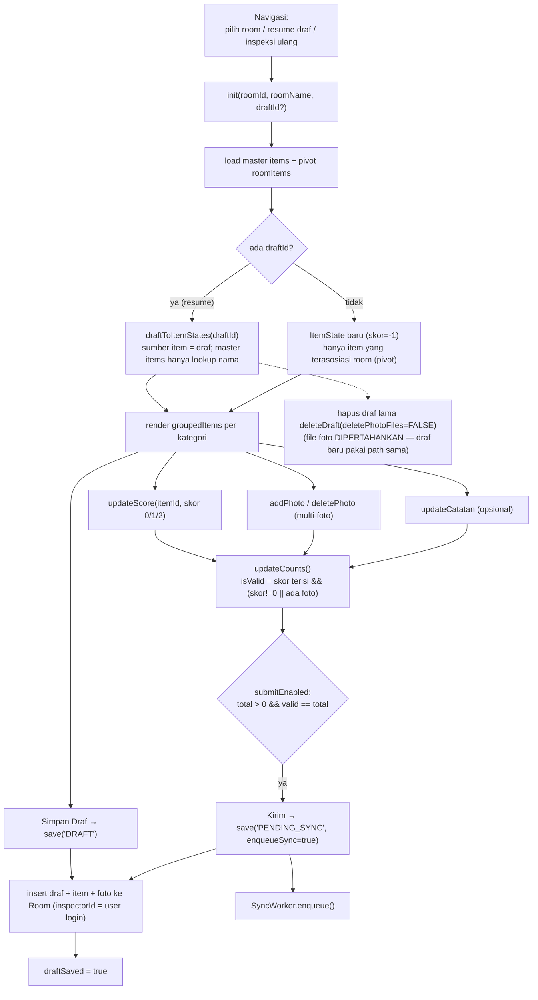
```mermaid
flowchart TD
    NAV["Navigasi:<br/>pilih room / resume draf / inspeksi ulang"] --> INIT["init(roomId, roomName, draftId?)"]
    INIT --> LOAD["load master items + pivot roomItems"]
    LOAD --> FILTER{"ada draftId?"}
    FILTER -->|"ya (resume)"| RESUME["draftToItemStates(draftId)<br/>sumber item = draf; master items hanya lookup nama"]
    FILTER -->|"tidak"| NEW["ItemState baru (skor=-1)<br/>hanya item yang terasosiasi room (pivot)"]
    RESUME --> UI["render groupedItems per kategori"]
    NEW --> UI

    UI --> SCORE["updateScore(itemId, skor 0/1/2)"]
    UI --> PHOTO["addPhoto / deletePhoto (multi-foto)"]
    UI --> NOTE["updateCatatan (opsional)"]
    SCORE --> VALID["updateCounts()<br/>isValid = skor terisi && (skor!=0 || ada foto)"]
    PHOTO --> VALID
    NOTE --> VALID
    VALID --> ENABLED{"submitEnabled:<br/>total > 0 && valid == total"}

    UI --> SAVE["Simpan Draf → save('DRAFT')"]
    ENABLED -->|"ya"| SUBMIT["Kirim → save('PENDING_SYNC', enqueueSync=true)"]
    SAVE --> DB["insert draf + item + foto ke Room (inspectorId = user login)"]
    SUBMIT --> DB
    SUBMIT --> ENQ["SyncWorker.enqueue()"]
    DB --> DONE["draftSaved = true"]

    RESUME -.-> OLD["hapus draf lama deleteDraft(deletePhotoFiles=FALSE)<br/>(file foto DIPERTAHANKAN — draf baru pakai path sama)"]
```

> **Catatan kunci**:
> - Skor `0` (Berisiko) **wajib minimal 1 foto**; skor `1` opsional; skor `2` tanpa foto.
> - Resume → submit: draf lama dihapus **tanpa menghapus file foto** (bug-fix 2026-08) — draf baru
>   mereferensikan path foto yang sama; file yang benar-benar tak terpakai dibersihkan
>   `DraftPhotoCleaner`.
> - Pivot kosong = form kosong (tidak ada fallback "tampilkan semua").

---

## 8. Alur Pengambilan Foto

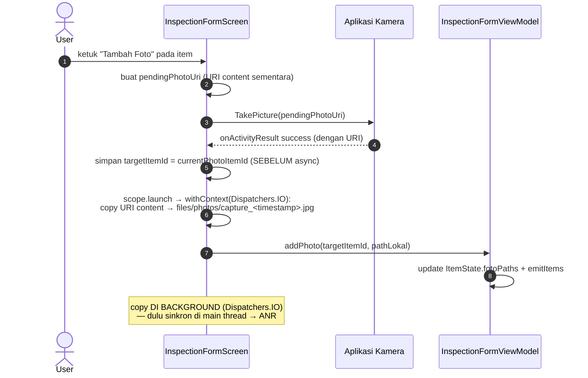
```mermaid
sequenceDiagram
    autonumber
    actor User
    participant Screen as InspectionFormScreen
    participant CAM as Aplikasi Kamera
    participant VM as InspectionFormViewModel

    User->>Screen: ketuk "Tambah Foto" pada item
    Screen->>Screen: buat pendingPhotoUri (URI content sementara)
    Screen->>CAM: TakePicture(pendingPhotoUri)
    CAM-->>Screen: onActivityResult success (dengan URI)
    Screen->>Screen: simpan targetItemId = currentPhotoItemId (SEBELUM async)
    Screen->>Screen: scope.launch → withContext(Dispatchers.IO):<br/>copy URI content → files/photos/capture_<timestamp>.jpg
    Screen->>VM: addPhoto(targetItemId, pathLokal)
    VM->>VM: update ItemState.fotoPaths + emitItems
    Note over Screen: copy DI BACKGROUND (Dispatchers.IO)<br/>— dulu sinkron di main thread → ANR
```

> Multi-foto per item didukung (unlimited). Jika user mengetuk "Tambah" di item lain saat copy
> berjalan, `targetItemId` yang ditangkap lebih dulu memastikan foto masuk ke item yang benar.

---

## 9. Alur Sinkronisasi Draf (Upload Dua Langkah)

Dipicu oleh `SyncWorker` (WorkManager, `Network.CONNECTED`, backoff eksponensial 30 detik).

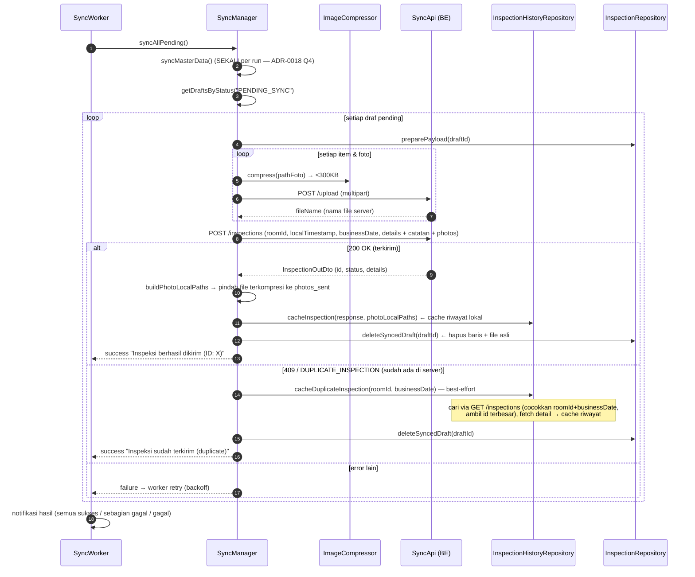
```mermaid
sequenceDiagram
    autonumber
    participant WM as SyncWorker
    participant SM as SyncManager
    participant IC as ImageCompressor
    participant API as SyncApi (BE)
    participant HR as InspectionHistoryRepository
    participant IR as InspectionRepository

    WM->>SM: syncAllPending()
    SM->>SM: syncMasterData() (SEKALI per run — ADR-0018 Q4)
    SM->>SM: getDraftsByStatus("PENDING_SYNC")

    loop setiap draf pending
        SM->>IR: preparePayload(draftId)
        loop setiap item & foto
            SM->>IC: compress(pathFoto) → ≤300KB
            SM->>API: POST /upload (multipart)
            API-->>SM: fileName (nama file server)
        end
        SM->>API: POST /inspections (roomId, localTimestamp, businessDate, details + catatan + photos)
        alt 200 OK (terkirim)
            API-->>SM: InspectionOutDto (id, status, details)
            SM->>SM: buildPhotoLocalPaths → pindah file terkompresi ke photos_sent
            SM->>HR: cacheInspection(response, photoLocalPaths) ← cache riwayat lokal
            SM->>IR: deleteSyncedDraft(draftId) ← hapus baris + file asli
            SM-->>WM: success "Inspeksi berhasil dikirim (ID: X)"
        else 409 / DUPLICATE_INSPECTION (sudah ada di server)
            SM->>HR: cacheDuplicateInspection(roomId, businessDate) — best-effort
            Note over HR: cari via GET /inspections (cocokkan roomId+businessDate,<br/>ambil id terbesar), fetch detail → cache riwayat
            SM->>IR: deleteSyncedDraft(draftId)
            SM-->>WM: success "Inspeksi sudah terkirim (duplicate)"
        else error lain
            SM-->>WM: failure → worker retry (backoff)
        end
    end

    WM->>WM: notifikasi hasil (semua sukses / sebagian gagal / gagal)
```

> **Definisi sukses (ADR-0018 Q1)**: "terkirim" = server mengakui inspeksi (200 dengan id) **dan**
> cache riwayat lokal tertulis. Path 409 juga menulis cache (best-effort) sehingga dashboard
> "Terkirim" & riwayat konsisten tanpa menunggu fetch ulang.

---

## 10. Alur Riwayat Inspeksi (Hybrid)

Cache lokal + fetch server (pagination server-driven).

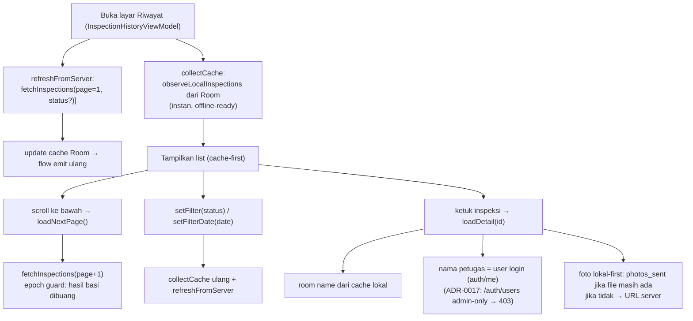
```mermaid
flowchart TD
    OPEN["Buka layar Riwayat (InspectionHistoryViewModel)"] --> CACHE["collectCache:<br/>observeLocalInspections dari Room<br/>(instan, offline-ready)"]
    OPEN --> FETCH["refreshFromServer:<br/>fetchInspections(page=1, status?)]"]
    FETCH --> UPDATECACHE["update cache Room → flow emit ulang"]
    CACHE --> LIST["Tampilkan list (cache-first)"]

    LIST --> SCROLL["scroll ke bawah → loadNextPage()"]
    SCROLL --> NEXT["fetchInspections(page+1)<br/>epoch guard: hasil basi dibuang"]
    LIST --> FILTER["setFilter(status) / setFilterDate(date)"]
    FILTER --> CACHE2["collectCache ulang + refreshFromServer"]

    LIST --> CLICK["ketuk inspeksi → loadDetail(id)"]
    CLICK --> ROOM["room name dari cache lokal"]
    CLICK --> INSPECTOR["nama petugas = user login (auth/me)<br/>(ADR-0017: /auth/users admin-only → 403)"]
    CLICK --> LOCAL["foto lokal-first: photos_sent jika file masih ada<br/>jika tidak → URL server"]
```

**Detail penting**:
- Filter status (`PENDING`/`APPROVED`/`REJECTED`) dan filter tanggal (`businessDate`) didukung.
- Pagination server-driven via `totalPages`; `loadEpoch` mencegah race refresh vs load-more.
- Detail inspeksi menampilkan foto **lokal-first** (instan, offline) dengan fallback URL server
  (ADR-0016).
- Aksi **Inspeksi Ulang** dari detail → form kosong untuk room yang sama.

---

## 11. Alur Cleanup Foto (DraftPhotoCleaner)

Dijadwalkan `App.onCreate` → `DraftPhotoCleanupWorker` (periodik harian, idempotent).

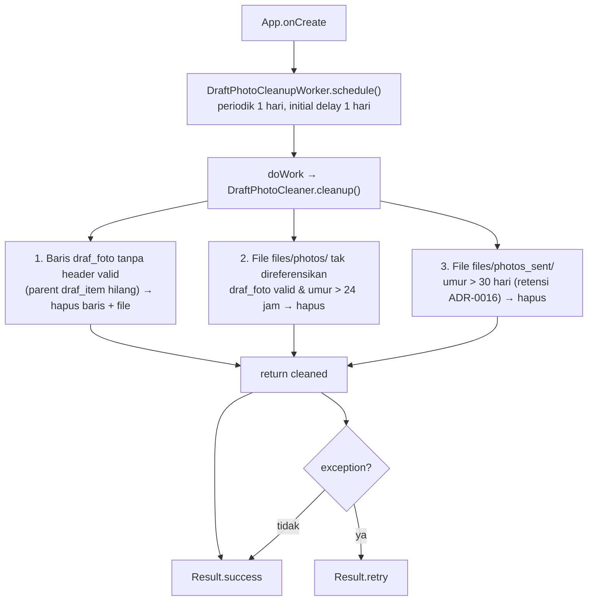
```mermaid
flowchart TD
    APP["App.onCreate"] --> SCHED["DraftPhotoCleanupWorker.schedule()<br/>periodik 1 hari, initial delay 1 hari"]
    SCHED --> RUN["doWork → DraftPhotoCleaner.cleanup()"]

    RUN --> C1["1. Baris draf_foto tanpa header valid<br/>(parent draf_item hilang) → hapus baris + file"]
    RUN --> C2["2. File files/photos/ tak direferensikan<br/>draf_foto valid & umur > 24 jam → hapus"]
    RUN --> C3["3. File files/photos_sent/<br/>umur > 30 hari (retensi ADR-0016) → hapus"]

    C1 --> RESULT["return cleaned"]
    C2 --> RESULT
    C3 --> RESULT
    RESULT --> OK["Result.success"]
    RESULT --> ERR{exception?}
    ERR -->|"ya"| RETRY["Result.retry"]
    ERR -->|"tidak"| OK
```

> **Grace period 24 jam** melindungi foto yang baru diambil kamera tapi belum disimpan ke draf
> (capture dibatalkan menghasilkan file `IMG_*` tanpa referensi).

---

## 12. Alur Navigasi

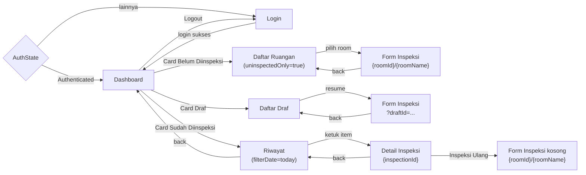
```mermaid
flowchart LR
    START{"AuthState"}
    START -->|"Authenticated"| DASH["Dashboard"]
    START -->|"lainnya"| LOGIN["Login"]

    LOGIN -->|"login sukses"| DASH
    DASH -->|"Card Draf"| DRAFTS["Daftar Draf"]
    DASH -->|"Card Belum Diinspeksi"| LIST["Daftar Ruangan<br/>(uninspectedOnly=true)"]
    DASH -->|"Card Sudah Diinspeksi"| HIST["Riwayat<br/>(filterDate=today)"]
    DASH -->|"Logout"| LOGIN

    LIST -->|"pilih room"| FORM["Form Inspeksi<br/>{roomId}/{roomName}"]
    DRAFTS -->|"resume"| FORM2["Form Inspeksi<br/>?draftId=..."]
    HIST -->|"ketuk item"| DETAIL["Detail Inspeksi<br/>{inspectionId}"]
    DETAIL -->|"Inspeksi Ulang"| FORM3["Form Inspeksi kosong<br/>{roomId}/{roomName}"]

    FORM -->|"back"| LIST
    FORM2 -->|"back"| DRAFTS
    HIST -->|"back"| DASH
    DETAIL -->|"back"| HIST
```

### Rute Navigasi

| Rute | Parameter | Digunakan oleh |
|---|---|---|
| `login` | — | Layar login |
| `dashboard` | — | Layar utama |
| `inspection_list` | `uninspectedOnly?`, `date?` | Daftar ruangan |
| `inspection_form/{roomId}/{roomName}` | `draftId?` | Form inspeksi (baru/resume/ulang) |
| `draft_list` | — | Daftar draf |
| `inspection_history` | `filterDate?` | Riwayat inspeksi |
| `inspection_detail/{inspectionId}` | — | Detail inspeksi |

---

## 13. Alur Re-Upload Foto (replacePhoto / ADR-0016)

Re-upload foto terkirim yang rusak/hilang di server menggunakan **backup lokal** di
`photos_sent/` (byte-identik server). Tombol re-upload hanya muncul jika backup lokal masih
ada; foto lama + thumbnail di server dihapus lalu digenerate ulang oleh endpoint replace.

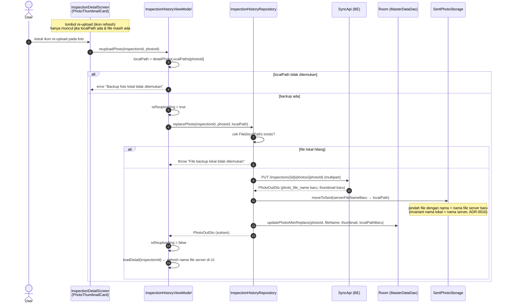
```mermaid
sequenceDiagram
    autonumber
    actor User
    participant UI as InspectionDetailScreen<br/>(PhotoThumbnailCard)
    participant VM as InspectionHistoryViewModel
    participant Repo as InspectionHistoryRepository
    participant API as SyncApi (BE)
    participant DB as Room (MasterDataDao)
    participant SS as SentPhotoStorage

    Note over UI: tombol re-upload (ikon refresh)<br/>hanya muncul jika localPath ada & file masih ada
    User->>UI: ketuk ikon re-upload pada foto
    UI->>VM: reuploadPhoto(inspectionId, photoId)
    VM->>VM: localPath = detailPhotoLocalPaths[photoId]
    alt localPath tidak ditemukan
        VM-->>UI: error "Backup foto lokal tidak ditemukan"
    else backup ada
        VM->>VM: isReuploading = true
        VM->>Repo: replacePhoto(inspectionId, photoId, localPath)
        Repo->>Repo: cek File(localPath) exists?
        alt file lokal hilang
            Repo-->>VM: throw "File backup lokal tidak ditemukan"
        else
            Repo->>API: PUT /inspections/{id}/photos/{photoId} (multipart)
            API-->>Repo: PhotoOutDto (photo_file_name baru, thumbnail baru)
            Repo->>SS: moveToSent(serverFileNameBaru → localPath)
            Note over SS: pindah file dengan nama = nama file server baru<br/>(invariant nama lokal = nama server, ADR-0016)
            Repo->>DB: updatePhotoAfterReplace(photoId, fileName, thumbnail, localPathBaru)
            Repo-->>VM: PhotoOutDto (sukses)
            VM->>VM: isReuploading = false
            VM->>VM: loadDetail(inspectionId) ← refresh nama file server di UI
        end
    end
```

**Detail penting**:
- Endpoint `PUT inspections/{id}/photos/{photoId}` (kontrak §4.6, ADR-0012) — server menghapus
  file lama + thumbnail, lalu regenerate nama baru.
- Invariant dipertahankan: nama file lokal di `photos_sent` = nama file server (lookup trivial).
- Backup lokal bersifat **temporal** (30 hari, dihapus `DraftPhotoCleaner`) — re-upload hanya
  mungkin selama backup masih ada.

---

## 14. Alur Inspeksi Ulang dari Detail Riwayat

Membuka **form inspeksi kosong** untuk room yang sama dengan inspeksi terkirim — bukan resume
draf. Jalur masuk: card "Sudah Diinspeksi" → detail → tombol "Inspeksi Ulang" (keputusan review
2026-08: tidak ada tombol "Inspeksi Baru" di dashboard).

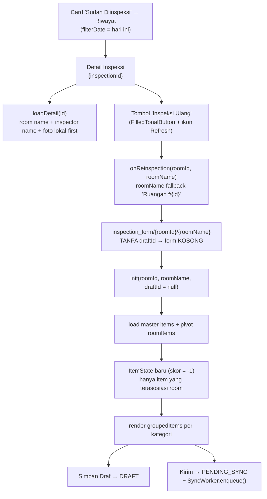
```mermaid
flowchart TD
    HIST["Card 'Sudah Diinspeksi' → Riwayat<br/>(filterDate = hari ini)"] --> DETAIL["Detail Inspeksi<br/>{inspectionId}"]
    DETAIL --> LOAD["loadDetail(id)<br/>room name + inspector name + foto lokal-first"]
    DETAIL --> REINSP["Tombol 'Inspeksi Ulang'<br/>(FilledTonalButton + ikon Refresh)"]
    REINSP --> NAV["onReinspection(roomId, roomName)<br/>roomName fallback 'Ruangan #{id}'"]
    NAV --> FORM["inspection_form/{roomId}/{roomName}<br/>TANPA draftId → form KOSONG"]

    FORM --> INIT["init(roomId, roomName, draftId = null)"]
    INIT --> PIVOT["load master items + pivot roomItems"]
    PIVOT --> NEW["ItemState baru (skor = -1)<br/>hanya item yang terasosiasi room"]
    NEW --> UI["render groupedItems per kategori"]
    UI --> SAVE["Simpan Draf → DRAFT"]
    UI --> SUBMIT["Kirim → PENDING_SYNC + SyncWorker.enqueue()"]
```

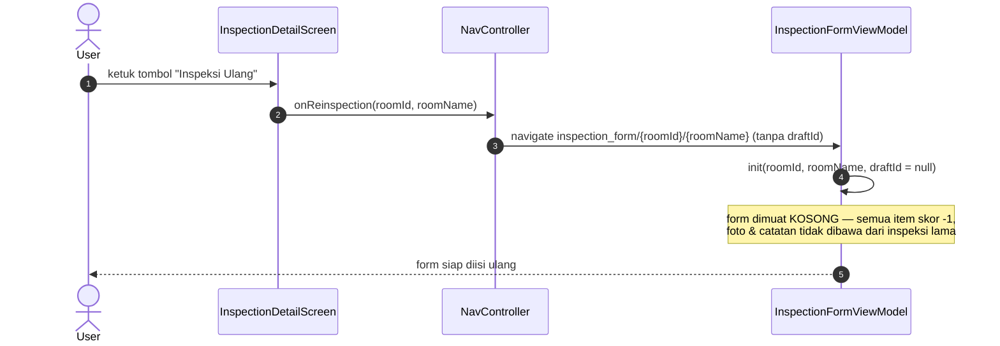
```mermaid
sequenceDiagram
    autonumber
    actor User
    participant D as InspectionDetailScreen
    participant NAV as NavController
    participant F as InspectionFormViewModel

    User->>D: ketuk tombol "Inspeksi Ulang"
    D->>NAV: onReinspection(roomId, roomName)
    NAV->>F: navigate inspection_form/{roomId}/{roomName} (tanpa draftId)
    F->>F: init(roomId, roomName, draftId = null)
    Note over F: form dimuat KOSONG — semua item skor -1,<br/>foto & catatan tidak dibawa dari inspeksi lama
    F-->>User: form siap diisi ulang
```

> **Perbedaan dengan Resume Draf**: resume membawa item, skor, foto, dan catatan dari draf
> tersimpan (`draftId` ada). Inspeksi ulang **selalu form kosong** — hasil inspeksi baru
> merupakan inspeksi terpisah untuk hari/timestamp baru, dan draf lama yang belum terkirim
> tetap diakses via card "Draf" → Resume.

---

## 15. Alur Error Handling & Retry SyncWorker

Mekanisme hasil (`Result`) dan notifikasi dari `SyncWorker.doWork()` setelah
`syncAllPending()` — menentukan apakah WorkManager menganggap selesai, mencoba lagi, atau
melaporkan kegagalan parsial.

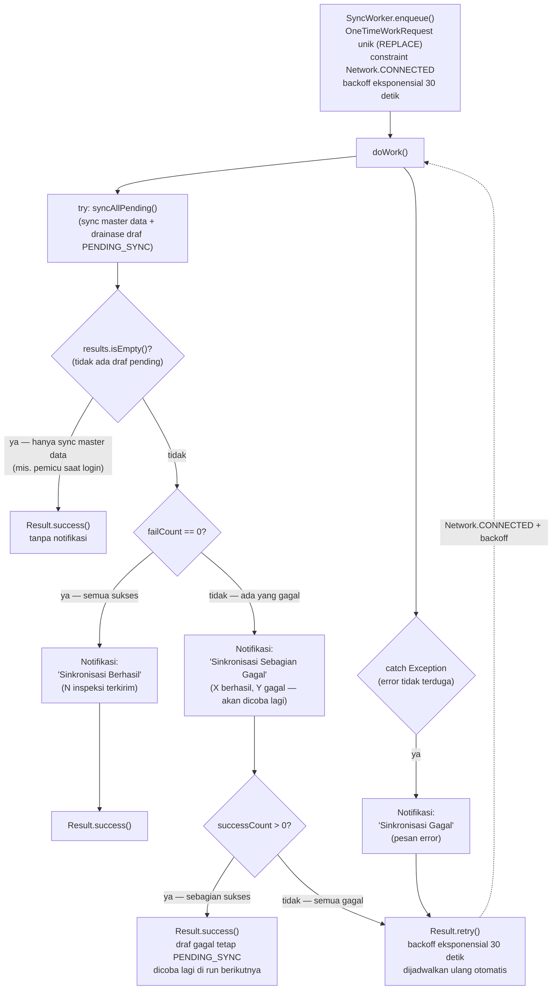
```mermaid
flowchart TD
    ENQ["SyncWorker.enqueue()<br/>OneTimeWorkRequest unik (REPLACE)<br/>constraint Network.CONNECTED<br/>backoff eksponensial 30 detik"] --> DO["doWork()"]

    DO --> TRY["try: syncAllPending()<br/>(sync master data + drainase draf PENDING_SYNC)"]
    TRY --> RES{"results.isEmpty()?<br/>(tidak ada draf pending)"}
    RES -->|"ya — hanya sync master data<br/>(mis. pemicu saat login)"| OK1["Result.success()<br/>tanpa notifikasi"]
    RES -->|"tidak"| FAIL{"failCount == 0?"}

    FAIL -->|"ya — semua sukses"| NOTIF1["Notifikasi:<br/>'Sinkronisasi Berhasil'<br/>(N inspeksi terkirim)"]
    NOTIF1 --> OK2["Result.success()"]
    FAIL -->|"tidak — ada yang gagal"| NOTIF2["Notifikasi:<br/>'Sinkronisasi Sebagian Gagal'<br/>(X berhasil, Y gagal — akan dicoba lagi)"]
    NOTIF2 --> PART{"successCount > 0?"}
    PART -->|"ya — sebagian sukses"| OK3["Result.success()<br/>draf gagal tetap PENDING_SYNC<br/>dicoba lagi di run berikutnya"]
    PART -->|"tidak — semua gagal"| RETRY["Result.retry()<br/>backoff eksponensial 30 detik<br/>dijadwalkan ulang otomatis"]

    DO --> CATCH{"catch Exception<br/>(error tidak terduga)"}
    CATCH -->|"ya"| NOTIF3["Notifikasi:<br/>'Sinkronisasi Gagal'<br/>(pesan error)"]
    NOTIF3 --> RETRY
    RETRY -.->|"Network.CONNECTED + backoff"| DO
```

**Detail penting**:
- **Enqueue unik** (`ExistingWorkPolicy.REPLACE`): memanggil `enqueue()` lagi saat login /
  restore sesi / refresh menggantikan job lama yang masih antri — tidak menumpuk worker.
- **Backoff eksponensial 30 detik** + constraint `Network.CONNECTED`: worker yang me-return
  `Result.retry()` dijalankan ulang otomatis oleh WorkManager saat jaringan tersedia.
- **Sebagian gagal ≠ retry batch**: jika sebagian draf sukses, worker me-return `Result.success()`
  (bukan retry) — draf yang gagal tetap berstatus `PENDING_SYNC` dan ditangani run berikutnya,
  tanpa mengirim ulang draf yang sudah terkirim.
- **Tanpa notifikasi saat tidak ada draf**: worker yang hanya menjalankan sync master data
  (pemicu login/dashboard) selesai diam-diam — tidak mengganggu user.
- **`DraftPhotoCleanupWorker` terpisah** (periodik harian, idempotent) — lihat Section 11.

---

## 16. Alur State Machine WorkManager

Lifecycle worker dikelola WorkManager dalam state machine: `ENQUEUED` → `RUNNING` →
`SUCCEEDED` / `FAILED`. **`RETRY` bukan state** — `Result.retry()` mengembalikan work ke
`ENQUEUED` dengan backoff eksponensial, bukan state final.

### 16.1 State Machine Umum

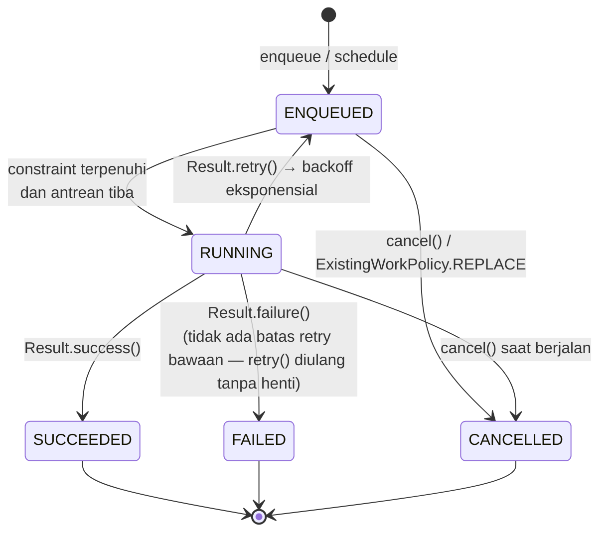
```mermaid
stateDiagram-v2
    [*] --> ENQUEUED: enqueue / schedule
    ENQUEUED --> RUNNING: constraint terpenuhi<br/>dan antrean tiba
    RUNNING --> SUCCEEDED: Result.success()
    RUNNING --> FAILED: Result.failure()<br/>(tidak ada batas retry bawaan — retry() diulang tanpa henti)
    RUNNING --> ENQUEUED: Result.retry() → backoff eksponensial
    ENQUEUED --> CANCELLED: cancel() / ExistingWorkPolicy.REPLACE
    RUNNING --> CANCELLED: cancel() saat berjalan
    SUCCEEDED --> [*]
    FAILED --> [*]
    CANCELLED --> [*]
```

### 16.2 SyncWorker (One-Time, REPLACE)

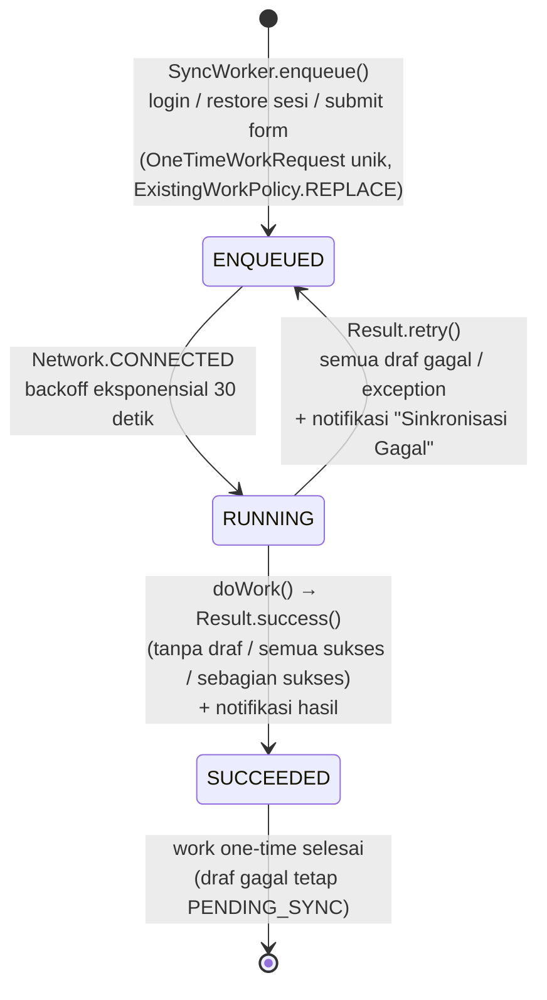
```mermaid
stateDiagram-v2
    [*] --> ENQUEUED: SyncWorker.enqueue()<br/>login / restore sesi / submit form<br/>(OneTimeWorkRequest unik, ExistingWorkPolicy.REPLACE)
    ENQUEUED --> RUNNING: Network.CONNECTED<br/>backoff eksponensial 30 detik
    RUNNING --> SUCCEEDED: doWork() → Result.success()<br/>(tanpa draf / semua sukses / sebagian sukses)<br/>+ notifikasi hasil
    RUNNING --> ENQUEUED: Result.retry()<br/>semua draf gagal / exception<br/>+ notifikasi "Sinkronisasi Gagal"
    SUCCEEDED --> [*]: work one-time selesai<br/>(draf gagal tetap PENDING_SYNC)
```

### 16.3 DraftPhotoCleanupWorker (Periodic, UPDATE)

```mermaid
stateDiagram-v2
    [*] --> ENQUEUED: DraftPhotoCleanupWorker.schedule()<br/>di App.onCreate<br/>(PeriodicWorkRequest 1 hari, initial delay 1 hari)<br/>ExistingPeriodicWorkPolicy.UPDATE (idempotent)
    ENQUEUED --> RUNNING: periode 1 hari tiba<br/>(tanpa constraint jaringan)
    RUNNING --> SUCCEEDED: cleanup() sukses<br/>→ Result.success()
    RUNNING --> ENQUEUED: exception → Result.retry()<br/>dicoba ulang di periode berikutnya
    SUCCEEDED --> ENQUEUED: periode berikutnya<br/>(periodic work tetap terjadwal)
```

### Perbandingan Kedua Worker

| Aspek | SyncWorker | DraftPhotoCleanupWorker |
|---|---|---|
| Request | `OneTimeWorkRequest` | `PeriodicWorkRequest` (1 hari) |
| Enqueue unik | `enqueueUniqueWork` + `REPLACE` | `enqueueUniquePeriodicWork` + `UPDATE` |
| Constraint | `Network.CONNECTED` | — (tidak ada) |
| Backoff | eksponensial 30 detik | default WorkManager |
| Pemicu retry | semua draf gagal / exception | exception |
| Notifikasi | ya (berhasil / sebagian / gagal) | tidak |
| Selesai | work one-time berakhir | tetap terjadwal selamanya |

> **Kaitannya dengan alur lain**: detail keputusan `Result` di `doWork()` ada di
> [Section 15](#15-alur-error-handling--retry-syncworker); pekerjaan yang dijalankan ada di
> [Section 9](#9-alur-sinkronisasi-draf-upload-dua-langkah) dan [Section 11](#11-alur-cleanup-foto-draftphotocleaner).

---

## 17. Alur AuthInterceptor & TokenAuthenticator (Single-Flight Refresh)

Dua komponen OkHttp yang mengelola token pada setiap request: **AuthInterceptor** menyisipkan
header `Authorization: Bearer`, **TokenAuthenticator** menangani response 401 dengan refresh
token otomatis (single-flight — hanya satu refresh berjalan untuk semua request konkuren).

### 17.1 AuthInterceptor (Penyisipan Token)

```mermaid
flowchart TD
    REQ["Request API"] --> P{"path endsWith<br/>/auth/login atau /auth/refresh?"}
    P -->|"ya — noAuthPaths"| PROC1["proceed TANPA header Bearer"]
    P -->|"tidak"| TOK["ambil access token<br/>(TokenManager, runBlocking)"]
    TOK -->|"token ada"| HDR["tambahkan<br/>Authorization: Bearer [token]"]
    TOK -->|"token null"| PROC2["proceed tanpa header"]
    HDR --> PROC3["proceed dengan header"]
```

### 17.2 TokenAuthenticator (Retry & Force Logout)

```mermaid
flowchart TD
    R["Response 401"] --> H{"request punya<br/>header Authorization?"}
    H -->|"tidak"| N1["return null<br/>(tanpa retry)"]
    H -->|"ya"| C{"responseCount > 1?<br/>(sudah pernah retry)"}
    C -->|"ya"| N2["return null<br/>(hentikan retry)"]
    C -->|"tidak"| E["extract error code<br/>(ApiErrorUtil)"]
    E -->|"TOKEN_INVALID"| FL1["forceLogout()<br/>→ layar Login"]
    FL1 --> N3["return null"]
    E -->|"selain itu"| L{"masuk synchronized(refreshLock)"} 
    L -->|"isRefreshing = true<br/>(refresh lain berjalan)"| N4["return null<br/>(single-flight — request asli gagal)"]
    L -->|"isRefreshing = false"| RF["isRefreshing = true<br/>refreshToken()"]
    RF -->|"sukses"| NT["simpan access token baru"]
    NT --> RT["return request dengan token baru<br/>→ OkHttp retry request asli"]
    RF -->|"HttpException 401/403"| FL2["forceLogout()<br/>(di dalam refreshToken)"]
    FL2 --> N5["return null"]
    RF -->|"IOException (jaringan)"| N6["return null<br/>sesi tetap valid"]
    RF -->|"error lain"| FL3["forceLogout()"]
    FL3 --> N7["return null"]
    RT --> FIN["finally: isRefreshing = false"]
```

### 17.3 State Machine Single-Flight Refresh

```mermaid
stateDiagram-v2
    [*] --> IDLE
    IDLE --> AUTH: 401 dengan header & belum retry
    AUTH --> FORCE_LOGOUT: error code TOKEN_INVALID
    FORCE_LOGOUT --> NULL: return null → layar Login
    AUTH --> LOCK: synchronized(refreshLock)
    LOCK --> NULL2: isRefreshing = true → return null<br/>(refresh lain sedang berjalan)
    LOCK --> REFRESHING: isRefreshing = false → set true
    REFRESHING --> RETRY: refreshToken() sukses → retry request dengan token baru
    REFRESHING --> NULL3: refreshToken() gagal → return null<br/>(forceLogout untuk 401/403)
    REFRESHING --> IDLE: finally — isRefreshing = false
    RETRY --> IDLE
    NULL --> IDLE
    NULL2 --> IDLE
    NULL3 --> IDLE
```

**Detail penting**:
- **Single-flight**: saat satu refresh sedang berjalan, request 401 lain yang masuk langsung
  `return null` (gagal tanpa menunggu) — mencegah ledakan request refresh paralel.
- **`responseCount > 1`** menghentikan retry berulang (satu request maksimal 1 kali percobaan
  refresh).
- **`TOKEN_INVALID`** = logout paksa langsung; **`TOKEN_EXPIRED`** = refresh. Gangguan jaringan
  (IOException) TIDAK memicu force logout (ADR-0018 Q3).
- **Catatan presisi**: `finally { isRefreshing = false }` berlaku pada semua jalur yang
  men-set `isRefreshing = true` (refresh sukses maupun gagal). Jalur single-flight
  `return null` keluar SEBELUM blok `try/finally` (karena thread tersebut tidak pernah
  men-set flag) — diagram 17.2 menyederhanakan dengan menunjukkannya dari jalur sukses.
- **Kaitannya**: alur token ini mendasari [Section 4.2](#42-auto-refresh-token--force-logout);
  detail `refreshToken()` dan aturan force logout ada di sana.

---

## Lampiran: State Diagram

### Siklus Hidup Draf

```mermaid
stateDiagram-v2
    [*] --> DRAFT: Simpan Draf (saveDraft)
    DRAFT --> PENDING_SYNC: Kirim (submit)
    DRAFT --> [*]: hapus manual (deleteDraft)
    PENDING_SYNC --> [*]: sync sukses / duplicate<br/>(hapus baris + file; cache riwayat)
    PENDING_SYNC --> PENDING_SYNC: gagal → retry WorkManager
```

### State Autentikasi

```mermaid
stateDiagram-v2
    [*] --> Loading
    Loading --> Authenticated: token valid & role inspector
    Loading --> Unauthenticated: tidak ada token
    Unauthenticated --> Authenticated: login sukses
    Unauthenticated --> Error: login gagal
    Error --> Loading: coba lagi
    Authenticated --> Unauthenticated: logout / forceLogout
```

### Status Inspeksi di Server

```mermaid
stateDiagram-v2
    [*] --> PENDING: submit diterima
    PENDING --> APPROVED: disetujui Supervisor
    PENDING --> REJECTED: ditolak (ada alasan)
```

---

*Dokumen ini dihasilkan dari analisis kode (`app/src/main/java/`) dan dokumentasi domain
(`CONTEXT.md`, `CONTEXT-MAP.md`, ADR). Perbarui jika ada perubahan arsitektur.*
